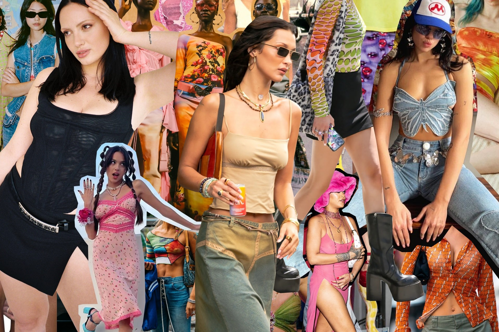

 
Fashion is like a time machine—it always finds a way to bring the past into the present. One of the clearest examples of this is the revival of Y2K fashion, the distinctive style from the late 1990s to early 2000s. From low-rise jeans and baby tees to shiny accessories and fancy sunglasses, Y2K fashion has returned as a nostalgic yet modern expression of identity. Today, is not just a fashion trend but also a representation of how the Z generation creatively reinterprets the past in their own unique way.

The word Y2K literally stands for “Year 2000”. Back then, people imagined the future as something shiny, metallic, and digital. The world was changing rapidly with the rise of new technologies such as cell phones and the early internet, while pop icons like Britney Spears and Paris Hilton dominated the scene. Fashion reflected this futuristic optimism with colors of metallic, rhinestones, bold logos, sparkles, and dramatic designs. For many, it was a time when fashion symbolized confidence and fun rather than minimalism or strict rules. 

What's fascinating is how Y2K fashion has made a huge comeback two decades later. Around 2020, people began to feel nostalgic for the early 2000s. TikTok creators, K-pop idols, and influencers started wearing butterfly clips, denim on denim outfits, and platform shoes again. At first, it seemed like just another passing trend, but it grew into something deeper. For generation Z, Y2K fashion is not about repeating the past exactly;instead, it’s about reinterpreting it by mixing the old with the new, combining vintage aesthetics with modern confidence.

So, in many ways, Y2K fashion perfectly reflects the digital generation. We live in a time when social media shapes how we present ourselves. Platforms like Instagram, Youtube and TikTok have become digital runways where everyone can be a stylist, model, and artist all at once. Wearing a Y2K fashion - a cropped cardigan, cargo pants, or a shining mini bag - becomes more than a style choice. It is a form of self-expression and nostalgia combined. Through fashion, the Generation Z connects with a past they never lived through, yet one that feels strangely familiar through the internet. 

Another reason Y2K fashion resonates so deeply is its sense of freedom. The early 2000s were all about experimentation and individuality. People could wear a pink fur jacket one day and a sporty tracksuit the next, and both would be considered cool. There was no single rule defining beauty and style. This freedom is what  Generation Z values the most today, especially in an age that celebrates diversity and self-acceptance. Y2K fashion gives people permission to be playful, bold, unique and unapologetically themselves.

At the same time, Y2K fashion is also a reaction against minimalism. For several years, clean and neutral aesthetics dominated fashion. But now, people are growing tired of simplicity - they crave color, energy, and chaos again. The comeback of shiny materials, low-rise pants, and chunky jewelry is like a rebellion against monotony. It’s a statement that says, “I want to stand out.” In a world filled with uniform trends, Y2K offers the joy of being unpredictable. Even major fashion houses like Dior, Balenciaga have embraced Y2K inspired designs, reintroducing denim skirts, metallic handbags, and playful silhouettes on the runway. K-pop stars, such as Jennie from Blackpink has also played a huge role in spreading this style globally. Their stage outfits often mix early 2000s energy with modern luxury, showing how the Y2K spirit continues to evolve. 

Personally, I find Y2K fashion inspiring because it represents confidence. When I see someone wearing a glittery top or wide-leg jeans, it feels as if they are saying, “I’m not afraid to shine.” The style encourages me to take risks with my own fashion choices—to wear what makes me happy, not what others expect. Sometimes, I even think Y2K fashion reminds us of something we’ve forgotten: that fashion should be fun.

In the end, Y2K fashion is more than a comeback; it is a conversation between generations. It connects the optimism of the early 2000s with the creativity of today. By remixing nostalgia with modern individuality, Y2K fashion shows that style is not about following rules, but about rewriting them. For Generation Z, fashion is a reflection of who they are: confident, experimental, and endlessly expressive. The return of low-rise jeans, shiny accessories, and playful energy reminds us that fashion always moves in cycles—it evolves, reinterprets, and reinvents the past into something new and inspiring. In a world where trends change overnight, Y2K proves that true style never fades, it simply transforms. 
