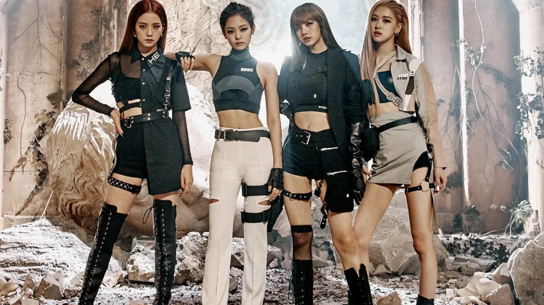

 
Kpop has transformed from a regional music genre into a global cultural force, shaping the way of people listen to music, watch performances and also dress. Among the many aspects of this influence, fashion stands out as one of the most powerful. Today, Kpop idols are not just people who are performing; they are global trendsetters whose outfits inspire millions of fans and influence major fashion brands. Because their image is carefully crafted and instantly spread through social media or other online platforms, their fashion choices have a real impact on global trends. In many other ways, the rise of K-pop also means the rise of a new fashion language—one that combines creativity, youth culture, and cultural identity.

One of the biggest reasons K-pop idol fashion has such a global influence is the strong visual identity created by each idol group. In Kpop, styling is not random at all. Every group develops a distinct aesthetic that matches their musical genre and concept. For example, Blackpink mixes high fashion with a bold, grand, sexy look, while NewJeans has popularized a soft Y2K and minimalist style. When fans are watching music videos or stage performances, they experience fashion alongside the music, making the style feel like a necessary part of the group’s brand. Even airport photos, once considered casual moments, have become iconic fashion references. As a result, fans around the globe try to recreate their favorite idol outfits—from hairstyle, make-up to accessories—turning everyday clothing pieces into global trends.

Social media or online platforms are another major factor that accelerates this influence. On online platforms like Instagram, Youtube and Tiktok, Kpop fashion spreads almost instantly. A single photo of an airport outfit can cause a jacket or pair of shoes to sell out in hours. Fans share details of the look and list every item a member wore, often with hashtags. The rapid circulation creates a cycle where idols introduce styles, fans replicate them, and brands respond to the demand. It becomes difficult to tell whether idols are following trends or creating them, because most of the time, they are doing both. This constant interaction between idols and fans make K-pop fashion a dynamic and global conversation.

Another major part of this influence comes from luxury brand collaborations. Fashion houses that once relied mainly on Western celebrities now compete to have Kpop idols represent their brands. Chanel’s relationship with G-dragon and Jennie, Louis Vuitton’s partnership with BTS, and Miu Miu’s collaboration with Jang Wonyoung show how sought-after Kpop stars have become. Brands choose idols not only for their beauty or popularity but also for their global reach. A single appearance by an idol at fashion week can bring massive media attention, and young consumers often trust idols’ style more than traditional models. These collaborations also change the image of luxury brands, making them feel younger, fresher and more culturally diverse. As K-pop continues to rise internationally, these partnerships will only grow stronger.

Beyond just clothes and brands, Kpop fashion represents a cultural shift from West to East influence. For decades, Western styles dominated global fashion, but today, many trends originate in Seoul and spread worldwide. Items like cropped cardigans, over-sized hoodies, ribbon hair clips, school-uniform-inspired outfits, and two-way bags have become part of mainstream fashion. People who follow K-pop often become curious about Korean culture, beauty trends and even the language. This type of cultural exchange shows how fashion can be more than aesthetics— it can be a bridge connecting different worlds, encouraging people to explore and appreciate new cultural perspectives.

In conclusion, K-pop idols have become some of the most influential fashion leaders in the world. Through distinctive visual identities, viral social media and online platforms presence, partnerships with luxury brands, and a shift in cultural aesthetics, they have shaped global fashion once again. Their influence goes beyond clothing trends; it reflects the power of youth culture, global communication, and creativity. K-pop fashion is no longer just something fans enjoy, it has become a huge global movement. As the industry continues to grow, it is clear that K-pop idols will keep playing a major role in shaping how the world dresses. Fashion, like music, is a universal language, and Kpop idols are speaking it loudly to the entire world. At the same time, their growing influence shows how fashion is becoming more global and interconnected than ever. Kpop idols encourage individuality, creativity and confidence, inspiring fans to explore their own style rather than simply follow trends. 