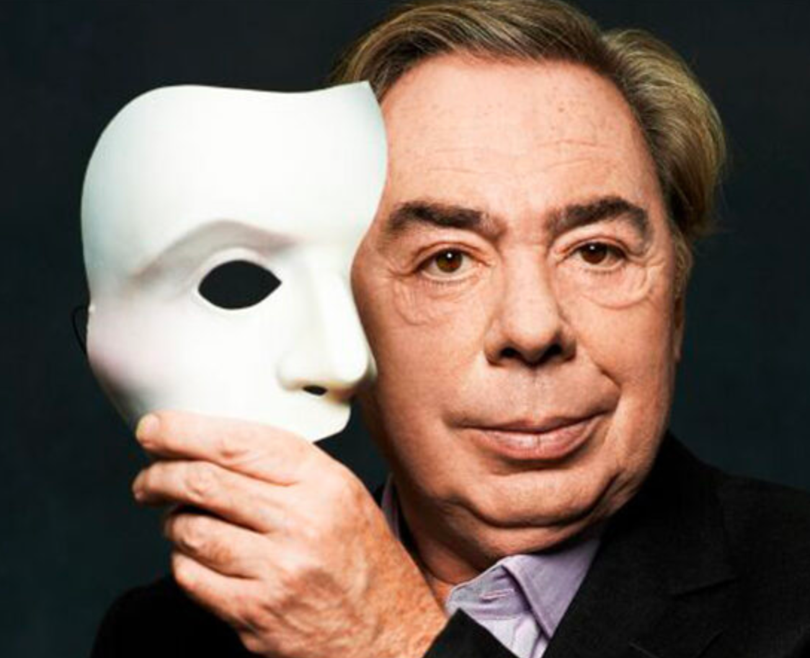
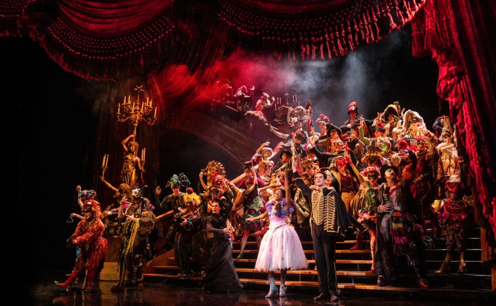
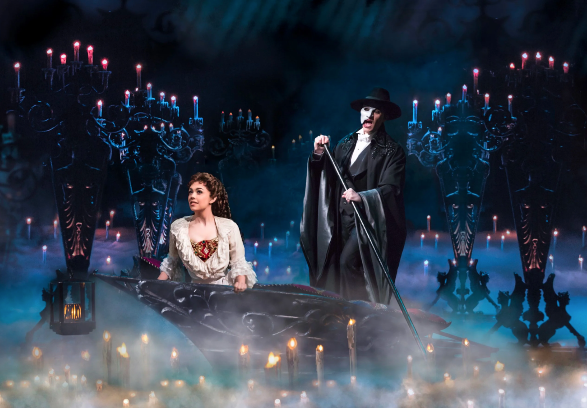

* [Overture / Hannibal](https://www.youtube.com/watch?v=-Wkyo_F28N0&list=PLnRQo_2HH8PybAaWAjuL3rZfihYZluMRf&index=2&ab_channel=AndrewLloydWebber-Topic)
* [The Phantom Of The Opera](https://www.youtube.com/watch?v=FKHMRGMkQHU&list=PLnRQo_2HH8PybAaWAjuL3rZfihYZluMRf&index=6&ab_channel=AndrewLloydWebber-Topic)
* [Think Of Me (From 'The Phantom Of The Opera' Motion Picture)](https://www.youtube.com/watch?v=waAX-CneZmM&list=PLnRQo_2HH8PybAaWAjuL3rZfihYZluMRf&index=3&ab_channel=AndrewLloydWebber-Topic)
* [Angel Of Music (From 'The Phantom Of The Opera' Motion Picture)](https://www.youtube.com/watch?v=WqZwg9FEZNg&list=PLnRQo_2HH8PybAaWAjuL3rZfihYZluMRf&index=4&ab_channel=AndrewLloydWebber-Topic)

***WHILE READING THIS ARTICLE, I HIGHLY SUGGEST YOU TO PUT A BACKGROUND MUSIC OF “THE PHANTOM OF THE OPERA” PLAYLIST. THIS WILL GIVE YOU A FEELING THAT THE PHANTOM IS CALLING YOU THROUGH THE MIRROR.***

“The Phantom of the Opera” is about to retire from Broadway after more than 3 decades. On Feb. 18, 2023, it will no longer be running. Originally a London import, Andrew Llyrod Webber’s musical was an instant big hit. Although critics didn’t consider the musical to be the best-written musical ever to grace the Broadway stage, it was an undeniable sensation from its first performance. The Anderw Lloyd Webber musical has been played by over 145 million people worldwide in 41 countries, 183 cities, and 17 languages. Following its Broadway debut in 1988, Phantom has received 70 major theatrical awards, including 7 Tony awards and 4 Oliver awards.

The play also holds the distinction of being the largest job producer in U.S. history of theater. On Broadway alone, the musical has played over 13,500 performances to 19.5 million people at the Majestic Theater on West 44th Street. During its run, “Phantom” produced an estimated 6,500 jobs in New York City, including 400 acting positions, while making $1.3 billion in ticket sales. 

The plot of Phantom of the Opera is about Phantom’s turbulent love affair and obsession with Christine Daae, a young attractive soprano singer. This gothic musical depicts a masked composer who haunts an opera theater and develops feelings.  The musical, which is set in the opera world and features the songs “Think of Me,” “All I Ask of You,” and “The Phantom of the Opera” is replete with elaborate costumes, intricate stage designs, and a large ensemble. The 130 cast and crew, 230 costumes, 14 dressers, 120 automatic cues, 22 scene changes, 281 candles, 250 kg of dry ice, and 10 smoke machines was necessary for managing every performance of Phantom. 

Modern musicals don’t typically have operatic music, a powerful overture, and famous set pieces like the chandelier as this spectacle on Broadway did. With the exception of Wicked, The Lion King, and Hamiliton, the majority of the Broadway productions today focus on more intimate, personal scale stories rather than trying to mimic the success of Phantom. Broadway successes like "Dear Evan Hansen" and "Come from Away" included pop-contemporary music, small ensembles, and minimal dance. 

The main reason Phantom is closing is not so much because people don’t want spectacle as it is because the production costs for shows like Phantom are just too high. All Broadway productions were severely impacted by the pandemic, but the popular musicals like Wicked and The Lion King were able to bounce back and maintain their popularity. Its high production costs, which have increased even further due to inflation, combined with its decreased box office return led to the show’s downfall. They took it for granted that it’s not going to run forever. 

Since the epidemic began, Broadway has faced several crossroads, but Phantom’s closure will be the most significant shift of the 21st century. Since 1988, no other play has appeared in the Majestic Theater, and many actors and theatergoers have never visited Broadway without seeing Phantom. This transition era for Broadway will almost certainly be analyzed in theatrical history, as the company must decide whether to develop a new Phantom or move on from its magnificence. However, ticket sales spiked as soon as the closure was announced the week of Oct 2022 when Thanksgiving tourists bolstered Broadway and Phantom had its heist-earning week ever, bringing in $2.2 million. This sold out virtually everything that they have on sale. Cameron Mackintosh, the show’s producer, announced an 8-week run extension until April 16 on Tuesday shortly after celebrating its 35th anniversary. 

A spokesman said other international productions will continue, including the main London production. For South Korea, the Korean production of the Phantom is returning for the 1st time in 13 years. It is the  3rd Korean-language revival after the 2001 and 2009 runs, and the latest production is set to premiere in Busan and will feature headlining actor 조승우, 전동석, 줄리안 킴 as the Phantom. 손지우 and 송은혜 will take the role of Christine. This year, the 75th anniversary of Webber's birth, the first Mandarin-language version of the show will open in Shanghai in May as well. I’m biding my time to watch the Phantom in London, sadly. 

***Glimpse of “The Phantom of the Opera” (Order of the Plot)***
* ['Think of Me' Sierra Boggess | The Phantom Of The Opera](https://www.youtube.com/watch?v=kZpvaRWak64&list=PLRImnjFIgJIWRMkXEoKmaUgW8qihGyRnm&index=9&ab_channel=TheShowsMustGoOn%21)
* ['The Phantom of The Opera' | The Phantom Of The Opera](https://www.youtube.com/watch?v=EGb4hj-EXt0&ab_channel=TheShowsMustGoOn%21)
* ['The Music of The Night' Ramin Karimloo | The Phantom of The Opera](https://www.youtube.com/watch?v=EBDxEHzidx0&ab_channel=TheShowsMustGoOn%21)
* [All I Ask Of You | The Phantom Of The Opera](https://www.youtube.com/watch?v=TrLsVpxCAo8&list=RDF1nmDJmMvUc&index=4&ab_channel=TheShowsMustGoOn%21)
* [Masquerade/Why So Silent | The Phantom of The Opera | The Shows Must Go On!](https://www.youtube.com/watch?v=G0ntdZSzJww&list=PLRImnjFIgJIWRMkXEoKmaUgW8qihGyRnm&index=13&ab_channel=TheShowsMustGoOn%21)
* ['The Point of No Return' Ramin Karimloo & Sierra Boggess | The Phantom of The Opera](https://www.youtube.com/watch?v=6FpRjVPMOoM&ab_channel=TheShowsMustGoOn%21)
* [The Final Lair (Down Once More) | The Phantom of The Opera](https://www.youtube.com/watch?v=F1nmDJmMvUc&ab_channel=TheShowsMustGoOn%21)

Do you want to delve into the entire history of musical theater from Greek theater to 21st-century modern theater? Or would you just simply like to explore song and dance as a means of creativity and self-discovery? If you’re looking for a collaborative environment, where you can find your hidden interest in music, then this journal is just right for you. The show must go on!

