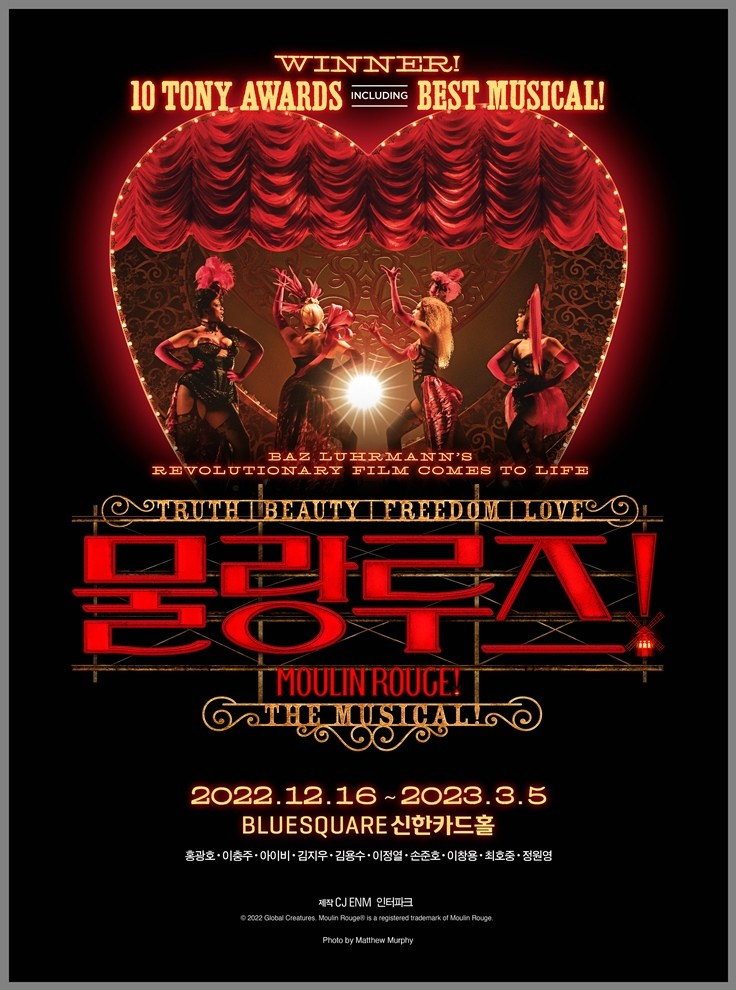

South Korea’s musical theater industry has gained a reputation for having outstanding performers and unique blend of Korean traditional and modern musical theater styles. However, as the musical industry continues to grow, some critics in the field have begun to raise concerns about the quality and lack of originality of the product. Moreover, there is growing criticism of the industry for relying on the popular franchises which is a sign of losing creativity. As a future theater student, I hold the idea that it is important for all audiences to analyze these criticisms and assess whether they are reasonable. In this article, we will explore the current state of the South Korean musical theater industry and investigate more about whether there is a need for change in the way it approaches creativity and innovation by asking the following questions. 

# Question 1: What are the characteristics of the Korean musical market?
One of the features of the South Korean musical market is that there’s strong emphasis on producing high-quality production putting a lot of focus on professionalism, technology, and top-notch set design. For example, the popular musical “The Phantom of the Opera” was presented in Seoul in 2019 on a $18 million budget. The show used cutting-edge technology such as a revolving stage, hydraulic lifts, and a projection system that projected background visuals onto the stage, making the experience more aesthetically appealing for the audience. The Korean musical market is notable for its diversity of output as well as its emphasis on quality. The conversion of popular media into musicals has been a prominent trend in recent years such as “Nanta” which is based on traditional Korean percussion performance and has become a global hit. Original musicals are also thriving in the Korean market with productions like “Jekyll and Hyde” and “The Last Empress” which gained glowing praise and commercial success. The industry certainly has many strengths, but there’s always setbacks. They are facing high production costs and competition from other forms of entertainment like K-pop and K-dramas which possess significant growth and sustainability for the future. Despite these challenges, the musical industry continues to grow and showcase the country’s unique cultural identity and artistic expression to audiences around the world by conveying social messages. 

# Question 2: Why are Korean musicals so expensive?
Korean musicals are recognized for their high production values, complicated choreography, and extravagant stage designs, all of which contribute to the production and staging costs. Furthermore, the pay for performers, musicians, and crew members in these plays can be rather huge. It is worth emphasizing that the Korean entertainment industry is very competitive, with producers required to invest significant money in their projects in order to attract audiences and outperform their competitors. When compared to similar performances in other nations, these all contribute to the higher expense of Korean musicals. The announcement of “Moulin Rouge!” making its Asian debut at the Blue Square Hall in central Seoul delighted numerous fans in the area. However, the news of the ticket price left many fans speechless. The VIP ticket costs 180,000 won ($138), almost 20% higher than other musicals. Some fans question whether this is a smart decision, as people tend to reduce spending on cultural activities during economic hardships. The Korean version of the musical is an exact replica of the original Broadway production, promising an equally impressive quality. The company revealed that bringing “Moulin Rouge!” to broadway cost $28 million, and a significant amount was also required to bring all set props into Korea and pay royalties for the 70 pop songs featured in the show. 

# Question 3: Why are Korean musical production companies being criticized? 
The Korean musical production business has come under criticism for a variety of reasons in recent years. The lack of diversity and representation on stage is one of the most common criticisms raised by critics. According to several critics, Korean musicals typically have a homogeneous cast and storyline that do not reflect the variety of Korean society. This has promoted requests for more inclusive casting and narrative that appropriately portrays the country's varied races, cultures, and lifestyles. Criticisms have also focused on the working conditions of performers, musicians, and crew members. Long working hours, lower compensation, and poor treatment of performers and production staff have been reported, raising concerns about exploitation and mistreatment. Furthermore, some crocs have criticized the commercialization of Korean musicals, with certain producers putting only profit over artistic integrity. As a result, there has been an increase in the number of mass-produced musicals that lack creativity and aesthetic worth, raising fears that the industry is becoming too formulaic and stale. 

# Question 4: How can Korean musicals improve? 
Korean musicals can take numerous steps to improve and answer reviewer's complaints. Musicals are a costly form of art, and they need more support and investment. If governments and companies provide more support to this industry, more professional and quality musicals will be produced. In addition, we should be able to produce global-level musicals in Korea as well. For this, we need professionals with specialized knowledge and technical skills in musical production, and we need to work with them to develop musical production technology. The desire to promote diversity and representation is one of their key areas for development. This may be accomplished by aggressively seeking out performers from varied backgrounds and developing stories that represent the diversity of the Korean population’s experiences. The working conditions of performers and production staff are another crucial area for improvement. Producers can make efforts to create a healthy work environment by providing fair compensations, proper rest times, and carefully complying to workplace standards. Korean musicals may become more innovative, varied, and engaging by making these changes, attracting a larger spectrum of audiences both from Korea and around the world. 

Do you want to delve into the entire history of musical theater from Greek theater to 21st-century modern theater? Or would you like to explore songs and dances as means of creativity and self-discovery? If you’re looking for a collaborative environment, where you can find your hidden interest in music, then this journal is just right for you. The show must go on! 