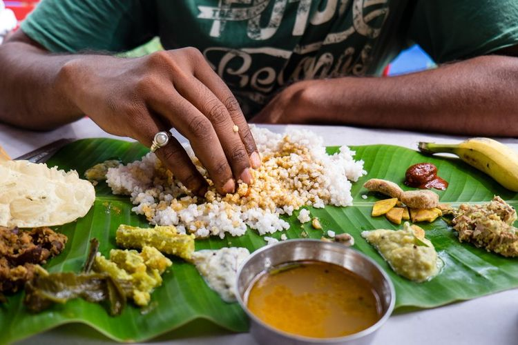

In India, eating with hands is not only a way to eat food, but also a tradition that has been followed for thousands of years. For Indian people, food is seen as a gift from God, and touching it directly shows respect and gratitude. This habit is not just about eating, but also about culture, religion, and family life.

The custom comes from ancient Hinduism and Ayurveda, the traditional Indian system of medicine. In Ayurveda, eating with the hands connects people to the five natural elements: earth, water, fire, air, and space. By using the hands, eating becomes an act of harmony with nature. It is not only about filling the stomach but also about creating balance between the body and the universe. 

There are also rules about this tradition. The most important rule is to use the right hand when eating. The right hand is considered clean and holy, while the left hand is seen as unclean for hygiene and cultural reasons. By eating with the right hand, people show respect to the food, to others, and to God. This makes the act of eating more meaningful.

Eating with the hands also helps people enjoy food with all five senses. When people touch food, they can feel its temperature, softness, and texture. They can also smell the spices more closely and enjoy the experience in a natural way. Using a fork or spoon creates distance, but the hand makes the food feel alive. Because of this, eating with hands is often called a complete experience of taste.

In Hinduism, eating food is sometimes compared to offering food to God. For this reason, people eat with care and sincerity. Some people outside of India may think that eating with the hands is not clean, but in fact, it is very hygienic. Before meals, Indians wash their hands carefully, and in temples or during feasts, washing hands is part of the religious practice. This shows that eating with hands is not dirty, but rather respectful and clean.

Today, many modern restaurants in India use forks, spoons, and knives, especially in big cities. However, at home and in traditional places, people still eat with their hands. Families gather, share food, and teach the younger generation about this custom. Even young people in India continue to practice it, because it is part of their identity and connects them with their history and ancestors.

In conclusion, eating with hands in India is more than just a habit. It is a tradition that shows respect for food, for God, and for nature. It is also a way to enjoy food with the whole body and all the senses. Even though modern life has brought new eating tools, the custom of eating with hands is still alive and important. It reminds people that food is not only for survival but also a gift to be enjoyed with gratitude.

