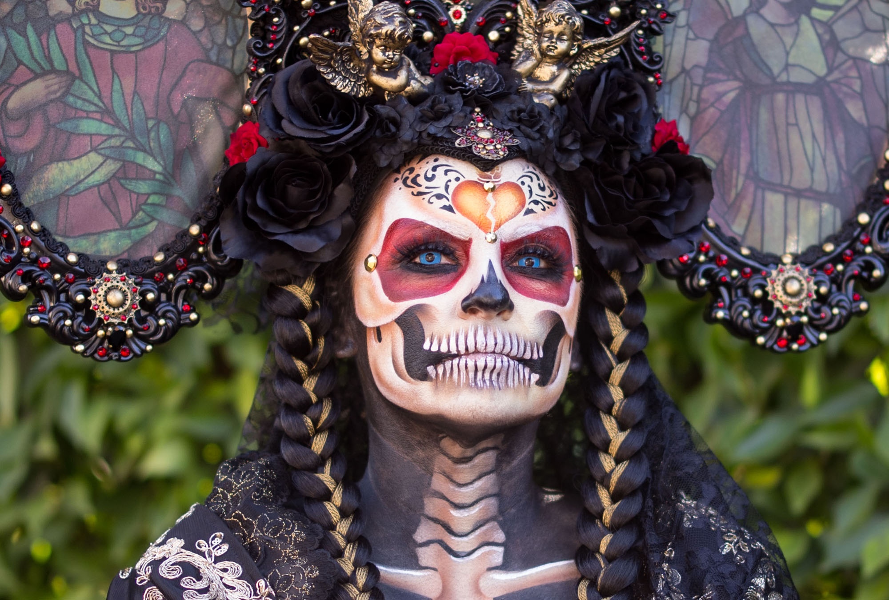

Mexico’s representative traditional holiday, "Day of the Dead,” is not just for mourning them. It is a festival that joyfully honors the lives of those who have passed away. In Mexico, all Mexicans host colorful events throughout the country. During this time everywhere is decorated with skull ornaments and orange flowers; furthermore, the whole city is filled with a warm and cheerful atmosphere.

The origin of the Day of the Dead dates back thousands of years. In ancient Aztec civilizations and Maya civilizations, people did not see death as the end of life;they believed it was the beginning of another world’s journey. They thought that the  souls of the dead returned  to the human world once a  year, so they prepared the food and  offered special offerings to welcome them back.  

On this day, Mexicans set up an ofrenda which is a kind of altar in their homes or graves. On the altar, they place photos of the deceased, their favorite food and drinks, candles, flowers, especially  the traditional marigold (cempasúchil). The bright orange color and strong scent  symbolize the light that guides  the souls of the dead back home. Families share the food and talk about memories of their loved ones,feeling their presence once again.

Also, during the Day of the dead, there are various symbolic foods. The most representative one is ‘Pande Muerto’, which means ‘The Bread of Dead'. This bread has a round shape and is topped with a decoration that resembles a bone, symbolizing the cycle of life and death. Sugar skulls are also a must-have. These cute and colorful decorations show the Mexican people’s attitude of not fearing death, but rather accepting it as a natural part of life.

At this time, parades, music performances, and costume festivals are held all over the country. People paint their faces like skeletons or wear fancy traditional costumes. The most famous character, ‘La Catrina’, is a female skeleton wearing an elegant hat. She conveys the message that even death should be accepted with dignity.

The Day of the dead is not just a simple religious event or sad anniversary. It is  a cultural festival that celebrates family memories, love, and rediscovers the meaning of life. On this day, Mexican people are not afraid of death. Instead, they remind themselves to stay connected with their  loved ones and believe that death is not the end of life, but a new beginning.

In this way, the Day of the Dead represents Mexico’s identity and has become a symbol of its cultural heritage and world view. In 2008, it was registered as a UNESCO Intangible Cultural Heritage, gaining worldwide recognition for its value. This special day reminds people about the preciousness of memories and the warmth of human existence.

The Day of the Dead is not only a Mexican tradition, but also leaves a deep impression on people around the world. Today many countries, such as the United States, and those in Europe celebrate this festival together. Rather than fearing death, people reflect on the value of life and the meaning of memories. This culture is truly indispensable and important, showing that death is not something to be afraid, but something to understand as part of life.
 
