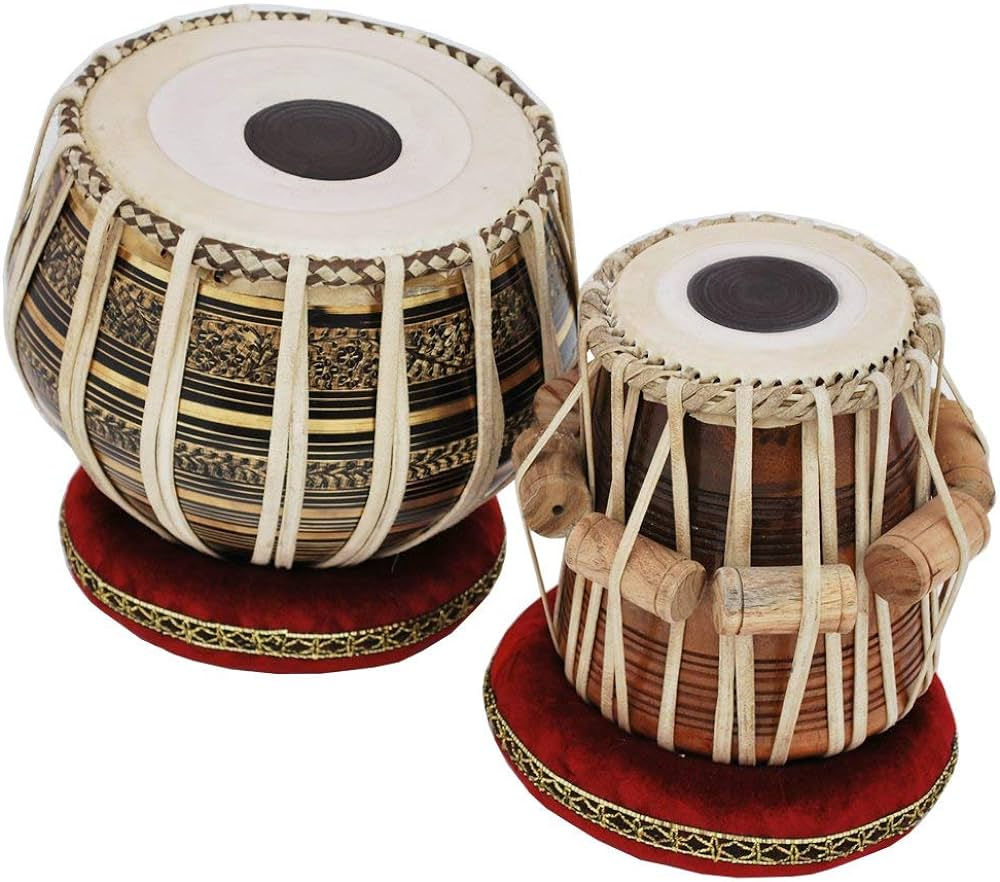

Drums have been universally used for centuries in music of many cultures around the world. From the rhythmic beat of African drumming to the complex rhythms of Indian classical music, drumming has played an essential role in the music and traditions of various cultures. Today, let's take a look at the traditional drums of various cultures around the world.

## Africa
Drumming is deeply rooted in African culture and is used in a variety of occasions, from religious ceremonies to social gatherings. In many African cultures, drums are considered sacred and are used to communicate with the soul. African drumming is known for its complex rhythms, and each drum plays a unique role in music. The djembe, a West African drum, is one of the best-known African drums and is often used in traditional drum ensembles.

The talking drum is also an instrument from West Africa, and it makes a talking sound. It usually has a cylindrical structure with a flute and leather that can be adjusted in height and fastened. The player imitates the human voice by changing the drum's height by adjusting the string. It is used in various music in West Africa and plays an important role, especially in rituals and festivals. In local cultures, the talking drum is regarded as an important instrument containing communication, art, and religious meanings.

## India
In India, drumming is an important part of classical music and is used to accompany a variety of instruments, including the sitar. The tabla, a pair of hand drums, is one of the most popular drums in Indian classical music and is known for its complex finger techniques. Indian drums are also used in folk music and religious ceremonies, and are often used in wedding parades.

## Middle East
Drumming has a long history in the Middle East and is also used in various traditional and contemporary music genres. Doumbek, a cup-shaped drum, is one of the most popular drums in the Middle East and is used in traditional belly dance music as well as contemporary pop and rock music.

## Latin America
Drumming is an integral part of Latin American music and culture. Conga, a long, narrow drum, is frequently used in Afro-Cuban music and is known for its deep, resonant sounds. Timbales, a pair of high-pitched drums, is frequently used in salsa and other Latin American genres. Cajón, a box-shaped drum, is popular in flamenco music.

## Japan
Taiko is a traditional Japanese drum that includes a wide variety of large drums. Odaiko is the loudest and strongest sounding, and Chu-daiko, Shime-daiko, and Nagado-daiko are used for various tones and sizes. They are used in religious ceremonies, festivals, and plays in Japan. Today, it has grown into a performance art loved all over the world. Performance art combines intense rhythms and visual effects to convey cultural and artistic messages.

Drumming is an important part of various cultures around the world. From the complex rhythms of African drumming to the complex finger techniques of Indian classical music, drumming has played an integral role in the music and traditions of various cultures. Whether used in a religious ceremony, social gathering, or as a form of expression, drumming is a language that brings people together and has the power to transcend cultural boundaries.

*Listen to the article as read by the author:*

`audio: https://www.dropbox.com/scl/fi/m94o4djnkpcmc8spx6di1/emily_0124.mp3?rlkey=lkq5fk817mwpv75ra8bd8idp0&raw=1`