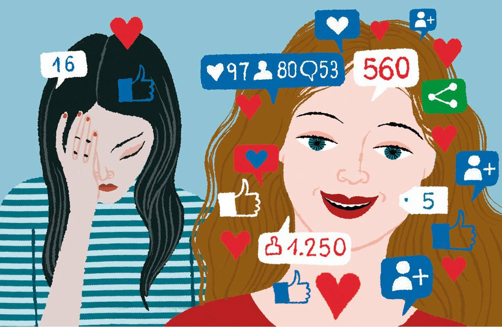

Self-esteem is the value an individual assigns to themselves, determining their worth.  During the teenage years, adolescents form their self-identity for socialization, which is greatly influenced by others’ evaluations. They raise questions such as ‘who am I?’ or ‘how do other people view me?’. As a period when social relationships expand, and teenagers grow emotionally and physically, building healthy self-esteem during adolescence is crucial for a better quality of life in the future. ’. According to psychologist Erikson, adolescence is the chaotic period. 

Most evaluations on SNS do not have a positive comment on people. Others’ SNS evaluation, such as the number of likes and followers, influences teenagers’  evaluation of themselves: their self-esteem. SNS is the space that selectively shows only good moments, where most users share only pleasant experiences. By watching those posts, adolescents constantly interfere with others’ lives. Teenagers think their normal life is not worth it. They feel like they are left behind by society. The biggest problem with SNS is that it shows direct social evaluation by numbers. The number of likes and followers makes teenagers feel like it is a general evaluation. According to social comparison theory, people compare themselves with others to realize their own.  And the comparison happens in SNS more frequently. The girls compare with their appearance, popularity, and body, while the boys compare with their achievements or social status. The teenagers can easily think that the content they are exposed to is the standard to be accomplished.  And as these comparisons accumulate, teenagers can easily believe that they are not good enough, and form a negative self-concept: they can no longer evaluate themselves without the evaluation of others. 

Another big problem with SNS is that adolescents can have negative relationships online. While teenagers communicate with their friends on SNS, no reply in the chat room or if no response to their post may be perceived as a sign of rejection. Also, they can feel denied when they get malicious comments, which can increase their anxiety and make them very strict about evaluating themselves, ultimately decreasing their self-esteem in the long term.

Still, SNS can be used positively, increasing teenagers’ self-esteem. Timid people can gain confidence by talking with people online, sharing their worries and experiences. Furthermore, SNS, as a place where teenagers can emphasize similar experiences, can reinforce psychological stability. When adolescents post their difficult thoughts and receive positive responses, they can be recognized by others and increase their self-esteem. Still, controlled use of SNS is the most balanced choice since it can train the self-control of teenagers and strengthen their self-esteem, ultimately improving their lives, while maintaining contact with others. 

SNS has become important to teenagers; it is the heart of their self-esteem. SNS can affect teenagers positively and negatively at the same time, so balanced use of SNS is vital. Acknowledging that SNS is not the reality, but it is a facility that helps our lives, and focusing on real life is crucial. The problem is not SNS itself; wrong usage and interpretation are the underlying, essential problem. SNS can be harmful to teenagers, but the correct use of it can foster self-understanding and self-esteem.  Thus, teenagers 해should have their own ways to maintain their critical perception and healthy usage habits to find SNS as a place of psychological growth and a healthy self-identity. 
