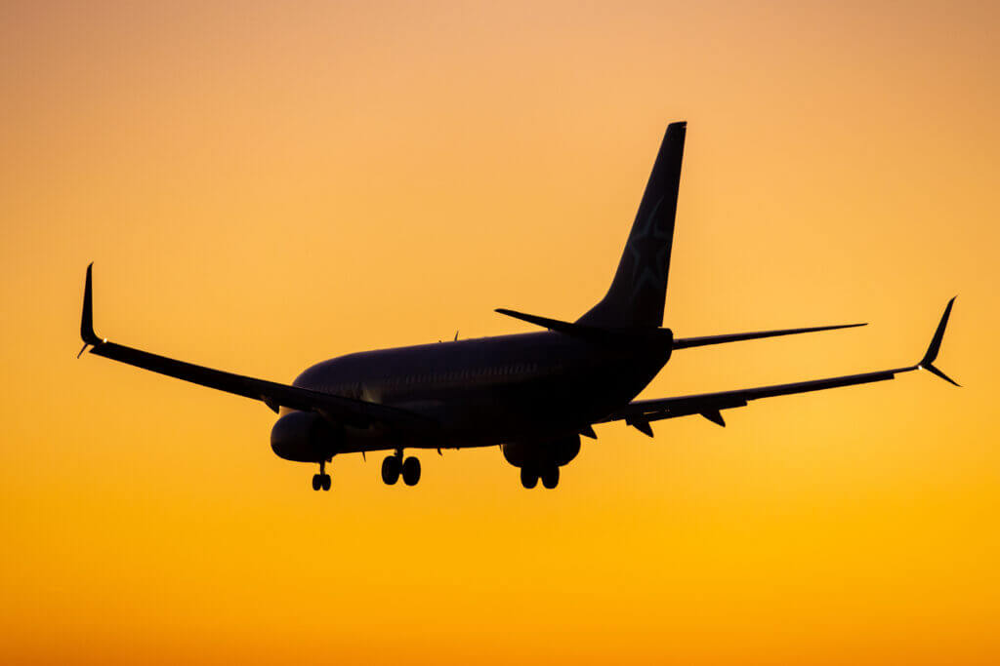

Most people fly on planes to go to different countries for travel, work, to meet others, etc. We need airplanes to travel long distances. Then, how do we fly? Understanding how airplanes fly not only explains the mechanism of scientific innovation, but it also shows the greatness of human innovation that can fly anywhere under better conditions. So let’s deeply know about the structure of the airplane and how they fly with the support oflifts, angle of attack, thrust, drag, etc. 

First, I will talk about the shape of the airfoil. The airfoil has a special section: its leading edge is round, and the upper side is longer and curved, but the underside is relatively flat. Moreover, the trailing edge is really thin. Because of this structure, the upper air can pass through longer pathways, leading to faster air speed and lower pressure. This is the Bernoulli principle. It claims that faster speed leads to lower pressure, and vice versa. Then did the planes only apply the Bernoulli principle? Actually, scientists explain that both the Bernoulli principle and Newton’s principle are required. Newton’s third law is especially important: “for every action, there is an equal and opposite reaction." This is another key explanation of the force of gravity. 

The airplane also needs the angle between the wing and the airflow, which is called the angle of attack. If the angle gets large, they push more air downwards. But if it gets too large, then the airflow is separated, causing turbulence as well as a rapid decrease in lift, which is called stall. Once the plane is in stall, the wing can not generate sufficient lift. 

The most important element that operates an airplane is thrust: the principle of the engine. Jet engines’ mechanism intake and compress the air, later causing combustion when high-pressure gas is injected backwards and is mixed with fuel and high temperature. This is based on Newton's third principle. If they push the air strongly, the airplane goes forward. Then why doe sthe airplane get slower? It is because of the drag. Drag is not simply ”air resistance.” There are various types of drag. First, the parasite drag is caused by the airframe surface friction and the shape of the airplane. Second, the induced drag is caused during the generation of solar energy. The airplane reduces drag through its sleek design and shape, folding the landing gear and minimizing the flap.  

This leads to another question: how can planes fly at high altitude? There is a logical reasoning behind it. If the planes fly at high altitudes, the air density is reduced, and the lift is also reduced; therefore, they fly faster or widen the side of the wing. The high altitude helps reduce air resistance and increases fuel efficiency, so business aircraft usually fly at about 30,000~40,000 feet. But we also need to control the surface to control the airplane. There are three main ways to control the plane. Firstly, Ailerons can make rolls that place both wing tips, which looks like small wings. They control the rudder that makes the airplane move left and right. For example, if we want to slant to the right, then the right side of the aileron goes up, and the left side of the aileron goes down. But how are they being slanted? It is because the right wing’s solar energy is reduced and the left wing's solar energy increases. Secondly, the elevator makes a pitch that places the rear of the tail wing and pitches the nose, the front section of the fuselage, up or down. If they raise the nose, then the elevator goes up, and the air presses down on the tail of the wing, which lowers the tail and raises the front part. If they lower the nose, then the tail gets raised, and the nose goes down. In other words, the elevator controls the airplane's angle of climb. Lastly, they operate the rudder yaws in the rear of the vertical stabilizer, left and right. For example, if they want to turn to the left, they move the rudder to the left side, and the air pushes the wing to the right side, which turns the nose to the left. But there is one important thing. The airplane doesn’t only use yaw to rotate the side, because then, the airplane moves slipperily, so real rotation uses aileron(roll) and rudder(yaw) together. This is called a coordinated turn. 

There is also anauto system, which is the auxiliary system, which is called autopilot. The sensor measures the speed, altitude, and inclination, and the computer automatically controls the surface. They move stably without the intervention of the pilot. 

All of these introduced today are still used in aviation. The inventors are trying to make the airplane more stable and comfortable to travel from country to country. Focusing more on aviation can improve our future
