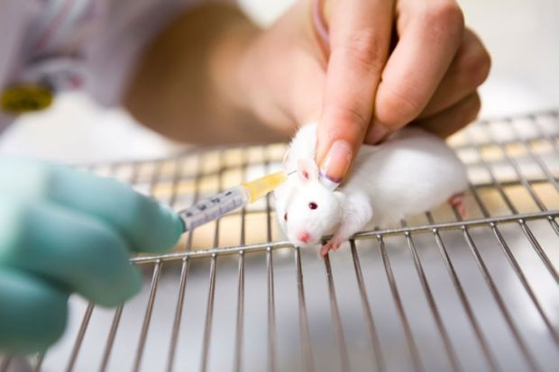

## Animals Born for Experimentation
Scientists use animals to develop medicines for human diseases, to determine the cause of diseases, and so on. This is to find out beforehand whether the drugs under development actually work on humans and if there are any side effects. Today, the animals used in these experiments are called lab animals.

Depending on the type and method of the experiment, most animals such as rabbits, rats, birds, mosquitoes, and cockroaches can be used as lab animals. They are sometimes caught in the wild and used for experiments, but recently, there are many cases where they are born with genes engineered or with specific diseases for better experimental results.

Animal testing first began in ancient Greece. It is known that Aristotle first dissected animals to reveal that animals had different organs. In the second century, Galenos, a surgeon, dissected monkeys, pigs, and goats to discover what hearts, bones, muscles, and brains looked like and their function. These were instrumental in the development of medicine until Besalius dissected human bodies in the 16th century.

## Do We Have to Do Animal Testing?
### It is necessary for human life and safety!
Animal testing is the process of using human-like animals to find out whether new drugs are safe and how certain diseases occur. Animal testing is important because it is possible to find out in advance what new substances are safe or not for our bodies.

For example, if a newly created drug is used on a person without knowing whether it is safe, it can harm the people's health. To prevent this risk, we are testing animals instead of humans. Therefore, it is mandatory멘데이토리 to conduct animal testing on drugs, cosmetics, and daily necessities네쎄씨티스 that directly affect human health before applying them to humans. Through this, the Ministry of Food and Drug Safety approves the sale of products only when they are safe.

## Is cruelty okay for science?
A problem with animal testing is that some experimenters treat animals in cruel ways. Recently, scientists at the Institute of Environmental Sciences in New Zealand tested five live pigs on a table and then shot them. It was to see how blood splatters when a person is shot.

Since then, the research paper has been published in the Journal of Forensic Science, an international academic journal, and the international animal protection organization PETA criticized that "the experiment method was very cruel and it was not a necessary study as similar experiments have already been conducted."

## Are There Alternatives to Animal Testing?
### Eggs can replace animal testing.
Scientists are thinking about a new way to replace animal testing besides the use of organoids. One of the new methods is HET-CAM. It uses an egg that has been fertilized by pairing a hen with a rooster. The egg has already been fertilized, so when the ambient temperature is kept above 37.5°C, the yolk cells gradually divide and develop into the body of the chick. The first organ that develops here is the blood vessel.

Scientists take out a fertile chicken egg that has passed 10 days in an environment of 37.5°C and cut off only a portion of the shell on the top. Then they place the material they want to experiment with on the blood vessels they see inside the shell. As a result, blood gathers abnormally in the blood vessels inside the fertile chicken egg, causing swelling or minor bleeding, and the toxicity of the substance can be assessed by the difference in the degree to which the blood vessels are damaged.

*Listen to the article as read by the author:*

`audio: https://www.dropbox.com/scl/fi/01aszsolbzfgureziytk3/emily_0424.mp3?rlkey=74omy3z2xrm6nxfjqljnipslo&raw=1`
