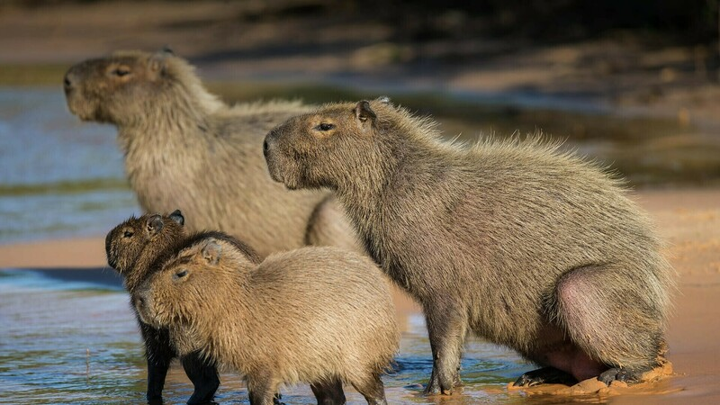

## What is a Capybara”

Capybara is the largest animal species of rodents in the world. It is more than 1 meter in size and weighs 40 to 50 kilograms on average but it can weigh up to 100 kilograms depending on the individual. It is nicknamed the water pig in South America because they like water. With black almond-shaped eyes, protruding ears, short legs, and stiff hair, capybaras have four front toes and three rear toes. What is unique is that there are flippers between the toes because they spend a lot of time in the water. That's why capybaras are sometimes called aquatic mammals. The capybaras are very large animals, but in the wild, they are at the bottom of the food chain. When they are alone, they are attacked both on land and in the water. Fortunately, capybaras have a fast reproduction rate and do not experience much attack due to their herd life. They typically give birth to five to ten cubs at a time.

A capybara, despite being an extra-large rodent, is a strangely popular creature due to its unique expression and round appearance. It is also known as a pet with great affinity. Capybaras are meek, but like all animals, if others try to invade or threaten, they might fight back. Therefore, it is better not to approach wild capybaras simply because they look cute and funny. In one Japanese zoo, a capybara even bit a monkey she was close to. Due to their personality, capybaras often raise cubs of other species. In an animal documentary on the BBC, an animal shelter in the United States showed a female capybara taking care of a group of puppies as if they were her own. This is also related to the raising strategy of the capybara. When they give birth to offspring, the entire group takes care of them. In other words, it means that the offspring of others are gently raised like their own.

## Raising a Capybara
**Food**
Because capybara is herbivorous, it eats hay, fruits, and vegetables. It is said that because of its strong appetite, in the zoo they eat two to three kilograms of food several times a day. If you raise it at home, you should prepare food as much as possible in the way capybara used to eat, and eat small portions while raising them.

**Baths**
Capybara lives mostly by the waters where the temperature is warm. It is good to make them time to relax in a spacious bathtub because they like to swim freely between water and land.

**Living Space**
Because capybara is a rodent, their teeth will continue to grow throughout their lives. Therefore, stones and trees that can cut their teeth are essential. The strength of the teeth is also strong, as it is the largest rodent. If a person is bitten, they can be seriously injured. So, if possible, a space dedicated for capybaras should be provided. It is recommended to put sawdust or straw where capybaras sleep.

