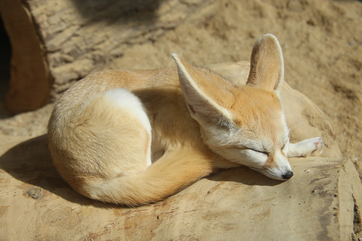

On a hot summer day, when sweat drips down your body just standing still, how do you endure the heat? Unlike us, who easily get tired from just a slight increase in temperature, there are some animals that survive through the hot sun all year round. Today, let's learn about the survival secrets of desert foxes!

The small fox that lives in the desert has a size smaller than a cat, but it has ridiculously big ears that look like big dog ears. Desert foxes look really cute but there are many questions. Why are their ears so big? How do they survive in such a hot desert with such soft fur?

## Where do desert foxes live?
Desert foxes are the smallest species among foxes. Even when they are fully grown, they weigh about 1.5 kg and are 36 to 41 cm long, so you can imagine how small they are. Desert foxes live in North Africa, including the scorching hot Sahara Desert. They are fully adapted to live in dry and hot conditions. But as global warming makes the Sahara Desert hotter, even these heat-resistant foxes have a harder and harder time fighting the heat.

## Why are their ears so big?
Desert foxes have a small body with big ears sticking out. One side of their ears can grow up to 15 cm, which is not much different from their entire height. Why are they so big? That way they can hear prey approaching better! Desert foxes have very good hearing so they can even recognize the sound of small insects moving under the sand. They listen to find the exact location, and then they dig exactly where the prey is. Not only that, they can survive well in the hot desert, thanks to their bat-like ears. They release heat through their ears to regulate their body temperature.

## Wouldn't it be too hot?
Most desert animals, like desert foxes, are ironically covered with dense fur. They even have fur on their feet! Fur in the hot desert
may seem silly, but you need hair to survive. Even though the sun burns like a ball of fire during the day, it gets incredibly cold during midnight. That's why you need hair to stay warm after it becomes dark. Not only that, the hair is also used a lot during the day. If you don't have thick fur on your skin, it will burn out quickly. Hair on your feet is also necessary to get around in the desert. If you've ever walked barefoot on the sand on a hot day, you would know why. The sand gets unbearably hot under the sun.

## When do we usually do activities?
Desert foxes keep their bodies cool in the hot desert, but they can't help it when it's hard to get around in the middle of the day. So they barely move during the day! They dig into the sand using their soft feet, go in there, curl up, and take a nap all day. Then, when it gets cool at night, they come out of their burrows and roam around.