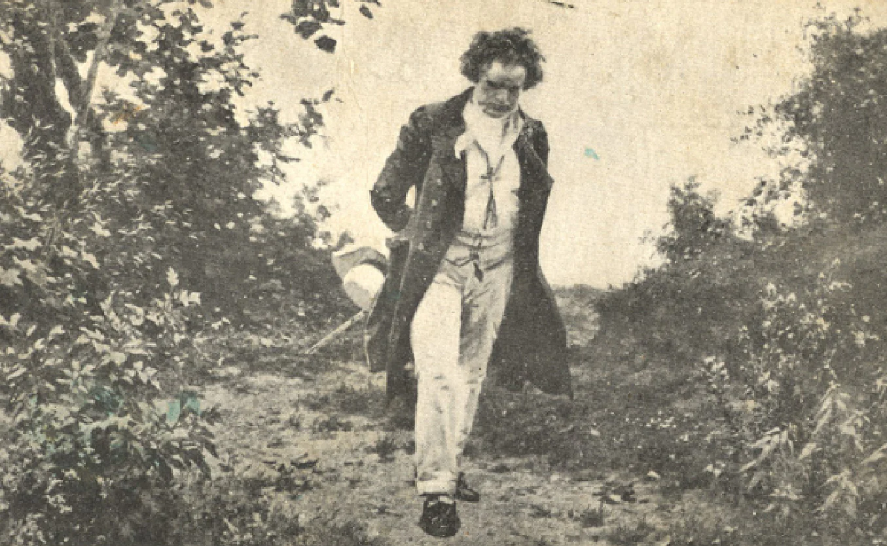

Think about popular classical music composers. You may think of your favorite or the one that you know. Most people think of Ludwig van Beethoven. He composed many famous pieces like “Fur Elise” and “The Destiny”. However, Beethoven is also famous for his deafness. Then, how did Beethoven compose when he couldn't hear?

Beethoven was born in 1770, but he wasn’t born deaf. Also, it wasn’t that he suddenly couldn’t hear one day. His symptoms started when he became an adult. However, we don’t know when it started and the cause. From early on, he was both a composer and a pianist. It is estimated that Beethoven had problems with his ears around 1796, when he was 27 years old. Playing music without sheet music is called improvisation. Beethoven was famous for improvisation because he was very good at it. For him, music just came to his mind without it being played.

Beethoven became more famous when he released Symphony No. 1 in 1800, but his ear problems became more serious. He had to get closer to hear an instrument, and he couldn't hear when others spoke quietly. Because of this, Beethoven developed depression, became less talkative, and did not want to meet people. As a composer, he thought his life was over, so he wrote a suicide note and planned to kill himself. Later, he wrote a will, which is known to have been written in 1802. The document is called the “Heiligenstadt Testament” because it was written at Heiligenstadt, Vienna. 

Even though it was such a desperate situation, however, Beethoven didn't give up and continued to compose. He used hearing aids to listen to the sounds better, but they didn’t help due to poor performance back then. He held a wooden stick in his mouth and pressed the keyboard with his hands on the piano. Since he couldn't hear well, he composed by feeling the vibrations of the piano. After all these efforts, he created the same quality music as before: Symphony No. 3 Hero in 1804, Symphony No. 5 Destiny in 1808, and Bagatelle No. 25 Elise in 1810. Beethoven’s music made at this time used a lot of low tones, and some experts say that he intentionally used low tones, reflecting on Beethoven's situation of not being able to hear high tones. After 1813, when he became completely deaf, he used a lot of high notes again. From this point on, he had no choice but to rely on his imagination. However, he was able to use his natural talent and skill developed through improvisation. Because he played the piano for more than 30 years before he became deaf, he knew how music would be played just by looking at the score. Diabelli Variations in 1823 and Symphony No. 9 in 1824 are all music that was made while he was deaf.

When Beethoven died in 1827, people saw hepatitis and pneumonia as his cause of death. However, after analyzing his hair recently, it was found that he died from lead poisoning. Beethoven is now regarded as a historical figure for overcoming his limitations, as well as for composing great music.

