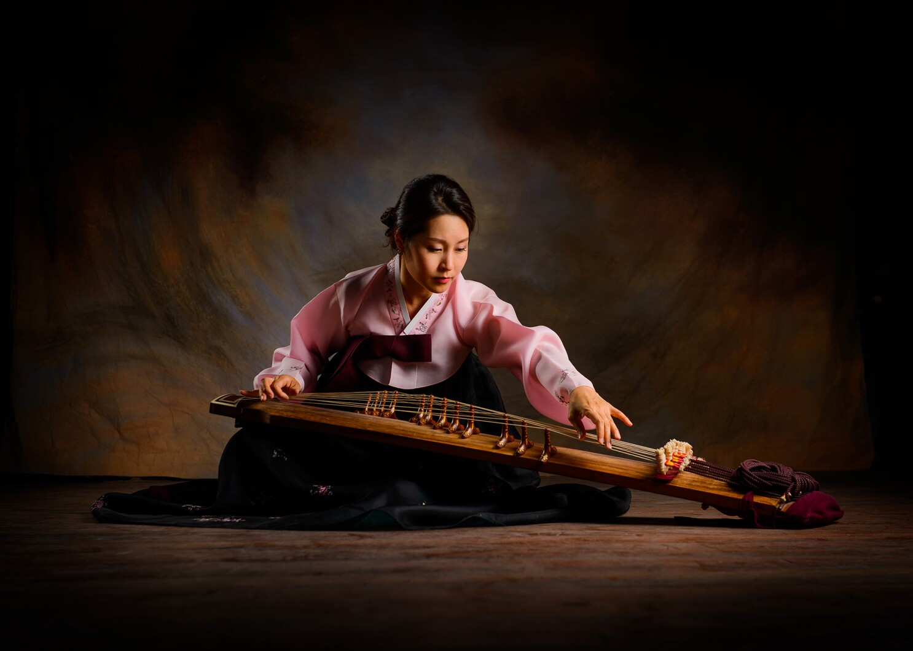
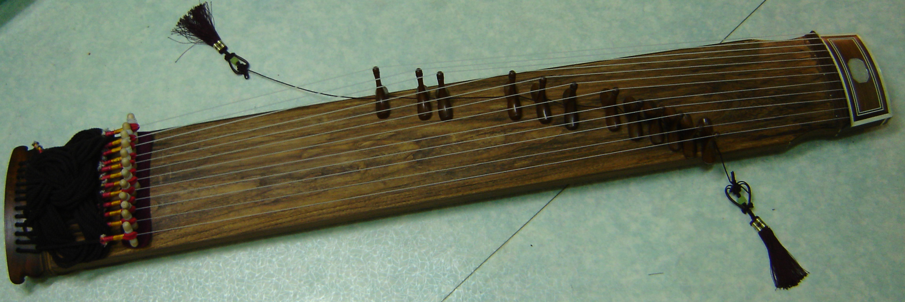

## What is a Gayageum?
The gayageum is a national string instrument unique to Korea. It is today called the gayageum but that is a name that comes from Chinese characters, and the pure Korean word in old literature was always “gayatgo.” On a narrow, long resonance plate made of paulownia wood, twelve strings of silk threads are attached, and there are small wooden pieces that could be easily moved while supporting each string. The player sits cross-legged and plays with the right end of the resonance plate on the knee and the left on the floor. While flicking the strings with their right hand, they shake the strings or press it with the left hand to vary the pitch and sound.

The gayagum has a tone that is clear and elegant, and its performance technique is diverse, so it can be used in many ceremonial and folk music. The gayageums used in aak or jeongak are called the beopgeum or pungryu gayageum, and those used in folk music, especially sanjo, are called the sanjo gayageum. The beopgeum is considered the original instrument, and the sanjo gayageum was changed from the beopgeum with the emergence of sanjo at the end of the 19th century. It is much smaller than the beopgeum.

## What is the Origin of the Gayageum?
According to “Samguk Sagi,” the gayageum was made by King Gasil of the Gaya Kingdom in the 6th century after seeing guzheng, an instrument from Tang Dynasty, and ordering a musician named Ureuk to compose 12 songs. After that, when the Gaya Kingdom lost power, Ureuk surrendered to King Jinheung of Silla with the gayageum. However, considering that the instrument was found in Silla's potteries that are believed to be from before the 4th century, and that there was already a unique Korean string instrument during the Samhan period, the gayageum is thought to have further developed under the influence of Chinese instruments around King Gasil’s time.

After King Jinheung, the gayageum was widely distributed throughout Silla, and the number of songs played with it reached 185, becoming greatly loved by royals and normal people during Goryeo and Joseon periods. With the creation of sanjo gayageum by Kim Chang-jo at the end of the 19th century, traditional gayageum was created and widely distributed.

## What is the Structure of a Gayageum?
1. The resonance plate called gongmyeongdong is tied with twelve12 strings made of silk threads, and the strings get sequentially thicker.

2. A small support on top of the resonance plate is attached, and one end of the string is threaded into 12 small holes next to it and is fixed to a small wooden stick called a dolgwae on the back of the plate. The other ends of the strings are tied on the hyun-chim and sent under the gongmyeongpan each to be tied with 12 ropes called budeul.

3. The budeul is also threaded and pulled through 12 holes at the tail of the lower resonance plate to fix the string tightly.

4. For each string, there is a wooden piece called the anjok that is placed in the middle, and it moves from side to side to adjust the length of the string from hyun-chim to anjok. Thinner strings use anjoks that are shorter in height.

*Listen to the article as read by the author:*
<iframe width="800" height="450" src="https://www.youtube.com/embed/K4VeAgYz4Hw" title="Emily Jeon - December 2023 - TCA Journal" frameborder="0" allow="accelerometer; autoplay; clipboard-write; encrypted-media; gyroscope; picture-in-picture; web-share" allowfullscreen></iframe>