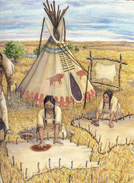

These days, Native Americans and American relationships are complicated, and which is still evolving. There were many attempts and efforts to get to this point. The following paragraphs will discuss how we could end up in our current relationship.

These days, numerous misunderstandings persist about Native Americans. To illustrate, certain people are conflating Indians and  Native Americans to be the same, due to stereotypes, when they are two different ethnic groups. First, in the 15th century, Columbus found the American continent, which he misunderstood to be the Indian continent, and called the Native Americans ‘Indians’. These words can be disrespectful to Native Americans. The term ‘Indian’ reflects a colonial mindset, which offends Indigenous people. Americans are trying to use words like indigenous peoples, native people/community, or some words that don’t point to Indians in modern days. 
For another instance, some people say the Native Americans have already passed away. Native Americans still exist, and Native Americans and Americans are both trying to communicate and build relationships with various tribes. The various tribes are almost absorbed into the society, tolerance of each other. They shouldn’t forget that Native Americans are still alive.

As previously mentioned, Native Americans are made up of various kinds of tribes. Based on history, about 15,000 to 20,000 years ago, people from Asia began migrating to America by crossing the land bridge. After the establishment in America, Native Americans started developing their own cultures. 
The Cherokee tribe is one of the most popular and significant tribes. Early on, they used the language called Iroquoian. Soon, the Cherokee man created an alphabet called Sequoyah, which is still used in modern days. The Cherokees’ social structures are based on a clan system with about seven structures with animal names, such as Wolf, Deer, or Bird. They had a belief in Animism. They regard all living things, the elements, and the organisms seriously. They made most fabric used for their clothes with deer. Women wore skirts and leggings. Men wore breech clothing with leggings. They prefer crops they can farm, and they make their habitats as small as they can.

First, the Native Americans had harmonious relationships with the Europeans. The Native Americans assisted Europeans in doing the essential things in life, such as living in nature, and how to give a ceremony in a tribe's own style. Europeans have also brought in some new implements to help them develop their tribes. But over time, they went through misunderstandings and conflicts between them. The main reason was the land. Native Americans stated that the country’s territory should be shared with everyone and used together. Based on their lifestyle, they used nature as a main resource. They were supposed to maintain the mindset to protect nature. Europeans started to take lands violently. Europeans tend to ruin the supplements the Natives used. They usually hunted deer and beavers for fur and trade. They were familiar with the money system. Native Americans didn’t trade animal resources largely, and the tribes depended on these animals to survive. The Europeans’ hunting was undue, and the traditional hunting areas were gone:  the treaties between them had been broken down. The Europeans tried to destroy the native religions and traditions,  making the Native Americans disillusioned. As Europeans visited other countries, they spreaded diseases such as smallpox, which killed millions of native people. They became a relationship where no one could be trusted, and treated with respect or consideration. 
These behaviors between them have naturally caused a war.  Native Americans couldn’t make this choice because they didn’t have enough power compared with the Europeans. 

There were several wars during the time: King Philip’s War, Black Hawk War, the Seminole Wars, etc, which were all pretty big wars. The King Philip’s War, also known as Metacom’s War, took over from 1675 to 1676s. The Wampanoag and the Narragansett tribes were especially active. They fought with English colonists (European settlers in New England). Like the War’s name, King Philip, King Philip was the English name for Metacom. Metacom was the chief of the Wampanoag tribe, with a strong determination to protect the Native land and cultures. The English colonists were taking lands from Native Americans, and the native americans were suffering under the English laws. Metacom’s brother died under \English law, but the laws kept growing worse. In the 1675s, they decided to attack the English settlements. The town was burned, and thousands of people died. The Native Americans were able to win, even though the English had numerous weapons. Eventually, Metacom was killed by the English, and most residents and survivors had been enslaved or died. These days, people remember this war as a significant war and one of the deadliest wars. 

People still remember the suffering that the Native Americans went through at the time. To come to this point, there were lots of people’s opinions about the Native Americans and the negotiation between them. 
As the Native Americans saw the lives of the Europeans, they adapted to them. They used European products and goods to live, forming another way of living. The government has also created reservations for Native Americans in the 1800s, forming trust and dignity for both groups. People are constantly thinking about a peaceful solution for everyone. They wrapped themselves to look like the people protecting the Native tribes from the whites and their violence. However, there was a dark intention hidden. The land that they gave was often poor and small, almost decayed, and they didn’t allow the Native Americans to live in the place. The laws have also changed, dictating them. The efforts of the native people were called the “Trail of Tears”. There once was a rule called the Bureau of Indian Affairs, BIA. The BIA was also almost a fake affair. The BIA made it necessary learning about the native americans and their culture. Even though it was limited to speaking their native language and sharing their cultures, the BIA system has made people who truly care about the Indigenous people. The government gave more self-government systems, and ended forcing assimilation policies. Some tribes returned the land, but the Europeans were still offensive.

As time passes by, they are not as violently being forced as they were in the past, but they still face serious problems and unfair treatment. Still, the rights of the native people are being more respected. Native American tribes became sovereign nations;  they are countries inside the U.S. Their society has the same system as the U.S: they run schools and health services. 
Also, they celebrate  Thanksgiving Day to celebrate their pain. This is a day of thanks for the native people assisting the Europeans at their first arrival. When they first arrived in America, they had difficulty growing crops. The Wampanoag tribe helped the Europeans crib on hunting. Thanksgiving was made to celebrate the beneficence they had. The first Thanksgiving was celebrated in 1621s for three days, with both the natives and Americans together. However, they are being criticised because some believe that it was the start of the Indigenous people’s suffering. Thus, some people celebrate Thanksgiving as the “National Day of Mourning.”

Even though the quality of life improved, they still face problems such as poverty. Many reservations for the Native Americans have been lazy. Because of unstable employment, education was limited. The most serious problem was that if the native people got kidnapped, disappeared, or were hurt, the American police did not give them enough help. Problems with lands and cultures also exist. Some land that is frightened to tribes is being used for oil drilling or mining, which causes protests and waste. The indigenous people are also trying to revive their culture. Like I mentioned earlier, people are trapped in stereotypes. Although it may not be forced as it used to be, the pain of the native people still has an effect in modern days. 

The Indigenous people faced numerous pains we can't understand, and many of them are proud of who they are. They are the keepers of the strongest cultural identity, and their deep connection to the land> There are also many modern achievements of the native people. They work for their tribes and keep their mindsets together. All of these have widened the range of things they can achieve. Native Americans today are artists, doctors, athletes, scientists, and leaders. The relationship between the indigenous people and Americans is still improving. Americans should listen to the voice of the indigenous people and let them enjoy their freedom!
