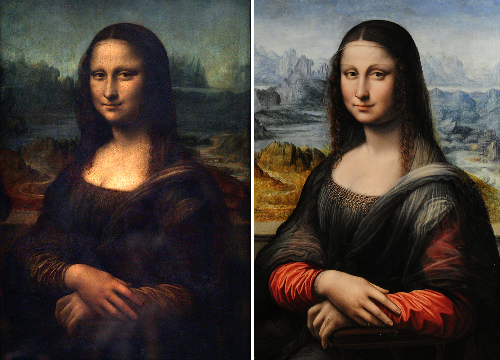

###### *Original Mona Lisa and Mona Lisa by Leonardo da Vinci's student.*

Mimic work refers to copying other people's paintings. It includes both tracing, which follows the trajectory of the stroke as it is, and imitation, which is drawn by looking at it with the eyes. However, it is sometimes considered better to indirectly imitate others’ work by taking a rough composition and description than to trace them directly, which is a phenomenon caused by very sophisticated and simple tracing using digital painting. Therefore, when expressing copy separately from tracing, it sometimes refers only to "reinterpret and draw the picture you see inside yourself without placing the work to be copied under the bottom layer of graphic software or oil paper."

Making a copy work itself does not constitute copyright infringement. This is because copyright law protects tangible expressions, not intangible ideas. For example, it is difficult to say that the act of taking only a small part of the picture, such as the straight line of the frame and the wrinkles of the clothes, infringed on the copyright of others. However, if a work similar to the original is created and published through imitation, it may be regarded as infringement of copyright. 

It is called forgery that deceived the identity and made it false. Like imitation, it is an act of copying and drawing, but the difference can be distinguished by whether or not the original work or the author of the original work is impersonated while drawing the work. It is free to imitate other people's works and reveal them for practice, but it becomes a problem if people say that it’s their idea entirely or impersonate it as belonging to a famous writer, not the original author. 

It is one of the tasks necessary for creative training and an important study to improve drawing skills. Regardless of modern art such as graphic design or classical painting, this imitation is a must-have curriculum if you are learning painting. This is because in the process of analyzing and mastering the techniques of other artists is very important, and the most obvious way to do this is to draw it right away.

It is fast to study through tracing when you have no sense of painting at all, but after you develop some sense, what you can learn through tracing decreases. From then on, you can get more from studying by imitation. It is a process of studying by looking at professionals' paintings, so observation and painting skills develop significantly. Aside from the effectiveness of imitation, it is a process that most people use to self-study painting.

The important thing is to remember what you learned from copying. Rather than practicing mechanically by increasing the amount of imitation practice, it is better to remember what techniques you learned even if you copied a small part of the painting. However, the more imitation you do, the more techniques you naturally learn, so it is not always too bad to increase the amount of copying. In particular, it is helpful to recreate your own work to  review and utilize what you have learned. If the technique or description of the mock work naturally came to mind, it was learned correctly through the mock work.

People often say as your drawing skills improve, the difference between your copy and the original drawing will be less noticeable, but this is not necessarily correct. No matter how excellent a copy is, if you draw it after seeing it, it is worse than the original drawing from direct observation. Even famous artists cannot copy their own paintings exactly the same. Obviously, if your imitation skills are very good, you can draw so similarly that you cannot distinguish between them when looking at each one individually. However, when viewed side by side, the discrepancy becomes more apparent. That's why there is a big difference between copying by looking at and tracing by drawing. The painting above of Da Vinci's student imitating the Mona Lisa is an example.