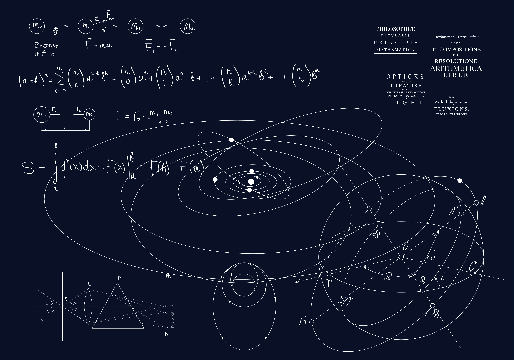

In order to understand theories and mechanisms of physics, like the Mechanical Theory-1, understanding the early period of physics is essential. Mechanical Theory is known as the basic concepts and principles of physics. It is valuable in daily life and scientific research. Essential components of mechanical theory include Newton’s Three Laws and the concepts of forces, speed, and work.

The primary concept of physics is “Measurement.” It is required in dealing with liquid, length, and solid amounts. Also, there are two measurement systems in real life, the English System and SI Units. The English system is used for inches, feet, yards, and miles to measure the length and width in America, usually, but SI Units are mostly used for nanometers, micrometers, centimeters, and kilometers, which are used in every country except the US and Canada. Speed is also an important concept in mechanical theory. Dealing with speed and velocity usually involves using a triangle table that is used for distance divided by time measurement. Specifically, acceleration, deceleration, and constant speed are known as increasing speed. Density is one of the top three most popular concepts that measure how full and compact an object is. For example, assuming there is a 1cm^3 aluminium cube on the desk, after measuring the weight of the object, the density of the aluminum cube could be calculated. It will approximately be 2.7g per 1 centi cubic meter. The specific equation to solve for density is mass/ volume (cubic meters), which is 2.7/1 for the aluminum cube. So the density will be 2.7g/1cm^3. Finally, the principle of friction states that forces are the push and pull that power both human and machine actions, or even natural forces like wind. For example, consider a student named Jerry. He pushes a box, and as a result, the box is moved by the force he applies.

In detail, there are three important concepts about friction and forces: Newton's Law. Newton’s Law is the key concept related to velocity. Velocity is similar to speed but has direction: east, west, south, and north. Newton’s first law is known as the dependent force. For instance, this theory is most usable when a cart is moved or an object is used. When the cart crashes somewhere, the object will stop due to friction, and the cart’s pusher will fly over the crashed object, which will add some speed. Newton’s second law is known as acceleration or deceleration. For example, assume there is one soccer ball and a student on the school ground. Suppose the wind comes from the west, and the ball goes to the east (right). However, when the ball is kicked 90 degrees (the east direction), the force accelerates the soccer ball when it's kicked. Then, it will gradually decelerate when the force is not adding velocity anymore, soon coming to a rest. Lastly, Newton's third law deals with rest from opposing forces. This occurs when the velocity from -a + a is equal to zero. (a is known as their forces and speed of their opposite velocity). For instance, assume you are A and your best friend, B, is in a flat grassland. If both of you held the same rope and both pulled in the opposite direction with the same forces (power), the rope will not move anymore in one direction, which is the velocity in ‘at rest’ period.
