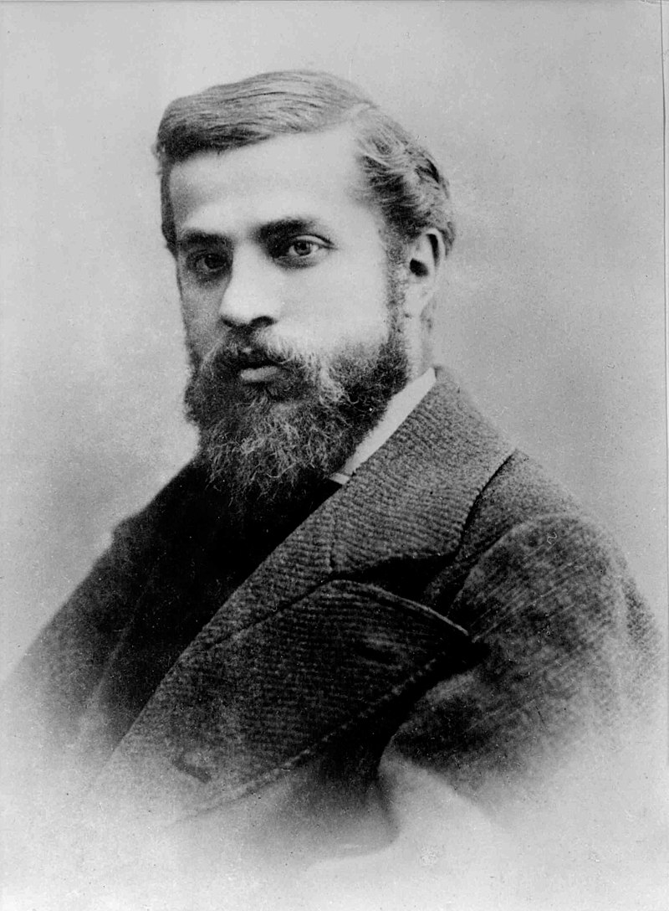

## About Gaudi

Antoni Gaudi (1852~1926) was the greatest architect in Spain. He built a lot of Spanish architecture and made a lot of glass and iron parts to make them. From 1984 to 2005, seven of his works were declared world heritages by UNESCO. In this article, I will talk about Antoni Gaudi’s works of architecture.

## Early works
Gaudi’s first works were created during his student days for his graduation. He used geometry and the mechanics of constructions to build four of them in 3 years.

When Gaudi finished the four works, he started his professional career while in university.
After studying and building more architecture, he graduated from his university in 1878. After graduating from university, Gaudi worked to make a living for 1 year and 6 months.
As he worked on a lot of projects, he made four architectures. Its names are Lamp Posts, Girossi Newsstands, Esteban Comella, and Farmacia Gilbert. For 4 years, Antoni Gaudi made a lot of things on a lot of streets. 

## Making Big Cathedral
In 1882, Gaudi had the plan to build a new cathedral, so he designed a church to make. Unfortunately, it was destroyed in 1936, but Gaudi went on to make more special architectures.

## Orientalist period
During this period, Gaudi did a lot of orientalist works in Spain from 1883 to1888. These are based on the Spanish patterns. He built five architectures that looked like Western houses. 

## After 1889
After 1889, Antoni Gaudi made neo-Gothic projects for 20 years.
He made important buildings and became successful. He originally used Gothic styles, but he wanted to construct some neo-Gothic buildings also.
There are five examples of such buildings.

## Teresian College

The first example is Teresian College built in Barcelona. It is crowned by merlons. The College was successfully completed recently.

## Episcopal Palace

Second example is this palace. Gaudi received his commission from clergymen who had been his best friends in Reus. 

## Casa Botines

Next is the Casa Botines in Leon, and it was commissioned by the city manager who wanted to make a magnificent tower. It was built in 1894.

## Bodegues Güel

In 1892, Gaudi was commissioned again. This time, it was to make a winery, and it was completely built by 1896.

## Torre Bellesguard

Lastly in 1895, he designed a big castle and built it for 12 years which was one of his hardest projects.

Antoni Gaudi had a lot of failures, but he also had a lot of success with his palaces.