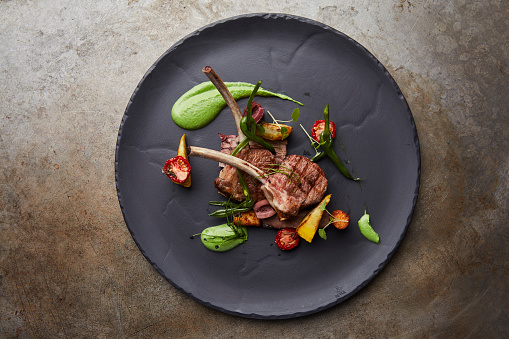

These days, there are many aesthetic and royal foods being served in some restaurants. Also, these types of foods are accurate and seem ordinary. It is “Fine Dining”, which is decorated with beautiful foods. It could be vegetables, sauces, fruits, and other foods. It can also be fast foods like hamburgers or French fries etc. Additionally, it is really expensive and looks like royal food. The following picture shows why: 

Therefore, let me talk about fine dining’s history first.

Ancient fine dining was established in Mesopotamia and other civilizations. During these periods, they used the food for their religion at first. But as time passed into the future, more religious foods were formed. For this reason, some fine dining is derived from religions. Second, in medieval Europe, they made more advanced foods for kings, queens, and servants. Furthermore, in this period, there were some basic things that happened in fine dining, also. For this reason, the Renaissance period developed fine and advanced foods for that reason. During the Renaissance, the culture formulated fine dining. This is because, in that period, culture and art were the most important things of all. So they used art to make better-advanced food to establish fine dining slowly. 

The official Fine Dining was established in 1782. There, it was specially provided for kings and queens in Western Europe. For that reason, every fine dining chef was also a royal chef, which is a king’s chef. But after the 1700s, there were developments of fine dining which were established in advanced restaurants in France and other Western European countries like Spain, Italy, etc. Later in the 19th century, there were more professional fine-dining restaurants. In these foods, the style became more modern, like using sauces, spices, etc. 

100 years later, the Michelin guide began. In the Michelin guide, there are 3 stars, which began in 1926. First, “One Star” is a bit of fine dining, which is not that professional. Second, “Two Stars” is a more professional and somewhat fine dining restaurant. But greatest of all, the “Third Stars” are the most professional, beautiful, and royal Western food there. Thus, many people came to the fine dining restaurant that has now become popular. But better than the 20th century, the 21st century is more unique and special due to big technological innovations. This is because Eastern foods are designed for fine dining, like Chinese national foods, where one can experience royal Eastern foods. For that reason, the unique parts are grown at last. 

In conclusion, history suggests that there are significant distinctions between ancient fine dining and present-day fine dining. Unlike ancient days, people can easily access fine dining if they visit the restaurants. Shortly, I hope fine dining will be spread to develop African fine dining.