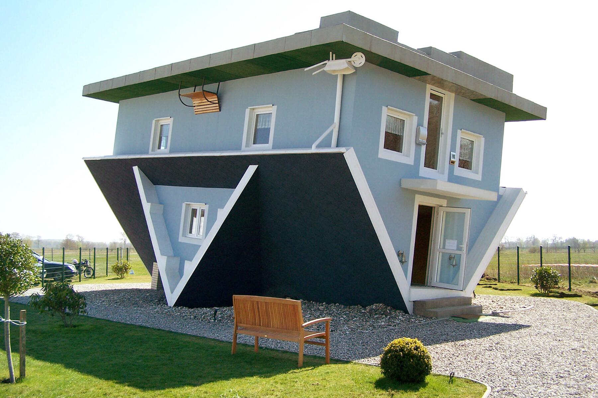

There are many architectures in the world. However, some architectures are very weird. Why do people make weird architectures in the world? Also, these architectures are so out of place. Today I will introduce some weird architectures and their origins.

## Origin
When did weird architecture begin? Funnily, weird architecture started in the dawn of civilizations. From then, societies made more of them.

## Kansas City Library

The Kansas City Library is famous for its weird architecture in the U.S. It has an interesting design of book covers. These books are Kansas City Library’s favorite books. The library was established in 1873, but this picture shows the new construction completed in 2004.

## Big Basket

The Big Basket building is the headquarters for a company in Ohio called Longaberger. It was built in the woods to sell lifestyle products. This building was completed in 1997. The building has 7 floors, and its top is the handle of the basket. The building cost about 6.5 million dollars.

## Upside Down House

The Upside Down House is another weird building in the world. It looks like a normal house and has ordinary objects inside, except that everything, including the doors, are upside down. For these reasons, the upside down house has a lot of features that are very famous.

## National Center of Performing Arts (Beijing)

The National Center of Performing Arts is also weird. Its special feature is the reflection of the dome on water that surrounds the building. The building opened in 2007 and has an area of 165,000 square meters.
The building is sometimes used for opera and theater. You can visit there with a lot of money. 
Conclusion

In conclusion, I talked about the world's weirdest architectures. I think, these days, architects are making more weird architectures. I think weird architecture is good for humans.