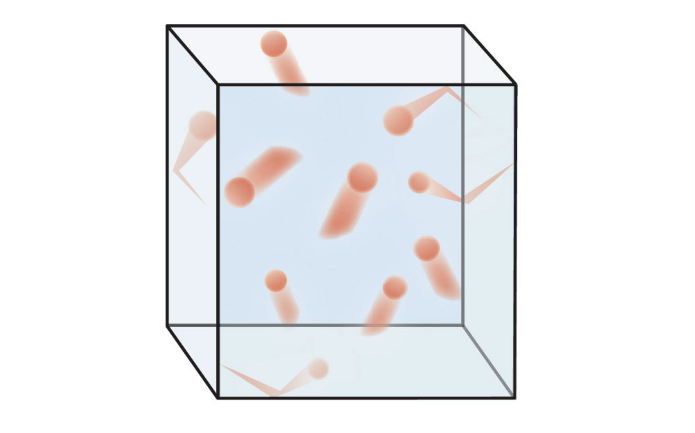

# Introduction

Do you know what the kinetic theory of gasses is? It describes a gas as a large number of particles that are too small to see without a microscope for random motion. Their collisions are physical and move freely. For example, the atoms or molecules of the particles move very randomly.

# History
In 1738, one mathematician defined the KTG (kinetic theory of gasses). His name was Daniel Bernoulli. He declared any extra potential energy gained from system fluid is caused by other external work done by non-viscous fluid. He also said that great numbers of molecules moving in all directions cause the pressure of the gas. 100 years later, physicists John Herapath and John James Waterston presented a comprehensive description of this theory, and they developed the mechanical explanations of gravitation. In 1856 August Krönig made a simple model of the theory.
After 20 years of researching molecules, examples of it were made accurately. In 1857, Rudolf Clausius developed a sophisticated version of this theory. Two years later Maxwell formulated distributions of the molecular velocities for physics. Lastly, in the 20th century, KTG was accepted by the scientific community.

# Assumptions
There are five assumptions or idealizations in this theory. The first is that gas consists of very small particles and each molecule has negligible volume.  Furthermore, compared to the container, the volume is extremely minimal. Secondly, the particles are so small that they can be treated as point particles, and this is referred to as the thermodynamic limit. Third, the particles constantly collide with the wall of the container and all these collisions are elastic. Fourth, the interactions between particles are strictly uncorrelated and they do not have any memory of colliding with each other. Lastly, the forces between molecules are negligible, meaning the interactions are so weak that they can be ignored.

# Equation Formula
In this section, I will introduce the simple force and pressure of the kinetic theory of gasses through equations.

This is the derivation.

Δp = mvx-(-mvx) = 2mvx

This equation shows the change in momentum.

t=d/v=2l/vx

F=∆p/∆t

This equation has to do with the force.

F=2mvx/2l/vx

f=mv2x/l

These are equations about pressure.

p=f/a

p=(mv2x)/l2

P=mv2x/l3

These were the basic formulas for the kinetic theory of gasses.

# Conclusion
In conclusion, the kinetic theory of gasses states that particles move freely. Moreover, this theory has a deep history from more than 200 years ago. There are 5 assumptions in the theory, and using the kinetic energy equations, we can easily understand the kinetic theory of gasses. Thus, we can understand history, energies, and the movements of particles through this theory.