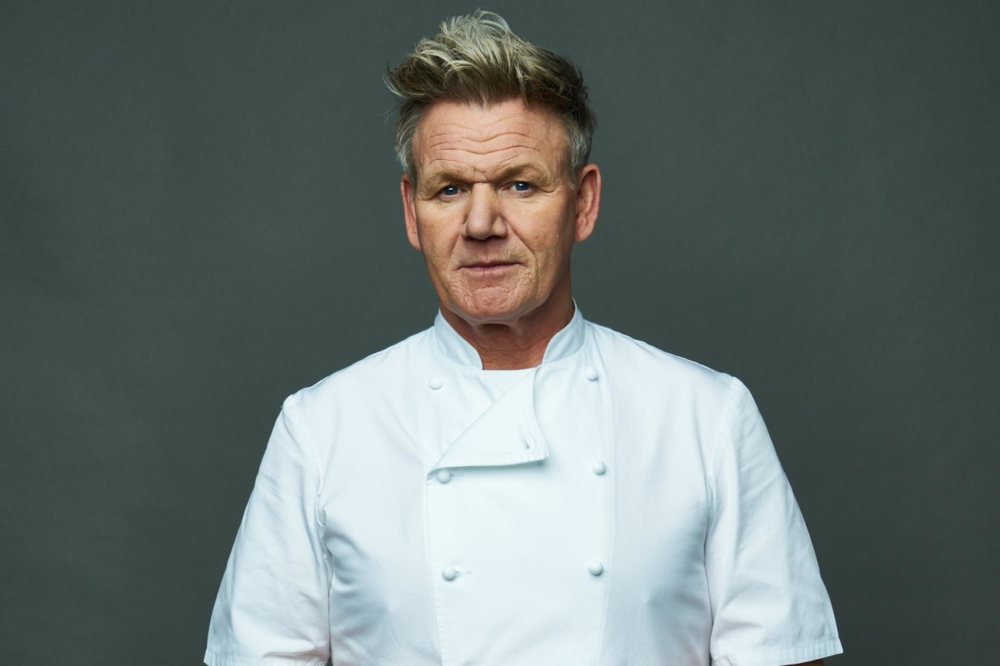

Nowadays, there are many chefs. But among them, there are only a few chefs who are globally famous. While there are a few top chefs, Gordon Ramsay and his biography are among the most significant.  This is because of his interesting characteristics and the content of his biography. 

Gordon Ramsay was born in 1965 to Gordon Ramsay Senior and his mother. In his youth, he was a youth soccer player, and his dad was addicted to alcohol, resulting in his parents' divorce. Consequently, he and his younger brother were abused by his dad because his brother started taking drugs. Later, when Ramsay became 18, he got injured in an accident that made him retire from his soccer career. When he finally became 19, Ramsay went to North Oxfordshire Technical College, studying hotel management. There, he worked as a hotel chef, and because of this, at 20, he decided to build his career as a chef. Also, when he was 20, he was employed and worked with Marco Pierre White at the restaurant ‘Harveys’ for 17 hours. 

After working for almost 3 years, he decided to study traditional French fine dining by quitting at Marco Pierre White’s restaurant. A few years later, he also tried learning Italian cuisine, which is also known as Italian Fine Dining. In 1993, he returned to London. There, he became head chef of the three Michelin-starred restaurants. After a year had passed, in 1994, he finally got his first Michelin-starred restaurant, which he later named Aubergine. As he started to manage his business, 3 years later, he got 2 stars. Later on, in 1998, Ramsay finally opened his second restaurant, named Restaurant Gordon Ramsay. In there, his father-in-law also helped his restaurant become a 3-star restaurant in 2001, finally at 35. 

Later on, he opened Petrus, and Amaryllis, his friend, worked in there. Later on, he also became a mentor in Hell’s Kitchen, which is considered the best chef among the participants. Also, he participated in another TV program, Kitchen Nightmares, which searched for the worst kitchen ever. Also in 2007, 2008, and 2011. Ramsay opened three restaurants named County Wicklow, Sunset Strip, and Montreal. But all restaurants closed before 2015. And until now, Gordon Ramsay still does his work related to preparing food.

Additionally, Gordon Ramsay is known as The World's Angriest Chef. This is because he always criticizes and scolds other chefs who are working for him. For this reason, in the Hell's Kitchen TV show, he always blames chefs. Also, Amy’s Baking Company (a.k.a. A.B.C) epitomizes how furious he turns. Since the participant did not show respect and did not organize their kitchen, Gordon Ramsay resigned from the program. 

In conclusion, despite his characteristics, Gordon Ramsay is an excellent chef. He owns a total of eight stars from the Michelin guide: he has one restaurant with 3 stars, another restaurant with 2 stars, and three one-star restaurants. Furthermore, he has many qualities that make him an excellent chef, including skilled leadership and established fame, following his unparalleled cooking techniques. 

