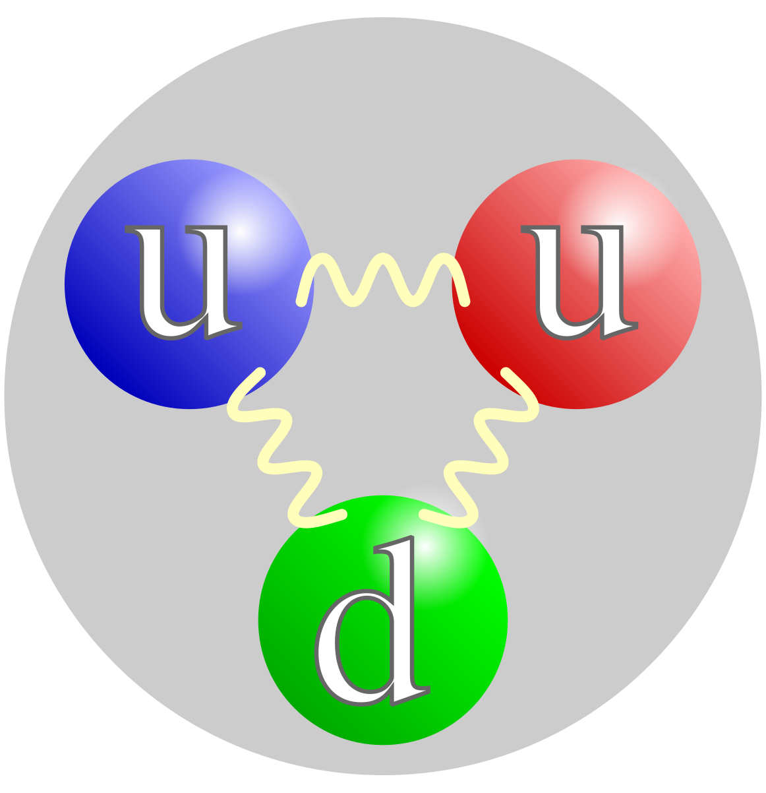

In our lives, all objects have atoms and elements inside them. Most of all, inside atoms, there are 3 things: protons, neutrons, and electrons. Excluding electrons, there are some materials that possibly could be the smallest material in the world. It’s a Quark, which is the combination of composite particles from Protons and Neutrons of an atomic nucleus. One of the scientists found models that also have many unique properties, such as electrical charge, mass, spin, and more from their properties. 

In 1964, two physicists named Murray Gell-Mann and George Zweig first discovered quarks. Which is a “Quark Model”. This model shows many properties of quarks and makes divisions of 3 generations each. This table is also used in real life in nuclear physics and chemistry. Two physicists made a table for 6 flavors (up, down, charm, strange, top, and bottom) that described gluon, photon, Z and W boson, and Higgs. It was later published in 1969 by the Stanford Linear Accelerator Center. Also in 1990, inspired by two physicists, three of the master physicists named Richard Taylor, Henry Kendall, and Jerome Friedman, received the Nobel Prize for SLAC experiences. 

As an introduction to the 2 physicists’ Quark Model, 4 divisions were made (2 are generations, 2  are interactions): Quarks, Leptons, Gauge Bosons (Vector Bosons), and Scalar Bosons. At first, for leptons and quarks, there were 3 generations: Generation I, Generation II, and Generation III. The first one is the up and down of Electrons and their neutrinos. In there, they are ordinary ones that people use. For others, there are charms, strange to muons and their neutrino, and to the bottom to tau. Also, each of the generations has color pairs of baryons red, green, and blue, which will relate to the other one with leptons. In there, they show strong interaction where color changes to the reflected color of mesons.  Second, there are Gauge Bosons of as we can list, Gluon, Photon, Z boson, and W boson. In there are the quantum numbers of hadrons, and forHiggs, it is used for other quantum theories of gravity. 

The most important one is the structure of quarks. In there, they have 7 properties. The first one is Electric charge, in there they always get a fractional electrical charge that gets ⅓ or + ⅔. The top boundary is the +⅔, and the bottom boundary is the -⅓. Next, spins are the degrees of freedom of their rotational movement. There, they also get fractions for ± h/2 that are spin-½ particles. The third one is a weak interaction; they have fundamental interactions, usually in the movement vectors of physics, that can be calculated by matrices. Despite weak interactions’ relationships to vectors, strong interactions have color changes. There are 3 types:  Meson (Anti color), Baryon (RGB), and Antibaryon (ARAGAB). In there, they carry particles of force that can also be shown in quantum chromodynamics, possibly. Fifth, there is mass inside the quark. For example, a proton has 938 MeV/c^2, and a neutron has 939.565 MeV/c^2. Sixth, they are possibly the smallest value of size. Their size is usually less than 10^-19 metres. Finally, they have 6 quantum numbers: u, d, c, s, t, b. 

Quarks are the main organic structures of atoms, similarly compared to the organs of human bodies. They had a long history of tables thanks to George Zweig, Murray Gell-Mann, Henry Kendall, Jerome Friedman, and Richard Taylor, who had a big impact on the nuclear physics of atoms in protons and neutrons. In summary, there are three generations and 5 types of bosons that are both shown in quantum physics. Another type of known quarks are Sea Quarks, and other types of quarks are still undiscovered.