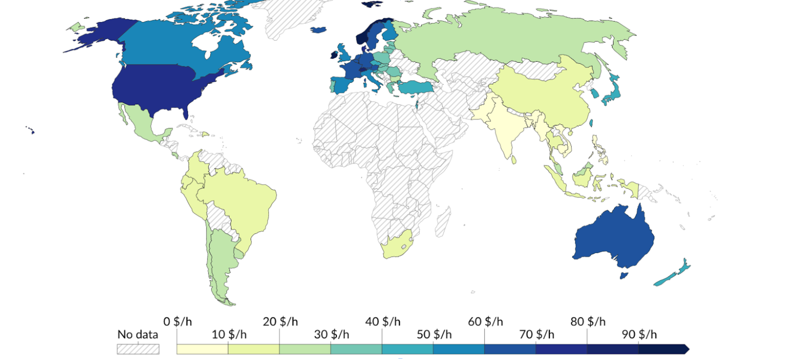

Productivity in economics is the amount of goods or services a worker produces in a certain amount of time. Specifically, it could be how much value a person creates in one hour. For example, if a worker in a cosmetics factory makes lotion worth $1,000 in 10 hours, the productivity could be measured as $100 per hour. If the other worker makes the same amount of lotion in 5 hours, the productivity would be $200 per hour. The second case has higher productivity because the worker is making the same amount of lotion in less time, meaning more efficiency. This same principle applies to national economies. Countries with higher productivity can create more economic value with the same amount of labor and capital, which directly impacts economic growth. Then, how are the productivity levels of the U.S. and Cambodia different, and what factors affect their productivity?

(“Labor Productivity per Hour, Penn World Table,” Our World in Data,
https://ourworldindata.org/grapher/labor-productivity-per-hour-pennworldtable?tab=table)

The productivity of the United States is $74 per hour, meaning it creates $74 worth of value in one hour. On the other hand, Cambodia’s productivity is $3 per hour, which means that the productivity of the United States is about 25 times higher than the productivity of Cambodia. What factors affect productivity?

1. Differences in Industrial Structure
The difference in productivity between the U.S. and Cambodia reflects a major difference in their industrial structures. The U.S. has an economy focused on high-value industries, particularly in sectors like information technology (IT), biotechnology, and aerospace. These industries are based on advanced technology and automation, which results in very high productivity. In contrast, Cambodia still relies heavily on agriculture and labor-intensive manufacturing. In Cambodia, 24% of the GDP comes from agriculture, forestry, and fisheries, and 66% of manufacturing is focused on textiles and garments. This means most economic activities take place in industries with low productivity. Therefore, the difference in industrial structure between the two countries plays a key role in their productivity levels, with the U.S. having higher productivity due to its advanced industries, while Cambodia has lower productivity.

2. Differences in Technology and Capital Investment
The difference in technology and capital investment is another major factor that increases the productivity gap between the two countries. The U.S. actively adopts advanced technology and invests heavily in research and development (R&D), which leads to high productivity across industries. For example, in the U.S. automobile industry, robots perform most of the assembly work, allowing the production of dozens of cars per hour. In contrast, Cambodia’s textile factories still rely heavily on manual labor, which reduces efficiency. Additionally, the U.S. continuously develops innovative technologies in fields such as information and communication technology, medical equipment, and aerospace, maximizing productivity. However, Cambodia has limited technology adoption and R&D investment, which is one of the main reasons for its low labor productivity. Because of the large technology gap, the productivity difference between the two countries is even more noticeable.

3. Differences in the Quality of Human Capital
The quality of human capital is another important factor explaining the productivity difference between the two countries. The U.S. consistently produces highly skilled workers through its world-class education system and vocational training programs, which are key to its economic growth and high productivity. American workers acquire high levels of skills through continuous education and training, making them well-suited for advanced technology industries. In contrast, Cambodia has not been able to fully develop its human capital due to historical political instability and the collapse of its education system. During the Khmer Rouge regime from 1975 to 1979, many intellectuals were lost, and the education system was severely damaged. As a result, Cambodia lacks skilled workers, and it takes much longer to develop its workforce. Therefore, Cambodia’s lower quality of human capital is a major factor that reduces labor productivity. On the other hand, the U.S. continues to secure human capital capable of increasing productivity through its education and training systems.

Conclusion
The productivity gap between the United States and Cambodia comes from differences in industry structure, technology, and the quality of human capital. The U.S. maintains high productivity through high-value industries and advanced technology, while Cambodia relies on agriculture and labor-intensive industries, resulting in lower productivity. The U.S. also maximizes productivity through education and technological innovation, while Cambodia faces limitations in education and technology investment, which contribute to its lower productivity.
