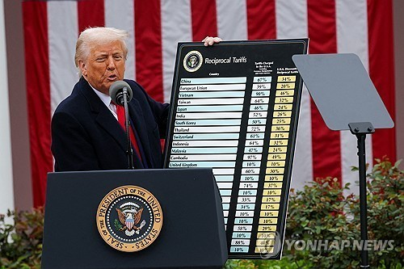

Tariffs are taxes that governments put on goods when they cross borders. They are usually placed on imports to protect domestic industries or to reduce trade imbalances. In 2025, the Trump administration raised tariffs on numerous foreign products. The primary reasons were to protect American manufacturing and to reduce the U.S. trade deficit. This issue is very important because the policy not only affects the United States but also many other countries, including South Korea. Since South Korea is one of America’s biggest trade partners, it is necessary to study how these tariffs influence the Korean economy.

The Trump administration’s tariff policy has clear goals. First, it wants to protect American workers and companies, especially in the manufacturing sector. Many factories in the U.S. have moved overseas in the past decades, and tariffs are seen as a way to bring them back. Second, the administration hopes that higher tariffs will reduce the trade deficit with countries like China, South Korea, and Mexico.

However, this policy has strong effects on South Korean exporters. Many Korean companies rely on selling goods to the U.S. However, the increased tariff makes their products more expensive in the American market. As a result, exports from South Korea to the U.S. have decreased. Thus,  various industries have been affected in different ways. For example, the automobile industry has faced serious challenges. Korean car companies, such as Hyundai and Kia, now face higher costs when selling to the U.S. This makes them less competitive compared to American car makers. Some companies are even under pressure to build more factories in the U.S. to avoid the tariffs. But relocating production is expensive and risky. The semiconductor industry was also influenced. Chips are one of South Korea’s largest exports. However, tariffs on electronic components raise costs and create uncertainty in pricing. Since semiconductors are important for many American technology firms, both countries are affected. Korean companies struggle with reduced profits, while American companies pay higher prices. Another important sector is the battery industry. Korean firms like LG and Samsung supply batteries for electric vehicles in the U.S. However, the tariffs make it harder for them to compete, and this slows down cooperation with American companies. Building factories in the U.S. could solve the problem, but again, it requires huge investments.

In addition, the tariffs also influence consumers in the United States. When Korean products become more expensive, American consumers must pay higher prices. This reduces their purchasing power and restricts their options in the market. While the policy is meant to help American companies, in practice, it sometimes places more burden on American families. Moreover, the global supply chain is also changing. To avoid high tariffs, some Korean companies have started transferring production to other countries, such as Vietnam, India, or Mexico. These relocations help companies lower costs, but they can reduce employment opportunities in South Korea. As productions shift abroad, South Korea may lose part of its industrial base. Not only that, but the tariff policy has also sparked social and political reactions inside South Korea. Businesses have asked the government for stronger support, such as tax relief, financial aid, and new trade deals. Workers have been worrying about job security, and public opinion has been divided. Some people see the policy as unfair treatment of allies, while others think it is a reminder that Korea must depend less on one big market like the U.S. In the long term, tariffs may force Korean industries to adapt. Companies may focus more on innovation, developing advanced technology, and diversifying their export markets. While the short-term effects are painful, the pressure could motivate South Korea to strengthen its global competitiveness. The experience also shows that in a world of rising protectionism, flexibility and creativity are essential.

Other countries have also suffered from Trump’s tariffs, but Korea has faced unique challenges. For example, Japan and Germany have strong domestic markets that can absorb part of the impact, but Korea depends heavily on exports. China has a larger economy and can fight back with its own tariffs, but Korea has fewer options. This makes the impact especially severe in South Korea. Because of the tariffs, many Korean companies are forced to reconsider their strategies. They face higher production costs and unstable trade conditions, which weaken South Korea’s industrial competitiveness. As a result, the Korean government has had to enter new trade negotiations with the U.S. The negotiation is uneasy because the American strongly insists on protecting their domestic economy.

In conclusion, the Trump administration’s tariff policy was designed with a positive intention: to protect American jobs and industries. However, the results are complex. For South Korea, the tariffs brought serious challenges. They reduced exports, weakened industrial competitiveness, and created uncertainty in trade relations. They also pushed companies to transfer production abroad and caused worries among American consumers who now face higher prices. These effects show that tariffs can cause problems for allies as well as for competitors.
South Korea now faces the challenge of adapting to this new trade environment. The country needs strategies to support its industries, such as investing in innovation, diversifying export markets, and building stronger economic partnerships. At the same time, Korea and the U.S. must find a way to balance protection and cooperation. A healthy trade relationship will benefit both nations in the long run. The future of U.S.-Korea economic cooperation depends on dialogue, compromise, and shared goals.
