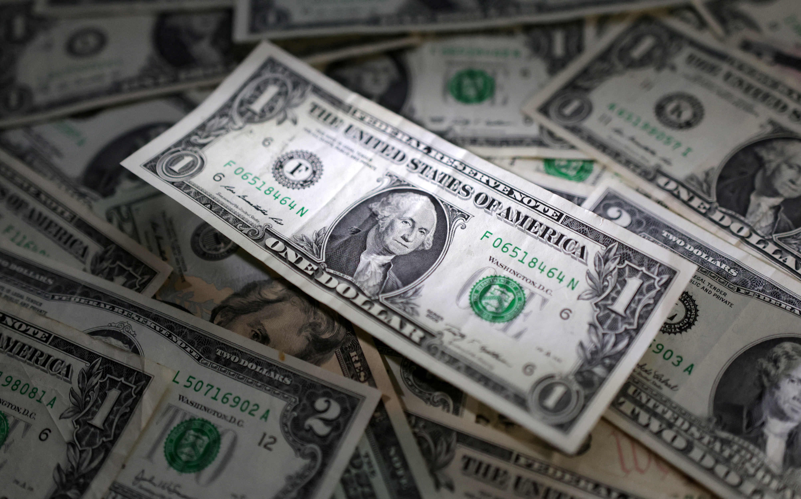

The U.S. dollar has established itself as the primary global reserve currency in international trade and finance. A reserve currency is a type of currency that countries prefer to hold in their foreign exchange reserves, often coming from a nation with a stable and reliable economy. Currently, the U.S. dollar serves as the most powerful reserve currency, facilitating trade and investment and acting as a safe asset in the global market. This article will examine how fluctuations in the U.S. dollar exchange rate impact international finance and trade.

## 1. Impact on International Trade and Imports/Exports
Fluctuations in the U.S. dollar exchange rate significantly affect trade and imports/exports worldwide. When the dollar is strong, prices for American products increase, leading to a decrease in U.S. exports. Conversely, the cost of imported goods decreases, allowing U.S. consumers to purchase foreign products at lower prices. Additionally, goods priced in dollars, such as raw materials, become more expensive. This includes essential resources like oil, raising import costs and placing an economic burden on importing countries. On the other hand, a weaker dollar enhances the price competitiveness of American products, boosting exports. However, higher import costs can lead to increased inflation within the U.S.

## 2. Impact on the Commodities Market
Since most commodities are traded in the U.S. dollar, fluctuations in its exchange rate have a significant impact on the commodity market. A strong dollar typically leads to higher commodity prices, placing a financial burden on importing countries that must pay more. Oil-importing nations, in particular, may face economic challenges due to inflationary pressures. Conversely, when the dollar is weak, commodity prices tend to be relatively lower, easing the financial strain on importing countries.

## 3. Impact on Emerging Economies
Fluctuations in the value of the U.S. dollar also have a critical impact on emerging economies. When the dollar is strong, many emerging countries face increased debt repayment burdens, as they must repay foreign debt in dollars. This can become especially challenging if their own currency depreciates, raising the risk of an economic crisis. Argentina and Turkey are notable examples of countries that have faced such challenges. Conversely, a weaker dollar can ease the debt burden on emerging economies, encourage foreign investment, and create favorable conditions for economic growth.

## 4. Impact on Financial Markets and Investments
When the dollar is strong and economic conditions are uncertain, investors tend to favor the dollar as a safe asset, leading to a concentration of capital in the United States. This can negatively affect stock and bond markets in emerging economies. Conversely, when the dollar is weak, capital flows into countries outside the U.S., which can drive up stock and bond prices in emerging markets and Europe. Thus, fluctuations in the dollar exchange rate influence investment flows and add volatility to financial markets, significantly impacting the stability and growth potential of global financial markets.

## 5. Impact on Global Economic Growth
A strong dollar can act as a slowing factor for global trade and economic growth rates. Rising commodity prices and increased debt repayment burdens may lead to an overall contraction in the global economy. Conversely, when the dollar is weak, global trade tends to be stimulated, promoting economic growth. These factors make fluctuations in the dollar exchange rate a key influence on global economic growth and business cycles.

In conclusion, the U.S. dollar plays a vital role in shaping international finance and trade dynamics. Its status as the primary reserve currency provides stability and trust, which are crucial for global economic interactions. The fluctuations in the dollar’s value have far-reaching implications for trade balances, commodity prices, emerging economies, and financial markets. A strong dollar can hinder U.S. exports and increase import costs, affecting domestic inflation and consumer choices. On the other hand, a weaker dollar often enhances the competitiveness of U.S. products abroad while easing financial burdens on countries with dollar-denominated debt. Additionally, the dollar’s strength influences investment flows, as capital gravitates toward perceived safe havens during uncertain times. Ultimately, understanding the complexities of the dollar’s impact is essential for policymakers, investors, and businesses navigating the interconnected global economy. As such, monitoring dollar fluctuations can provide insights into broader economic trends, helping stakeholders make informed decisions and adapt strategies in an ever-evolving landscape. By recognizing these patterns, nations can better position themselves to harness the benefits of a stable global financial system while mitigating the risks associated with currency volatility.