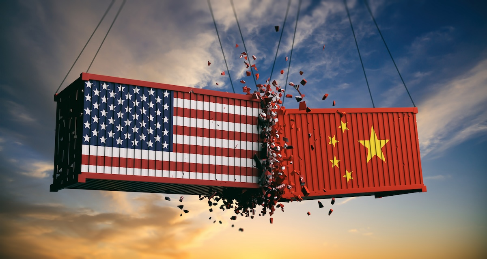

The trade war between the United States and China is one of the most important global issues in recent years. It began in 2018 when the U.S. accused China of unfair trade practices and stealing American technology. At first, it seemed to be a simple argument about tariffs and trade balance. However, as time passed by, it became clear that this conflict is not only about money or imports and exports: it is also about who will lead the world’s technology and innovation. This article will explore how the U.S.–China trade war started, how it turned into a competition for technology, and what this means for the world.

In the beginning, the U.S. focused on fixing its trade imbalance with China. America imported much more from China than it exported. The U.S. government, led by President Donald Trump at the time, placed high tariffs on Chinese goods to make them more expensive. The goal was to protect American industries and pressure China to change its policies. However, China responded by placing its own tariffs on American products, such as soybeans and cars. This made many companies and consumers of both countries suffer. Consequently, global trade slowed down, and prices of many goods increased. But, even after these strong actions, the trade gap did not disappear. This showed that the problem was more than just tariffs.

As the trade war continued, both countries started to focus more on technology. The U.S. banned companies like Huawei and ZTE, stating that they were a threat to national security. These companies were leaders in 5G and other high-tech fields. The U.S. worried that China might use technology to gain control over communication networks around the world. China, on the other hand, wanted to reduce its dependence on American technology. It started to invest more in research, artificial intelligence, and especially semiconductors. This shift made the trade war more like a “tech war.” The problem was no longer who sells more products, but who leads the world’s innovation.

The trade war also showed how closely the economy and technology are connected. In the past, countries competed mainly through trade and industry. But today, the ability to produce and control technology defines economic power. For example, if one country controls most of the chip supply, it can influence many industries—from smartphones to cars. This means that technology is now a key part of national security and economic stability. Because the U.S. and China both understand this, they are fighting not only for market share but also for future control in science and innovation.

The effects of the U.S.–China conflict have spread all over the world. Many global companies that depended on cheap Chinese manufacturing started moving their factories to other Asian countries like Vietnam and Indonesia. Some nations, such as Japan and South Korea, have had to take careful positions between the two powers. This trade war has also made the world economy more divided: some countries are choosing to work closely with the U.S., while others have decided to work with China. This division can make global cooperation more difficult and slow down scientific progress. It also creates uncertainty for smaller countries that rely on both powers for trade and technology.

The trade war is not only about economics—it is also about global influence. The U.S. has long been the world’s strongest economic and technological leader. But China’s fast growth challenges that position. Both countries are now trying to become more independent, especially in technology. This has created a new type of competition where countries seek to control their own supply chains and develop their own technologies. It is a move away from globalization, where everything was connected, to a world where nations protect their own interests first.

T U.S.–China trade war is more than a fight about tariffs: it is a competition over technological leadership and global power. Tariffs may have started the conflict, but innovation and technology are now at its heart. The outcome will not only decide a stronger country but will also shape how the world’s economy and technology develop in the future. For the world to further develop, cooperation may take precedence over competition. If both countries focus only on triumph, everyone could lose. But if they find ways to share ideas and create fair rules for trade and technology, the global community can grow together. The trade war teaches us that in today’s world, economic and technological strength cannot be separated, and that global progress depends on how we choose to use that power.
