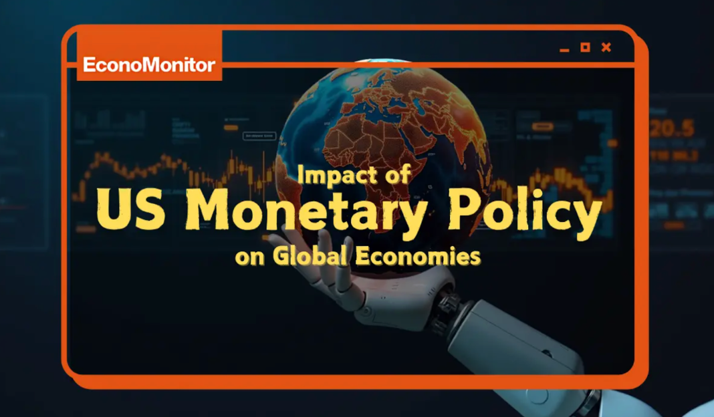

## The US 'Rate Decision' that Moves the World
Over the past few years, the most frequently mentioned terms in the global economic news have likely been 'Inflation (Price Increase)' and 'Interest Rate Hikes.' In particular, every decision made by the US central bank (formally: the Federal Reserve, or Fed) affects the global economy. To control rising prices in states, the Fed quickly raised its benchmark interest rate. Now, it is sending a strong signal that it will keep that high rate for longer than expected. This stance is known in economics as the 'Higher for Longer' policy. This journal aims to explore the background of the Fed’s decision, and analyze the significant shocks and waves this 'Higher for Longer' policy is sending through global currency markets and the economies of developing countries, including South Korea.

## The Reason for Keeping Rates High – The Difficult Battle Against Inflation
There are two main reasons why the US central bank is not lowering rates and instead keeping them high. The first reason is inflation. The Fed aims to keep inflation around 2%. However, the prices of some core goods and services are still high. To tame inflation that is not coming down easily, the Fed believes it must keep the powerful brake of high interest rates applied. The second reason is the strong job market. The unemployment rate in the US is much lower compared to other countries, and there are plenty of jobs, allowing people to demand higher wages. When wages rise, people increase their spending, which can create a vicious cycle that pushes prices up again. Therefore, the central bank maintains high rates to mediate the enthusiasm in the job market. In the end, keeping interest rates high for a long time is a strong, last effort to make sure inflation is really gone.

## First Wave – The Strong Dollar Phenomenon Drawing Global Investment to the US
When US interest rates rise, an immediate and major change occurs in global financial markets: the 'Strong Dollar' phenomenon. Imagine this situation: Global investors are in search of the safest and most profitable place to put their money. If US banks offer much higher interest rates than those in other countries, naturally, money will flow strongly into the US. When investment funds concentrate in the US Dollar, the dollar's value becomes increasingly strong. This strong dollar creates immediate difficulties for countries like South Korea. As the dollar strengthens, the value of Korean currency(Won) relatively weakens—this is called Won Depreciation. When Korea imports goods (like crude oil, food ingredients, or manufactured goods) from overseas, Korea has to pay in dollars. With a weakened won, Korea must pay more Korean won to buy the same goods. This raises import costs, leading to domestic inflation. Consequently, the US rate decision indirectly influences Korea's inflation and limits the Korean central bank's policy choices (whether to cut rates or not).

## Second Wave – Deepening Debt Crisis in Developing Nations
The 'Higher for Longer' policy is most fatal for developing countries and nations with high national debt. When US interest rates rise, capital invested in developing countries quickly flows out to the safer, higher-yielding US market. This is known as capital flight. When money leaves, the emerging economy is destabilized, forcing its government into a dilemma: it must reluctantly follow the US by raising its own interest rates to defend its currency and stop the outflow. A bigger problem is debt. Many developing countries borrowed money in US Dollars. Due to the strong dollar, the size of their debt instantly swells. Furthermore, because the US maintains high rates, the interest cost on that debt also sharply increases. Caught in this double whammy of the strong dollar and high interest rates, many vulnerable nations face a severe debt crisis, teetering on the brink of national default.

## Third Wave – Increased Risk of Global Economic Slowdown and Outlook
Maintaining high interest rates for a prolonged period places a huge burden on businesses and ordinary households worldwide. Companies find it difficult to borrow money for investment, and citizens face heavy loan interest, leading them to reduce spending. When investment and consumption decrease globally like this, the pace of economic growth slows down, potentially leading to a global economic recession in the worst case. The US central bank is aware of this dilemma. They want to curb inflation but  if rates stay high for too long, they risk damaging the entire global economy too severely. The current outlook suggests that even if inflation approaches the goal, the strength of the job market may delay the timing to cut the rate. We are likely to have to adapt to a high-interest-rate environment for some time to come.

## Responding to the New Economic Climate
The Fed's Higher for Longer policy is not just a news headline: it is a critical event that determines our daily cost of living and the order of the global economy. While this strategy may help control inflation domestically in the US, it is widening the economic gap between nations through the strong dollar and the emerging market-debt crisis. Therefore, central banks and governments in countries, including South Korea, must not passively follow the US policy. Instead, they need to create independent and proactive countermeasures to protect their currency stability and financial systems. Understanding this new economic environment of prolonged high interest rates is essential for us to plan our future and engage in wise economic activities.

