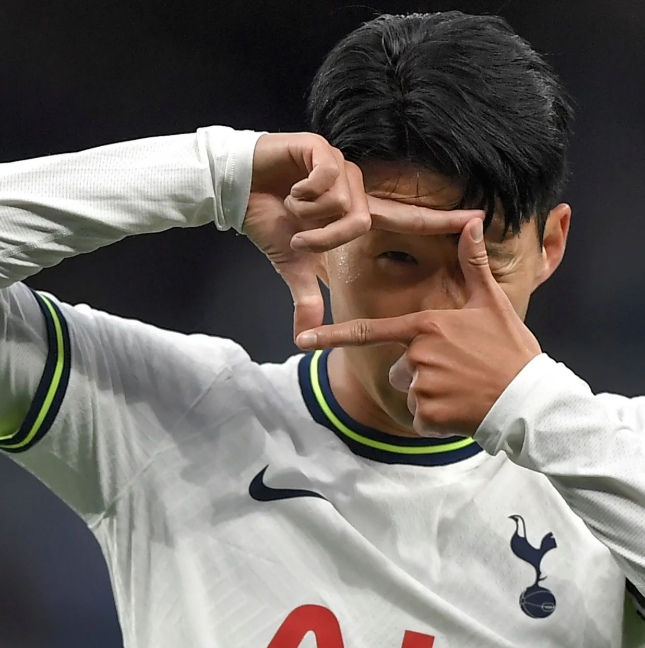

Son Heung Min was born on July 8, 1992, in South Korea. As a young boy, he loved playing soccer, but his father, Son Wong Jung, banned soccer, including playing competitive matches and even shooting practice, until he turned 15. Regardless, he kept playing games with other friends and continued to practice for 4 hours a day until he finally got a chance to play his very first real match.

Son joined his first professional team in 2010, a German soccer team called Hamburg until 2013. He then joined another team called Bayer Leverkusen and played there for 2 years. He moved to Germany, and in 2018, Son joined the Korean soccer team. He joined the team again in 2022 and again in 2026.

After playing matches, Son got the Golden Boot title. How, though? Well, we have to go back to May 22, 2022, heading to the final match of 2022. There were 3 surprises. 

1. Son scored two goals in half a second. I mean, that is almost impossible.
2. None of Son's 23 goals came from penalty kicks. Every single goal was scored from open play.
3. They won 5-0, securing the team a spot in the UEFA Champions League.

I mean, Son is the same as Ronaldo. Son is a king of soccer.

Son's daily life

7:20 AM – 7:30 AM: Wake Up & Hydrate: He starts his day early, takes a quick shower, and eats fresh fruit, like apples or avocados.

8:30 AM: Arrival at the Training Ground: Son prefers to get to the club early. He eats a clean, healthy breakfast provided by the team nutritionists and immediately heads to the gym.

9:30 AM: Pre-Training Mobility: Before the actual team practice begins, he spends an hour on leg movement, activation exercises, and joint mobility to prevent injuries.

10:30 AM – 1:00 PM: Team Training: This is the core "work" window, where he participates in high-intensity tactical drills, scrimmages, and conditioning with his teammates.

I mean, playing soccer for 2 hours and 30 minutes will make him so tired and sleepy. If you are Korean, we should respect Son and thank him for playing for Korea. And I wish Son wins the next World Cup.

