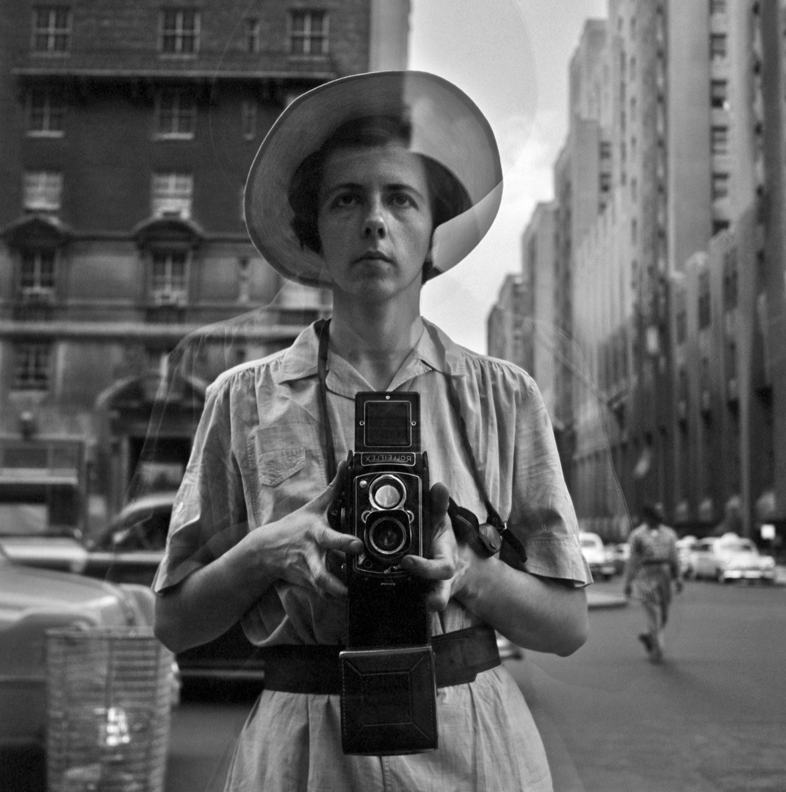
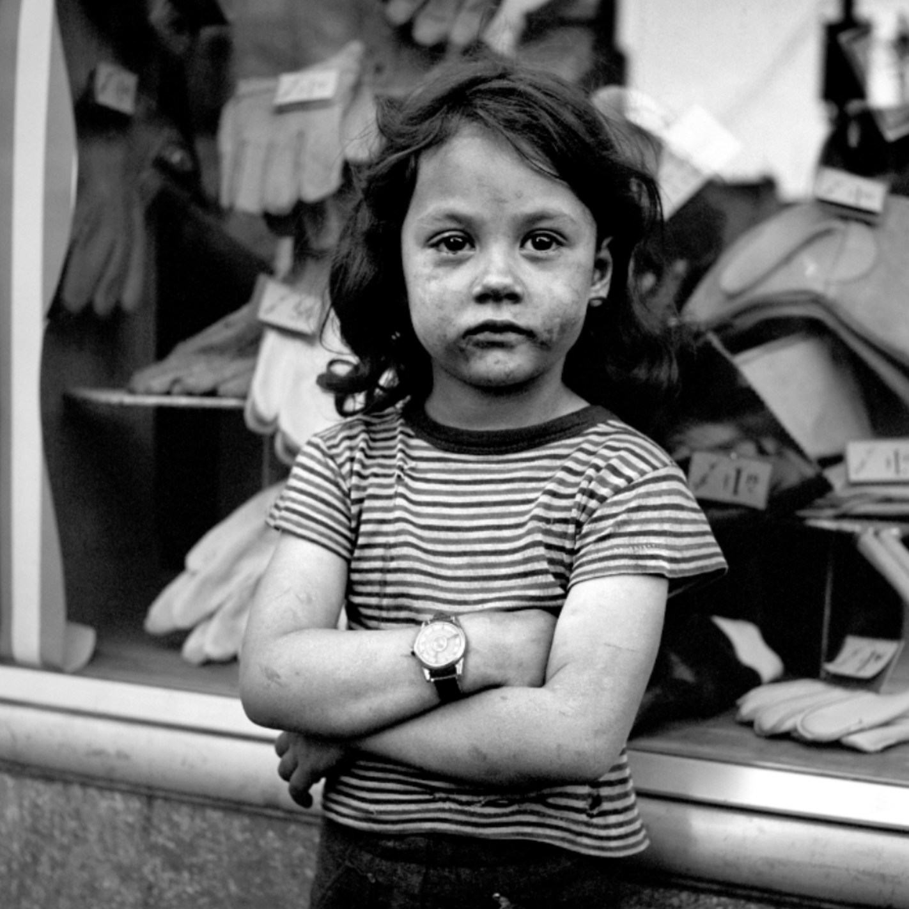
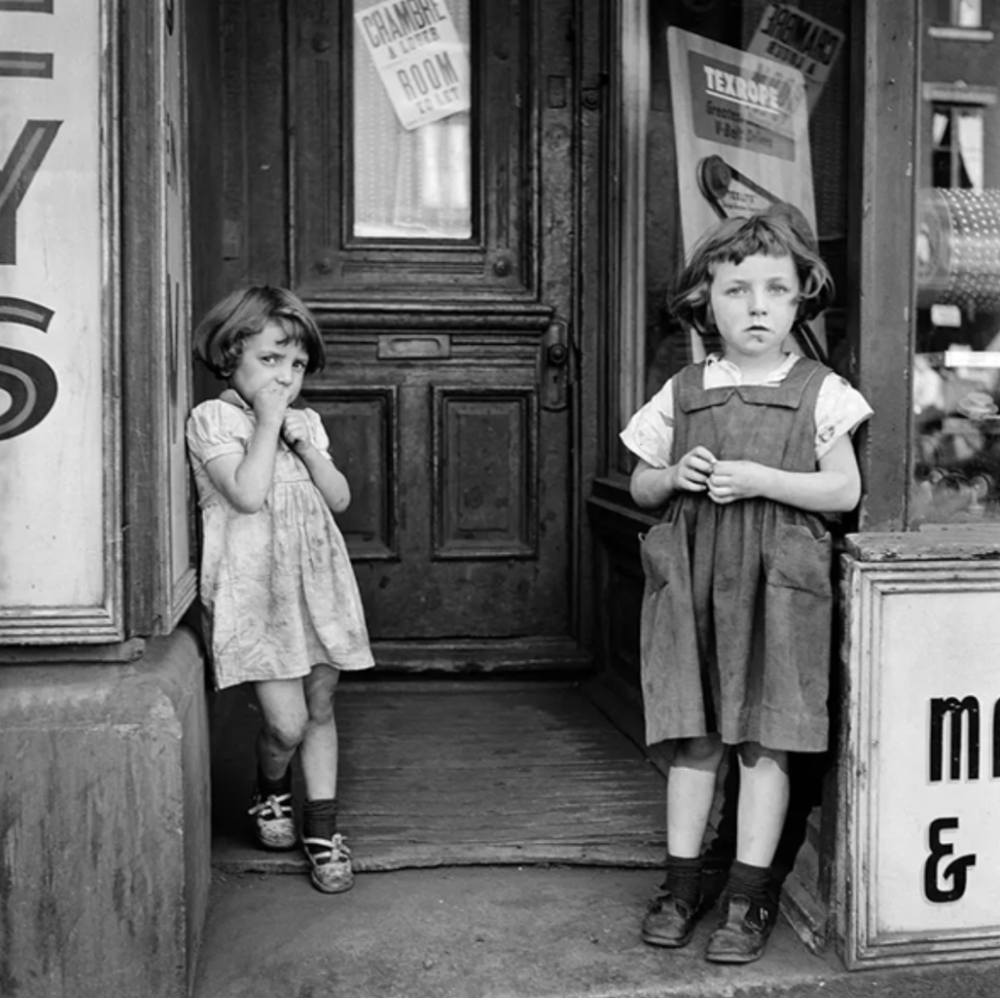
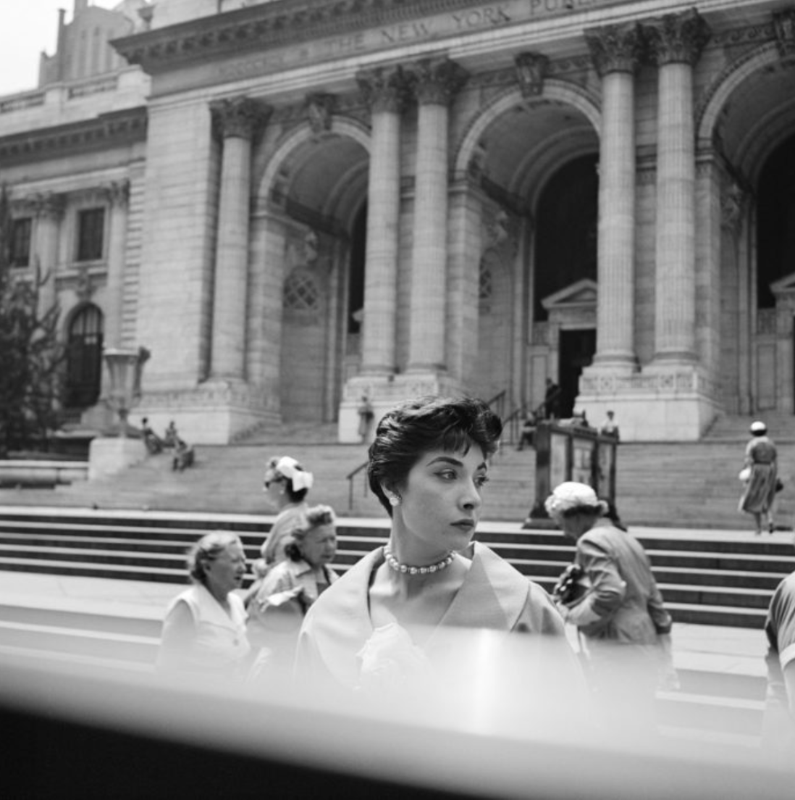
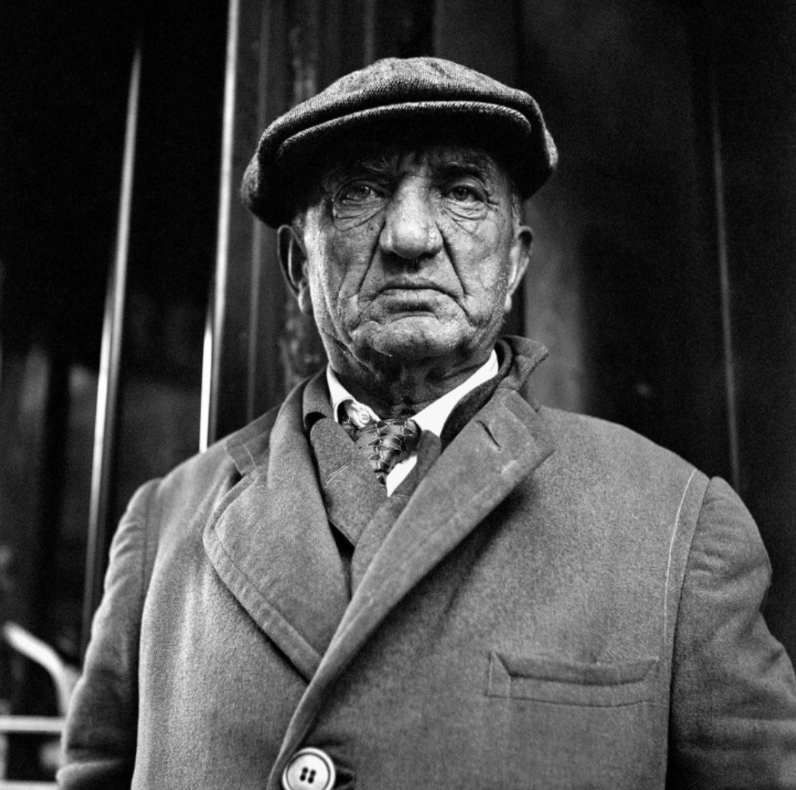
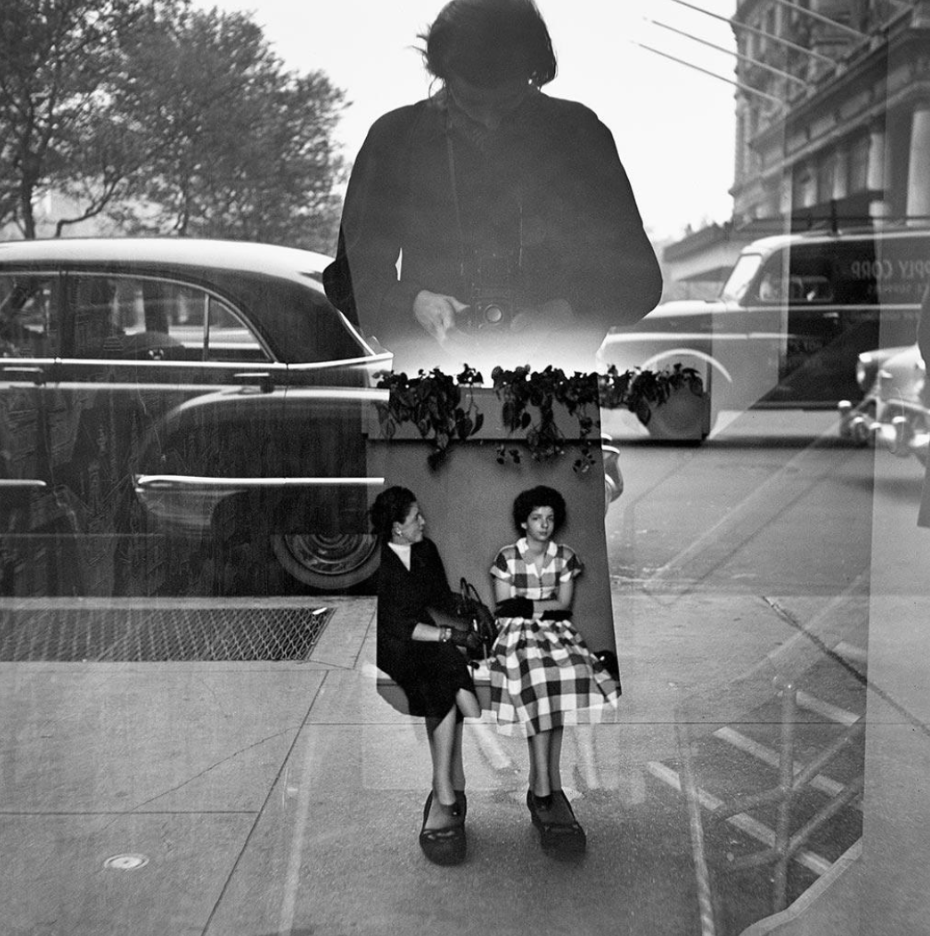
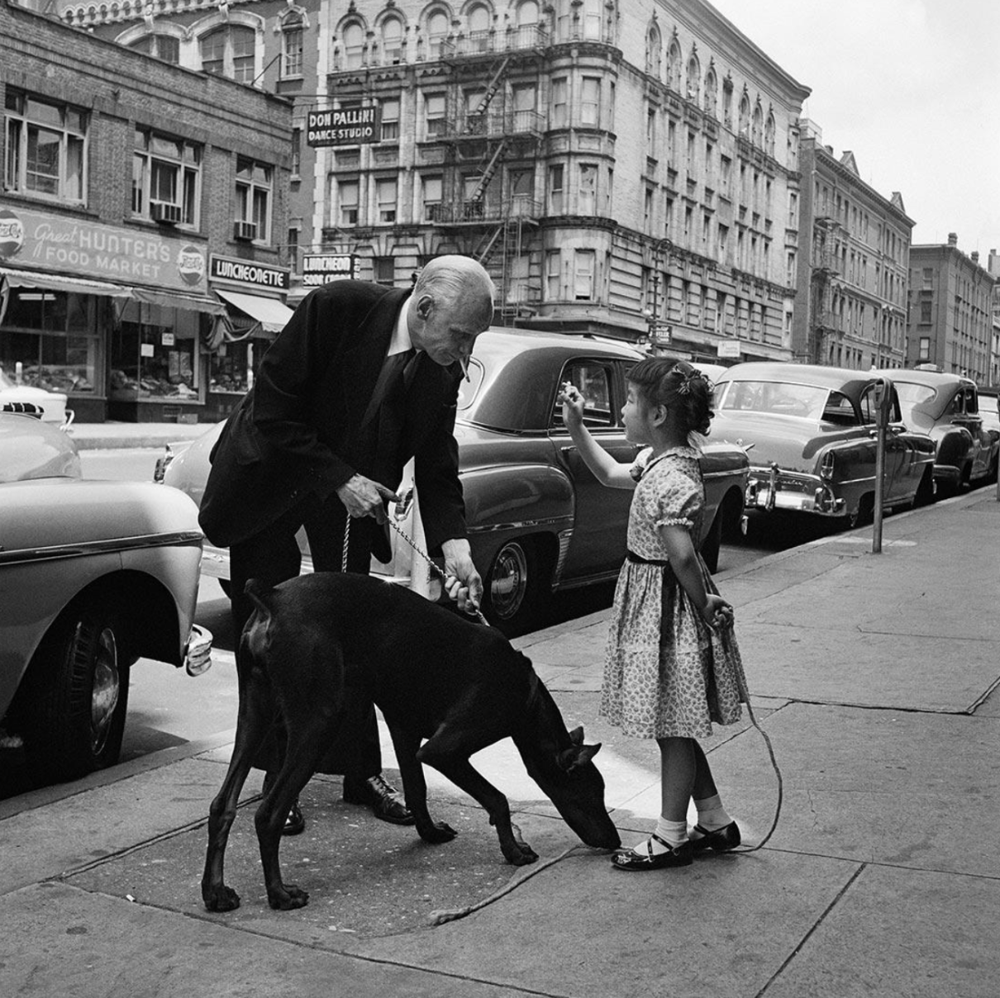

An opportunity to see Vivian Maier's works finally arrived in Seoul. Maier is called with various titles, including mysterious genius photographers, craftsmen of Lolliplex, mysterious street photographers, and Mary Poppins with a camera. Today, she is also known as one of the greatest photographers of the 20th century, and her photo exhibition will open on August 4, 2022 at Ground Seesaw Seongsu in Seoul. The Vivian Maier Photo Exhibition, the first of its kind in Asia to be held in Seoul, is the world’s largest tour ever. Past exhibitions were held at the Luxembourg Museum,Paris in September 2021 and the Royal Museum of Torino,Italy in February 2022. 

In this exhibition, you can see more than 270 photos, including vintage works printed by Vivian Maier and her unpublished works, as well as cameras (Loyplex and Leica cameras), props, videos and audio materials that she used herself. In particular, the exhibition will also include photos she took while traveling to countries such as the Philippines, Hong Kong, Thailand, Singapore, and India in 1959 when she was 33 years old. The exhibition also includes a self-portrait that is considered Vivian Maier's signature photograph. Her sensuous self-portrait, which expresses herself as if hiding through mirrors, show windows, and shadows, is the origin of “selfies” that are often seen on SNS these days.

Vivian Meyer (1926-2009) was born in New York, USA, and is a female photographer who was rediscovered in the 21st century after her death. Even after her death, she is now regarded as one of the greatest photographers of the 20th century. She is also the first artist to try a selfie that takes pictures of herself. Born in a time when female photographers were rare, she lived her whole life as a nanny, and began taking pictures as a hobby. 

Although it is not the first time that artists were unknown and were evaluated posthumously, she chose to be unknown herself. She worked as a babysitter all her life but she was also passionate about taking photos and took nearly 150,000 pictures that weighed nearly eight tons, but she never showed them to anyone in her lifetime and her works were never released to the world until they were auctioned off by the warehouse owner. 

Her name and work were brought into the world in 2007 when it was released by historian John Malouf, who accidentally won a large number of photographs at the small auction house. Her debut, which was virtually a discovery, made many people more interested in her. After her work was released, the public and media reacted explosively to her work, and experts began evaluating the unknown street photographer as a master of photography. 

Although she wasn’t trained as a professional photographer, her work vividly captures the expressions of the characters at the time the pictures are taken. Having worked as a nanny, housekeeper, and caregiver all her life, she always went outside with a camera whenever she had time and took pictures of people who came into her eyes, and as a result, her photos contain all the exquisite moments of ordinary people. The photos of streets taken by Vivian Maier are like theaters with ordinary people as actors. Her photo shows the irony of the streets where the kindness of the world and tragedies exist at the same time. 

After Vivian Maier's photo was released to the world, numerous books and documentaries have been published about her. However, since she lived such a private life, the only way to know more about Meyer is to hear from the people that barely remember her, and above all, the photos that she took herself. If this exhibition makes you more interested, I recommend you to read her biography, "Vivian Maier: Developing the Unknown Life of a Nanny Photographer."

Through her works we can see the humorous street people, urban landscapes showing geometric beauty, compassionate gaze towards the marginalized and vulnerable, and unique self-portraits. Her photos, which captured all of this with perfect composition and timing, exude a strange charm. This exhibition gives visitors the pleasure of imagining the story behind it through photos that exquisitely capture vivid emotions and gestures that they usually miss in their lives and inferring what kind of street photographers might have been who focused on the vitality of people living different lives.
