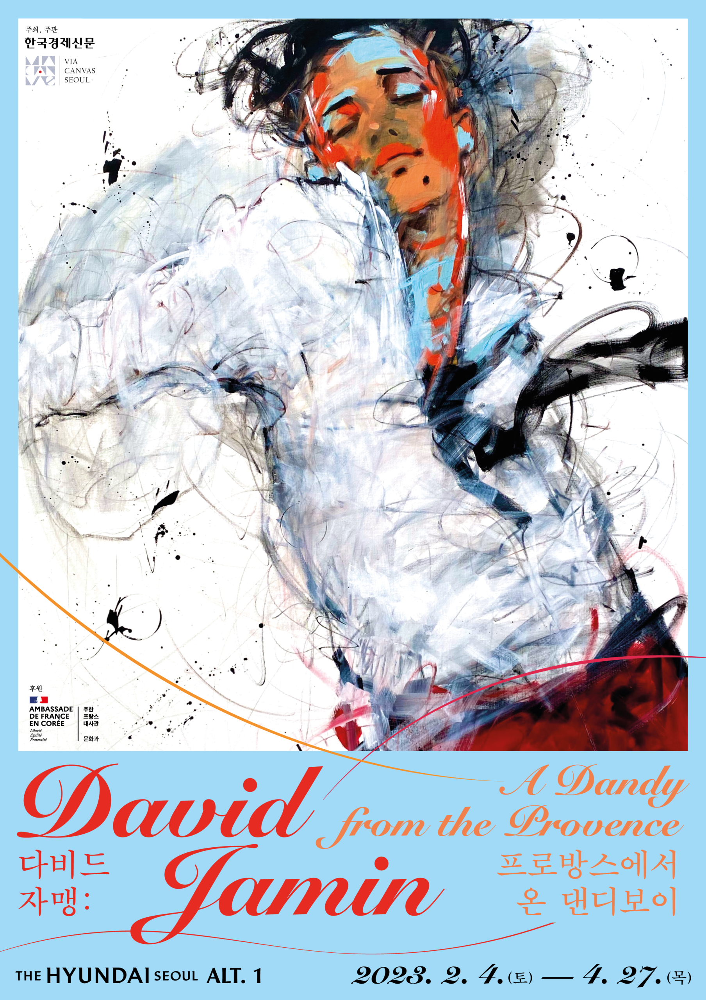
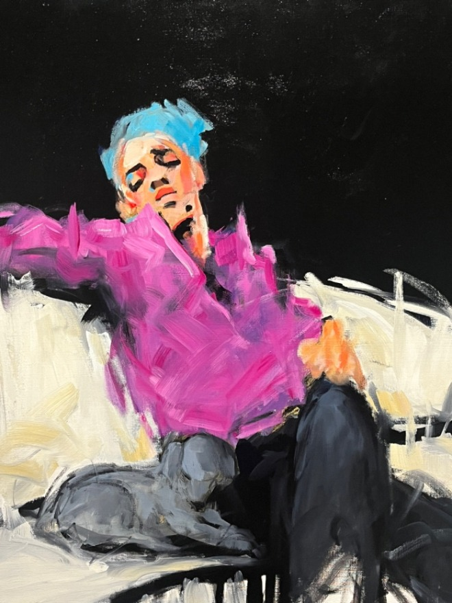
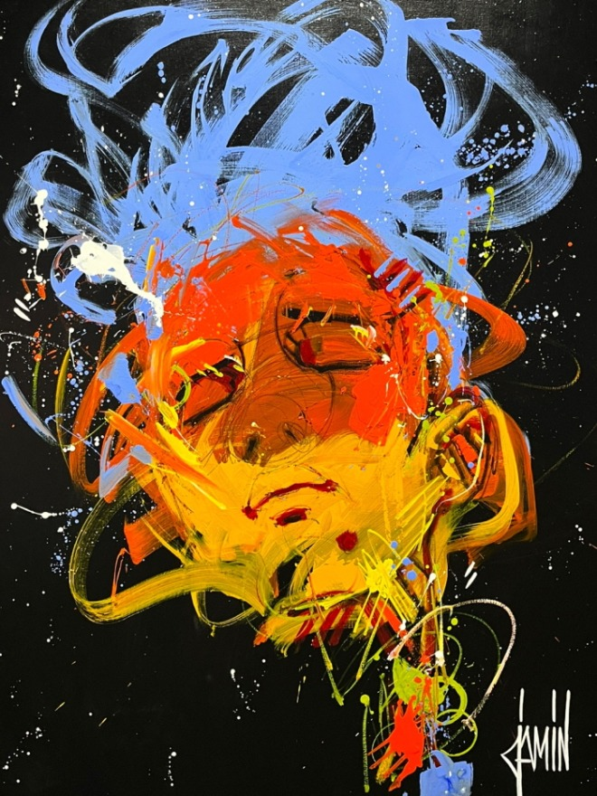
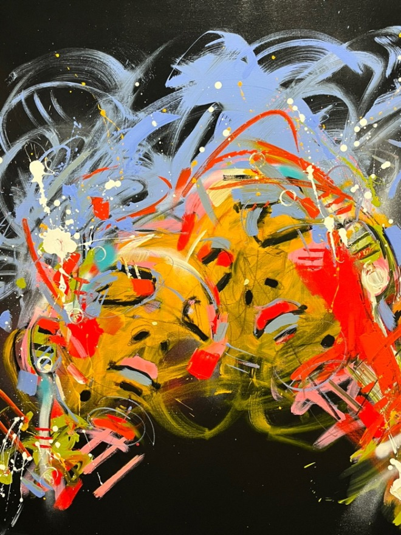

"The three keywords of my life and work are freedom, compassion, and love of life." - David Jamin

In 2021, David Jamin, an emotional artist in the contemporary art world known to the Korean public for the first time through "David Jamin: Travel to the Inner World," will hold his second solo exhibition in Seoul. Having combined his lifelong exploration of the theme of "Dandy" with the artist's own soul, he decided to name his second retrospective "Dandy Boy from Provence" with two keywords, "Provence" and "Dandy." 

The exhibition begins with a trip to the studio in Provence, David Jamin’s hometown, which began when he was born in the southern area and lived in the northern area for 30 years before moving back to a village in the south in 2013. It is the first exhibition with more than 150 works of David Jamin can be seen in one place, and in particular, it includes more than 100 new works of David Jamin in 2022. It is also the only individual exhibition that can be seen exclusively in Korea. It's special in that it's an opportunity to see an exhibit that cannot be seen anywhere else in the world. The composition of homage to masterpieces by artists including Gogh, Monet, Degas and Lautrec, Korean stars, children, and gardens, which he has frequently explored, is something special for this exhibition. As such, in this exhibition, his works from childhood to self-portrait and building his own style is divided into a total of six sections: Provence's studio, free style, “you and my microcosm”, “paying respect”, “Korea’s Star”, and “a resting place in my heart”. In particular, he painted the "Korea's Star" as part of the "Great Players" series, which depicts five Korean stars Kim Yu-na, Son Heung-min, Kim Yeon-kyung, Park Chan-wook, and Yoon Yeo-jung. Having never visited Seoul yet, he will visit Korea for the first time and meet with Korean fans in a fan signing event. 

David Jamin was born on November 24, 1970 in southern France and spent his childhood in Provence. His works related to Provence can be found in the first section of the exhibition, "Provence's Studio." He has lived in the northern region for 30 years since his adolescence. Since 2013, he has permanently moved near Provence, recovering stability under the sun of Provence and being inspired to use strong colors and dynamic images. He gained international fame after starting to work with the Art World Gallery in 1996, and dreamy portraits with inner feelings as a turning point in his life, painted since the early 2000s, became known to many people as his signature style. He is currently having exhibits throughout Europe, including France, the United Kingdom, the Netherlands, and Switzerland, as well as New York in the United States and Montreal in Canada. David Jamin, who has mainly done acrylic work that melts human movement and inner exploration in his work with sensuous colors and forms, has completed more than 7,800 works so far.

Among David Jamin's many works, a series of works dealing with a free-spirited man can be seen often. The man sitting on the sofa looking at the visitors with a chic expression is blue, purple, and red. A variety of colors are circling over the man, but somehow he looks lonely. The reason for this is that these paintings are called free-spirited coolers. Freedom is positive but comes with responsibility. Joy comes with it, and these various "coolies" who live a free life pay the price of loneliness. It can be seen that "human warmth" is needed for them.

David Jamin said he wanted to show his hometown of Provence through this exhibition, adding that Provence is a very unique area that values land and has a lot of colors. He then explained the works, saying, "Dandyism (an attitude that expresses mental superiority to others) is a trend that I think is important, and it was born in the 18th century as a new style, but it holds an eternal value. He said that "light" is an important factor in implementing the work. In fact, if you look at his early works, the darkness and brightness contrast very clearly, and the light adds volume and dynamics to the painting. He also emphasizes “happiness” in his work. He said, "Personally, I'm happy to share my life with my family and even to the public who like my paintings."

Through this exhibition, David Jamin wants to convey one of his keywords, "love for life," to Korean audiences. He also wants the audience to feel the colorfulness of a positive life while watching his work.