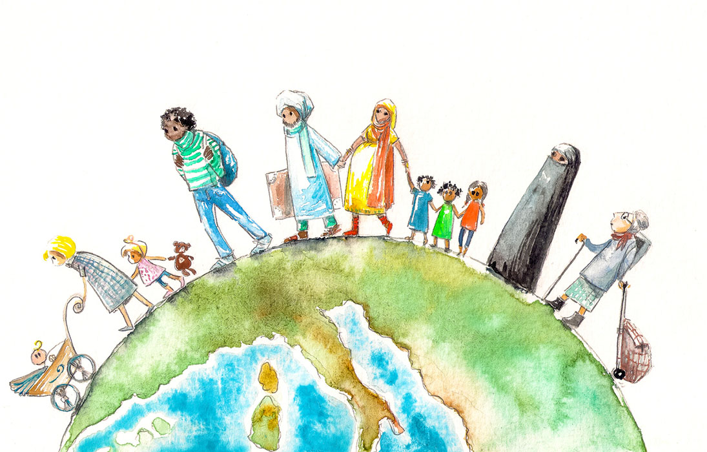

## What Is Migration? 
Migration refers to movement of people over the borders, between countries. The migrant moves from the home country to the host country. Migration is not a simple social or economic issue, but it is also a political issue that deeply connects two or more countries or at times, separates two countries. A fair and humane way of migration is made possible through help of international organizations, specifically the United Nations High Commissioner for Refugees (UNHCR) and International Organization for Migration (IOM). It is significant to understand migration’s influences on both host and home countries for global cooperation. 

## Effects on Host Countries
There are both positive and negative impacts that host countries experience from incoming migrants. 

One positive effect of migrants on the host countries is a great economic growth. Most often, when the workers come from countries abroad, they tend to work in work sectors where there is shortage of local workers within the country. These industries typically involve agriculture, construction, and elder care.  For instance, in California and Florida, many migrant workers from Central America and Mexico work in farms and harvest crops. Without these workers, the farms would not be able to meet its demand for crops, making the whole economy struggle. In addition, in Germany, workers from Turkey and Syria help the labor shortages in manufacturing and elder care. Like these examples, in modern societies, migrants serve as a significant labor force to keep the country’s economy growing and developing. Not only enhancing labor shortage issues, but also, migration brings in cultural diversity. Cities such as Toronto and New York are famous for having diverse people from various cultural backgrounds. 
Despite the economic boost and cultural enrichment that migrants bring into the local economy, undeniably, there are challenges. One of the biggest challenges is the social tension that arises between the local residents and the migrants. This most likely occurs when the host communities are not fully ready to accept a new population as a part of their original community. In 2015, over one million refugees entered Europe, fleeing from war in Syria. While some countries like Germany accepted these refugees, Poland and Hungary refused to accept these refugees. This further posed political tensions between the countries and conflicts within the European Union as well. 

## Effects on Home Countries 
Home countries also experience both positive and negative consequences from migration. The primary reason and the most positive effect of migration is simultaneously bringing in a certain amount of remittance, money that migrants earn and send back to their families in home countries. This improves the families’ living standards and support them economically. But beyond this, remittances further contribute to the national economy. In certain countries like Nepal and Philippines, flow of remittances is very crucial. In Nepal, the remittances make up more than twenty percent of GDP and are responsible for keeping up the economy. In other words, one fifth of the entire economy of the country depends on money sent by workers that work abroad. This income also helps the government to pay for its social programs and reduce unemployment pressures within the local economy. 

However, one negative impact is brain drain. Brain drain is a phenomenon where a great number of professionals, or highly educated workers, from diverse work sectors move to other countries seeking better job opportunities. Most commonly, doctors, engineers, and IT workers tend to migrate to other countries that can pay them with higher salaries and offer better work settings. This is problematic since the home countries can’t provide their local citizens with basic infrastructure (such as healthcare services) that the citizens  need for their lives. In Sub-Saharan Africa, many doctors migrate to the UK and Canada, while in India, many IT professionals move to the United States or Europe. Brain drain is particularly damaging to the government when they have greatly invested in education and training, just to lose their workers to other nations. 

## Conclusion
Like this, although migration seems like a small local issue, its effects are much greater than what most of us believe. It involves actions of bigger global organizations and partnerships between countries. Migration brings in both opportunities and challenges to the nations. However, the truth is fair and well-managed migration policies lead to greater cooperation between diverse nations and further enrich cultures. The future of the global economy would greatly rely on how the countries worldwide manage different migration issues. If managed properly, migration could be a positive source that links various people of different cultural backgrounds and boost the global economy. 