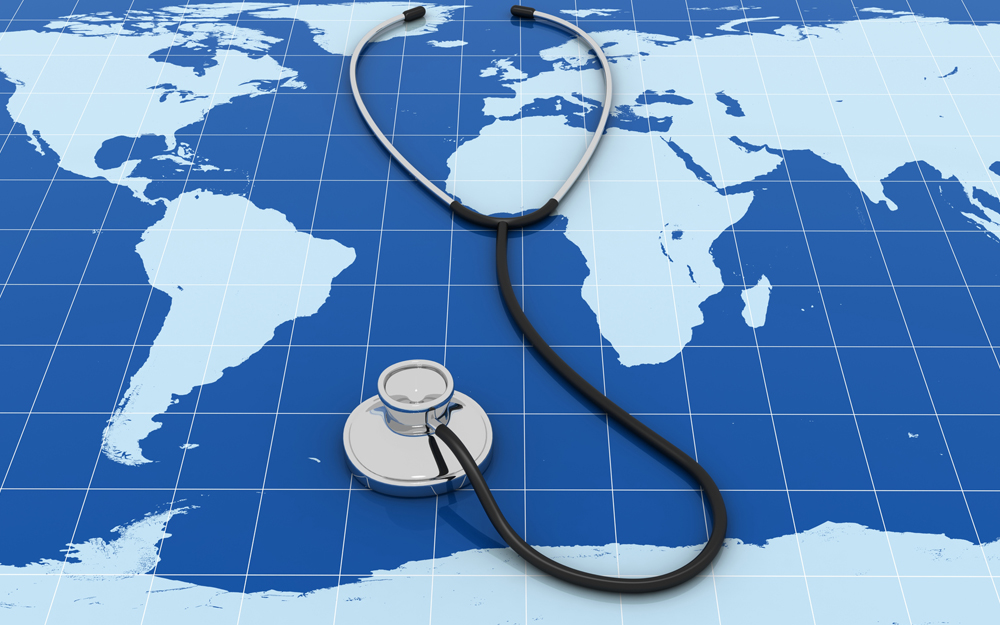

Health diplomacy refers to when there are global health efforts made through cooperation between countries and establishment of stronger international relations. It is at the intersection of national policies and global health, where medical collaboration is the bridge that essentially connects the countries and strengthens international relations. In health diplomacy, in order to solve worldwide health issues (such as COVID-19), governments, scientists, and big international organizations such as WHO work together as partners. Nowadays, health diplomacy has become so significant that without it, it is difficult to solve health issues by a single national power. In times of pandemics, health diplomacy helps countries to share knowledge and coordinate national responses, ensuring that all countries and the entire global population are protected from potential danger. 

Although the concept of “health diplomacy” sounds new, health diplomacy is not an entirely new concept. The first known example of health diplomacy goes back to the nineteenth century. During this time, the world internationally cooperated together in order to prevent cholera from spreading more. Since then, the world has become even more interconnected with digital and further technological advancement. Health diplomacy is a significant tool that manages health threats worldwide. In the 21st century, the world we live in, all countries are interdependent on one another in solving global health problems through collective efforts. 

Field of modern health diplomacy can be generally divided into two categories: bilateral diplomacy and multilateral diplomacy.  

## 1. Bilateral diplomacy (Direct medical assistance) 
Bilateral diplomacy refers to when a country directly helps out another country that is in need of additional medical capacity. For instance, a country which has an excess capacity of medical necessities can send doctors, equipment, or vaccines to a country that needs these at the moment. During COVID-19, some countries were able to supply vaccines to neighboring countries in shortage of it. This medical cooperation fosters improved diplomatic relations between countries. 

## 2. Multilateral diplomacy (Global Institutions) 
Multilateral diplomacy is when global programs intervene for better cooperation between countries. In global health, countries can work together in a more fair and proper environment involving institutions such as WHO and UNICEF. These institutions fund health initiatives, share research information, and most importantly, create standards for worldwide political responses to diverse health threats. An example of this is COVAX, an initiative created by WHO during the COVID-19 pandemic that aims for fair vaccine distribution and access to the world. While COVAX faced various challenges, it was an important effort to provide vaccines to poorer nations as well. 
The COVID-19 pandemic, surprisingly, was a significant turning point in the history of health diplomacy. How countries responded to COVID-19 is considered both a success and a failure in health diplomacy. How countries reacted to COVID-19 was successful in that scientists were able to rapidly cooperate and share scientific knowledge about the virus through the help of an interconnected network of institutions. However, one failure was vaccine nationalism. Relatively wealthier countries were able to purchase greater amounts of vaccines ( more than they needed for their population), which led to shortage of vaccines in low-income countries, delaying their ability to vaccinate vulnerable people. 
Like this, health diplomacy matters. Health is a global issue, and diseases don’t stop until all cases are perfectly cured across the borders. Health diplomacy not only solves global health problems but also helps improve international relationships. For instance, the United States and Cuba, despite having experienced long-standing political tensions, were able to build better relations through health diplomacy. They sent each other training doctors and provided medical help during times of disasters. In this way, they created opportunities for mutual trust. Like this example, medical cooperation clearly serves an important role in promoting further global equity and peace worldwide. 
However, despite a well-coordinated system of medical diplomacy worldwide, there are still challenges that remain. The greatest difficulty is the unequally distributed power and unbalanced influences in making important health decisions. Other challenges include underfunding of health initiatives and political interference in global health rules. 

Although such challenges do exist, health diplomacy is very significant in modern societies. Countries need to work together in order to achieve the common goal of maintaining global health security. This is only possible through fair cooperation, trust, peace, and most importantly, shared responsibility. The future of the world would depend on how well the nations worldwide would be able to cooperate sincerely with one another and further develop this complex field of health diplomacy. 