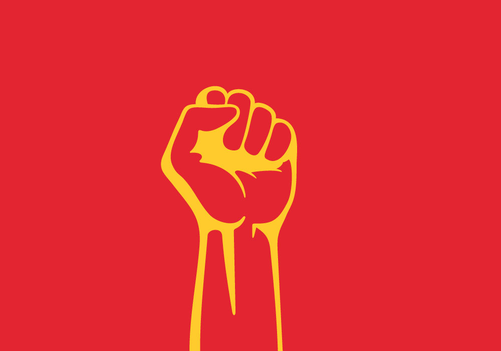

In recent decades, countries across the world have had a common trend in terms of their political systems. There was a significant decrease in the number of dictatorships and communism and an overall rise of capitalism. Each political system holds different advantages and disadvantages, and it is worth knowing these for a better understanding of general politics and the world. Hence, this article will mainly explore the concept of communism, communist countries in the world, and its interchangeable use with socialism. 

## What is Communism: Strengths and Limitations 
Communism is an economic and political ideology which states that all modes of production must be owned by the government and each citizen must be treated equally for an equal distribution of wealth. 
Communism has a strength in that communist countries have strong and strict beliefs and clear goals: to unify the country and equally redistribute the wealth, without any class distinction. It tends to lessen the struggles between different wealth classes, promote the efficient use of national resources, and provide equal job opportunities for all citizens in the society. 
Despite this, communism has many limitations. One limitation in communist countries is excessive control of the government. Under this system, only the political parties have access to private or public resources. Hence, this decreases the possible potential of the society to develop, as private individuals don’t have rights to participate in government decisions for making use of national resources. Another limitation is that citizens in communist countries don’t have the most basic human rights, especially freedom of speech and the right to express one's own opinion. Because of the tendency of communism to unify the country, even if there is an individual who makes more effort and has better abilities, he or she is paid and treated equally. It is very ironic how communist societies aim to decrease class struggle and discrimination across different wealth classes, when in fact, all communist countries commonly experience poverty. 

## Communist Countries Across the World 
Currently, there are only five communist countries: Cuba, Vietnam, Laos, North Korea, and China. One interesting communist country is Laos, located in Southeast Asia. Laos shows a long history of political conflicts over its course of development. Laos had maintained a monarchy for a long time. However, communist forces led by Pathet Lao successfully removed the long-lasted monarchy and converted the political system into communism, after fifteen years of bloody civil war. Currently, Laos only has one political party that rules the whole country, and the leader of the Lao People’s Revolutionary Party Thongloun Sisoulith is the president. However, recently, Laos has suffered from great poverty, which is the common problem most communist states tend to face.

## Can We Use "Communism" and "Socialism" Interchangeably?
The answer to this question is…yes. We can use them interchangeably. In detail, they have different aspects, but generally, they have many similarities. Both socialism and communism share the same beliefs: unifying all the citizens and reducing class struggles. 

However, they clearly have some differences. One big difference is that in socialist societies, each citizen can hold private resources for their means of production, although it is limited to a certain extent. However, in communist societies, this is not possible. Each individual can’t own private resources, and therefore, all national resources are under the control of the government. It is only the government that can decide how to make use of the national resources. Thus, the power that the government holds is much greater in communist societies. Another difference is found in the history of how these ideologies are developed. Communism is usually forcefully implemented through wars or conflicts that have occurred among different political parties. In contrast, socialism is not implemented immediately just like how communism was implemented. Rather, over a long period, a society slowly converts into a communist society. 

# Conclusion
Nowadays, most citizens tend to believe that communism is inefficient, limited, and lacks further potential for development. However, this is not true. There are positive and effective parts of communism that we can further implement in our current systems. For instance, communist societies are usually highly organized, with clear rules and specific goals. Communism is not entirely inefficient for the citizens. At times, capitalism can lead to worse, more complicated consequences than communism can. As the general public, people must recognize that there is no perfect good or bad, efficiency or inefficiency in terms of political systems. Each political system carries both strengths and limitations, as there is no perfect, ideal political system that can satisfy everybody. Hence, it is significant to view the world without being blindly stereotyped by the image of each political system. Only with an unbiased and deep understanding of each political system, a citizen is finally ready to construct their views of the world and make important decisions for the bettering of the society.  