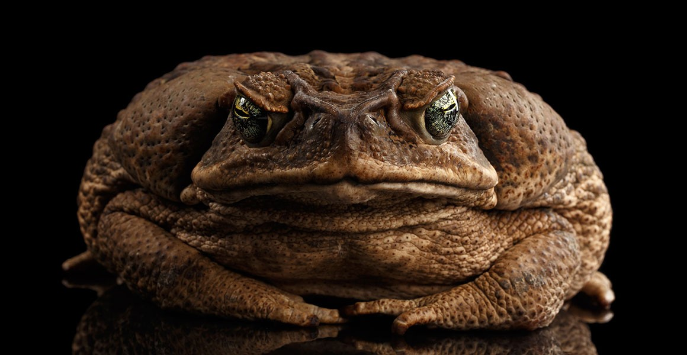

Invasive species are organisms that are not native to particular regions but are introduced to new habitats mostly through human activities. While there are various invasive species throughout the globe, the introduction of foreign species can be divided into two categories: either intentionally or unintentionally introduced. In many of the cases, people had brought foreign plants and animals, mostly for pets or as food.  Those are the intentional cases; on the other hand, in some cases, these organisms are transported through ships, planes, and other long transportation vehicles unintentionally. When the organism had just arrived in a new region, it might not seem harmful; some could even be hidden, or may seem interesting and useful. However, over time, these invasive species can cause significant environmental issues by disrupting ecosystems and threatening native organisms and habitats in various ways.

One of the major problems that these invasive species pose is unavoidable competition with native species. There are no places on earth where resources for survival are unlimited. Native species have adapted to their own conditions over decades to even centuries, forming a balanced and stable system that matches them. Therefore, when invasive species are introduced to such systems, in many cases,  the native species directly compete with these foreign species for the limited resources. Unfortunately, in most cases, invasive species have certain advantages, such as rapid reproduction and strong adaptability, a crucial factor for an organism’s expansion. Through these advantages, invasive species dominate the environment in a short period. Then, obviously, native species struggle to thrive in their own habitat, and their populations may start to be overwhelmed by the invaders. In extreme situations, the native species might even go extinct, leading to a loss of biodiversity, slowly erasing the original form of the ecosystem. 

After all, the condition that makes the situation worse is when there are no natural predators in the new environment. In their original habitats, their populations were controlled by predators and natural factors that vary. However, when they are introduced into a new habitat, these control factors are most likely not prepared. This lets the invasive species reproduce and expand rapidly over large areas in a short period of time without any interruptions. Since these rapid, large expansions need a large amount of resources as well, and after all disrupts the whole biodiversity. A common example is invasive fish species like the bigmouth bass from North America, which, when introduced into asian countries, outcompetes the native fish. They take over the native species' food and habitat, or even directly prey on the native species, later declining the population of native fish. 

Not only for animals, but also invasive plants are common as well. In serious cases, invasive species spread very quickly by blocking sunlight and absorbing nutrients from the soil, which disrupts the normal growth of native plants. As a crucial part of the ecosystem, the possible changes in vegetation affect the organisms that depend on those plants for survival.

Since invasive species affect the whole ecosystem, it is inevitable for human societies to experience significant effects as well. The ecosystem serves as a crucial source of drinkable water, food production, and a stabilized climate. However, when the ecosystem is disrupted by invasive species, these benefits might be lessened or gone. For example, invasive insects that have a strong appetite might damage crops, leading to economic losses for farmers and lessened agricultural products for customers. In some cases, it might directly threaten humans and their livestock health by carrying diseases that might spread too easily, resulting in serious health issues. Furthermore, governments or organizations will need to spend their money and efforts to stabilize the ecosystem, ruined by invasive species. However, environmental damages are not only repaired by funding.

When the invasive species have already occupied the region, countermeasures such as management and control strategies are important. There are different kinds of strategies for different cases, such as physically removing the invasive species, using biological control methods, or restoring the resources in order to support the native species. It is essential to apply appropriate acts in different cases. However, these methods won’t work smoothly, are time-consuming, and expensive in some cases. Therefore, the prevention of invasive species is the bolt-on to sustain the environment. 

In the end, invasive species are a devastating environmental issue that affects all three factors: ecosystems, biodiversity, and human life. They provide stressful competition against native species, spread rapidly, and result in long-term environmental damage. Since human transportation leads directly to introducing these species, individuals, communities, and governments need to take action and work to prevent this, leading to a far more stable and healthy environment for both humans and animals.
