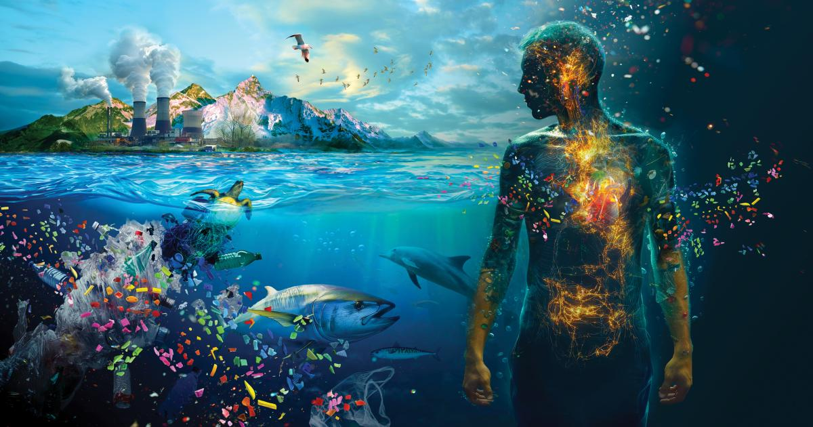

Microplastics can be simply described as plastic particles that are so tiny that they’re nearly impossible to detect with the naked eye, but they have become abundant components in freshwater environments. Rivers act as a major transport route for plastic pieces, sending microplastics from small streams to lakes and oceans. Unlike larger pieces of plastic, microplastics are easily ingested by aquatic organisms due to their small size, which makes them easily consumable and similar to natural prey, such as plankton.

Unfortunately, freshwater fish are quite vulnerable to microplastic exposure because they thrive in various ranges of rivers and interact directly with the contaminated elements in the water. While past studies that focused mainly on the physical presence of microplastics in fish’s digestive system, new studies have emphasized their deadly effects, including physiological exhaustion, immune system disruption, and altered behavior. Among these, changes in gut microbiota have received attention as an important way of linking microplastic consumption to broader biological results.

Freshwater fish consume microplastics by multiple routes. Direct consumption happens when fish mistakenly prey on microplastics, especially particles that resemble plankton, which are the main food source of some fish. On the other hand, indirect consumption happens as well, this is through trophic transfer: when the fish consumes other smaller creatures that are already contaminated.

How strongly the fish influences the amount of exposure varies; the way a fish feeds changes the amount of plastic consumption. Benthic feeders: the one who feeds on the ground are likely to consume microplastics accumulated in the floor levels, whereas other fish on higher levels encounter particles that are suspended somewhere in the water column. Not only their position, but their characteristics, such as size, shape, and type of components, also affect the possibility of the fish consuming microplastics and digesting them. For example, Fibrous microplastics, which come from fabrics of flexible textiles and wastewater sources, are most abundantly detected in the fish digestive system and may maintain their shapes or other characteristics.

Behavioral changes are one of the most clear consequences of microplastic consumption. This altering of their natural behavior is also a crucial factor, since it can directly affect the survival of the species by damaging their skills:  escaping from predators, efficient search for food, and their utility on their habitat.

In fact, few studies have shown that fish that are exposed to microplastics have shown a trend of reduced swimming activity, lowered reflex on escaping factors, and abnormal feeding behavior. These kinds of changes can be assumed to be a minor factor in affecting a fish, but they can gradually disrupt the whole relationship of predation in an aquatic environment. Specifically, it is also shown that the microplastics disrupt the activity of the digestive system’s bacteria, therefore affecting signals from organs to the brain, resulting in a change of behavior.

It is also essential to know that changes in microbial components can affect neurotransmitter production and stress hormone control, which change cognitive behavior and other responses that are deeply connected with the survival of fish.

Until today, the focus has been centered on specific effects on fish, but when all these physiological and behavioral effects of microplastics gather, it leads to a broader ecological result. Fish with disabled foraging ability and lessened predator avoidance will let the population gradually experience lowered growth rates and raise mortality. As time flows, these effects could influence the whole body of water and its surroundings; the disability might also be inherited through generations, spreading widely, and resulting in the species becoming endangered.

Currently, the concern about microplastic impacts on aquatic environments is growing. However, there is still a lack of knowledge to resist it. Therefore, deeper and long-term studies on exposure to the environment are required to gain greater knowledge of it and solve it as soon as possible. Especially, in a world now with not only one problem, but with even bigger issues like rising temperatures and sea levels. Specifically, for microplastic exposure, scientists should study deeply into animals’ reactions to it and remedy the larger problem of the ecosystem.

Microplastic consumption is often overlooked by people, but it is definitely one of the main stressors on freshwater habitats. Not only does it accumulate as fish consume it, but it also changes their digestive activity and later their behaviors. To better address this critical issue, longer and deeper studies are mandatory. In addition, this is not only a problem for fish, but all the surrounding organisms too, as a part of the whole, gigantic community called Earth.

