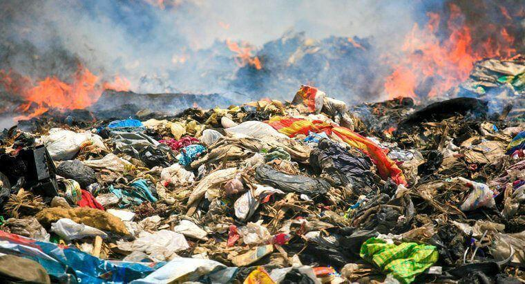

Fast fashion has changed the paradigm of the worldwide clothing industry by making trendy clothes easily accessible with inexpensive prices. New styles appear in shops frequently, encouraging people to buy clothes continuously. While this makes fashion affordable and even convenient, it also causes irrevocable harm to the environment. Fast fashion results in enormous water use, chemical pollution, microplastic contamination, and direct harm from textile waste. The question is not whether it harms the environment; we already know it pollutes the environment. Therefore, the important point is uncovering who is responsible for this harm: the consumers who purchase the clothes or the companies that promote and produce these clothes. In essence, the answer to this is that the companies have greater responsibility because they are the ones who control the whole system, bringing harm.

The major environmental consequence of fast fashion is heavy water consumption and pollution. Cotton farms for clothing often require a substantial amount of water, and textile dyeing is the biggest source of industrial water contamination throughout the world. One of their routes is toxic chemicals from factories entering rivers, damaging the local ecosystem and the communities nearby that depend on the water from it, affecting agriculture and human health. Corporations choose which location to produce their clothing, what environmental standards to follow, and whether to use cleaner technologies. Of course, these are not really shared with customers but only within the corporation, and that is the predominant reason why they have the paramount responsibility against environmental costs.

Fast fashion includes a big portion of the production of microplastics. Many of the clothing items are made with cheap garments consisting of synthetic materials like polyester, nylon, and acrylic, likely in most people’s closets. When these tiny plastics are washed, they flow into waterways and reach the oceans, harming marine life by disrupting the food chain of marine organisms. Not only for marine organisms, but it also ends up in drinking water, in our bodies. Most people are unaware that their clothing sheds plastic particles every time it is washed. By promoting cheap production andignoring sustainability, companies continue to use materials that contribute to long-term environmental harm. This underscores how companies’ choices, rather than customers' ignorance, play a central role in continuing pollution. 

Another issue is textile waste, since fast fashion clothes are designed to be worn a few times and to be unworn. Together with rapidly changing trends, it brings a disrupted culture, with clothing being seen as very temporary. As a consequence, millions of tons of clothing that are not easily decomposed are piling up in empty land every year. When those clothes are donated to other countries, it simply expands the waste problems throughout the world. 

However, the customers cannot be totally excluded from that responsibility. Those fashion industries are there because there is a significant demand. Simultaneously, worldwide trends, influencer cultures, and online shopping malls entice us to buy things with a few clicks without hesitation. Therefore, there is a clear duty for consumers to contemplate when buying clothes, choose a high-quality garment, use sustainable brands, and also reuse and repair clothing for longer use. Consumers also need to speak out for more sustainable garments to pressure the companies that constantly produce fast fashion products. Additionally, as a small suggestion, you can perform a small act of virtue by shopping in a secondhand shop since vintage fashion is a recent trend. 

To sum up, fast fashion has constantly caused and is still resulting in serious environmental harm through water pollution, microplastics, and piled textile waste. Although consumers unintentionally contribute to the problem by purchasing cheap and temporary clothing, corporations still hold a greater responsibility because they control and acknowledge how the system operates, including the choices of garments and marketing plans that bring excessive consumption by customers. It is obvious that the companies have the power to reduce environmental damage through investigating and investing in sustainable technologies, business strategies, and better garments. Meanwhile, consumers should become conscious and responsible for their clothing selections. To change this situation, we need both the individuals and the companies to work together as the residents of Earth. 
