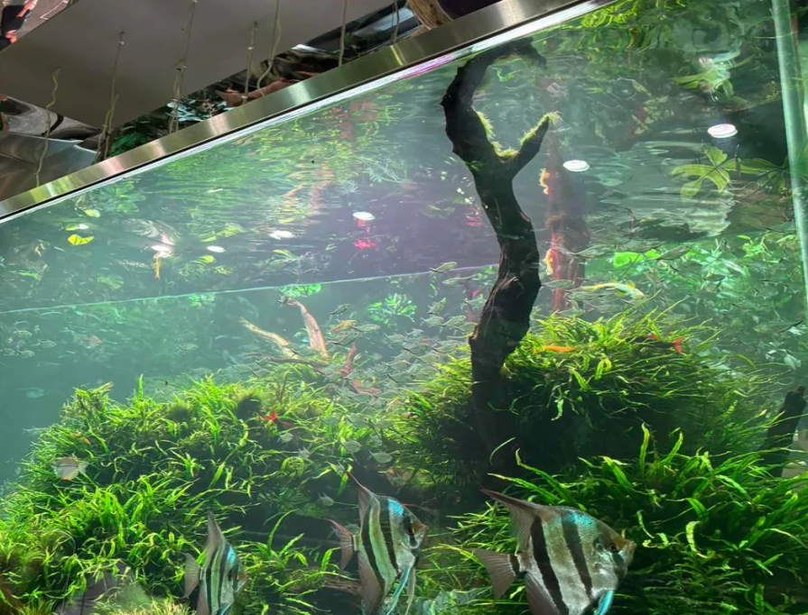

When people imagine an ecosystem, they often think of an immense natural environment such as rivers, forests, or oceans. However, an ecosystem is not just a natural environment with a large space. Even a glass aquarium can function like a mini ecosystem because it contains living organisms, nonliving(abiotic) environmental factors, and interactions between each and every factor. Although an aquarium is artificially created and managed by humans, many of the same ecological processes that occur in real aquatic environments can also be seen inside it.

Most ecosystems consist of two major categories: biotic and abiotic factors. Biotic factors are the living components of an environment, including fish, aquatic plants, bacteria, and various microorganisms. Abiotic factors are the nonliving components, such as water temperature, light, PH, and oxygen. These are simply factors that are not alive. Both biotic and abiotic factors do not exist independently. Instead, they frequently interact and change the conditions in which they exist. For example, water temperature can affect the metabolism of aquatic organisms, and the amount of available light can affect plant growth and physical structure.

One of the most crucial processes that demonstrates the complex system of an aquarium is the nitrogen cycle. Fish release waste in water, which adds ammonia to the environment. This ammonia, at high concentrations, can be dangerous for the organisms. However, certain bacteria play an important role in processing these compounds into harmless forms. These bacteria first convert ammonia into nitrite, which is also harmful to fish. Then, other bacteria convert nitrite into nitrate. Nitrate is much less harmful and can be absorbed by aquatic plants as a nutrient. Through this process, waste produced by fish can eventually become a useful resource for plants.
Plants also play an important role in the aquarium ecosystem through photosynthesis. They use light and carbon dioxide to produce energy and release oxygen into the water. Oxygen is essential for fish and other aquatic organisms because they need it for respiration. Simultaneously, fish release carbon dioxide when they breathe, which can then be used by plants. This shows how different organisms in an aquarium can depend on each other to thrive.

An important part of an aquarium ecosystem is the relationship between the organisms and their environment. For example, if too many fish are placed in a small tank, more waste will be produced, which can increase ammonia levels and negatively affect water quality. On the other hand, if there is not enough light, aquatic plants may not grow properly. The underdevelopment of a plant may even affect other organisms by reducing food sources or taking away their shelter. A change in one factor can therefore affect other parts of the system. This shows that the organisms and environmental factors in an aquarium are interconnected rather than existing separately.
An aquarium can also show how important balance is within an ecosystem. If one part of the system becomes too dominant or disappears, other parts can be affected as well. For example, excessive algae growth can use nutrients quickly and change the amount of oxygen available in the water, which we call an algal bloom. In contrast, a lack of plants can reduce the amount of nutrients being absorbed from the water. This demonstrates that stability does not come from one organism alone. Instead, it comes from the relationships and interactions among many different organisms and environmental factors.

In addition, the aquarium can be viewed as a simplified model of larger aquatic ecosystems, or even as a simple source of entertainment. In a natural lake or river, there are countless organisms interacting with one another, making the system much more complicated. However, the core idea remains identical. Fish depend on oxygen and food, plants depend on light and nutrients, and microorganisms help break down waste and recycle nutrients. Human activities can also change these relationships by changing water temperature, nutrient levels, or water quality. By observing and managing a smaller and more controlled environment like an aquarium, it becomes easier to understand how changes in one part of a natural ecosystem can affect other organisms and the entire system.

Size does not determine everything. An aquarium may be much smaller than a river, lake, or ocean, but it can still demonstrate many of the same basic principles of an ecosystem. The nitrogen cycle, photosynthesis, and interactions between organisms collectively show how living and nonliving components work together, and it’s easily observed in small aquariums as well. What looks like a simple glass tank is actually a small, controlled environment where different organisms and factors constantly affect one another. Understanding these interconnections in an aquarium can also help us expand our understanding into larger natural ecosystems and how their balance is maintained.

