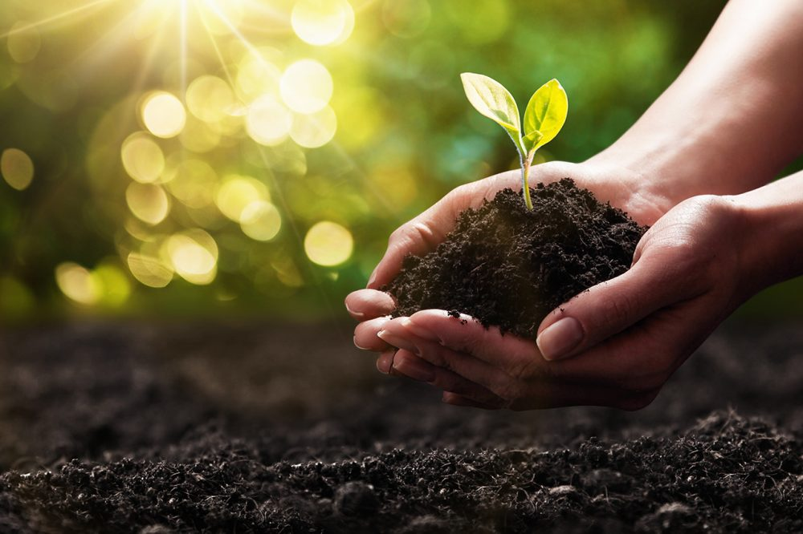

What is soil? Very often, soils are simply expressed as dirt, which merely means anything but dirty, useless dust. However, dirt plays a critical role as a system of living that sustains life. The current state of soil affects plant growth, flow of water, and carbon storage, which are essential for maintaining our only ecosystem. Since it is about the “underground” world, people usually do not have a chance to take a detailed look inside. Actually, this hidden world of soil directly affects human resources and ecological survival. However, this valuable and essential system is frequently overlooked by humans, and a large portion of it is being ruined.

Based on the status of the soil, the texture, content, and color vary. These can simply be defined in two types: healthy and unhealthy soil. When the soil is in a healthy state, it has a dark brown color, a crumbly texture, an abundance of rich organic matter, and a thriving microbial community. Meanwhile, the unhealthy soil has a pale grayish color, which indicates the lack of fertility, mostly very dry since it has low water retention, and lacks both biological matter and activity. In some places, human activities such as construction(roads), deforestation, and urban development gradually degrade the soil’s quality. These developments mainly disturb the water cycle in the soil. Consequently, as a long-term effect, it reduces agricultural products(resources) and even breaks down animal habitats through biodiversity loss.

One of the main characteristics of a healthy and organized soil is having diverse, abundant organisms. Underneath, in the soil, it is essential to include such organisms: microbes, fungi, insects, and lots of decomposers. Obviously, from their name, these kinds of organisms have a critical role in breaking down organic material to provide a stabilized and fertile land for all kinds of vegetation. However, these organisms are very easily damaged by contamination, basically by the overuse of harmful chemicals. Additionally, a majority of these organisms contribute to regulating greenhouse gases by storing and absorbing them. By absorbing CO2 and other kinds of gases, it also has the potential to contribute to ceasing climate change. Therefore, losing these organisms for any kind of reason will be a significant disaster for mankind.

At this point, people might assume that pollution and urban developments are the main factors that lower the quality of soil, which is also true, but simply using the land for agriculture can also impact the soil quality, especially when there is an inadequate quantity of agricultural activities. Intensive farming(overusing the same land for farming), overuse of chemical fertilizers, and a monoculture cropping system, in which one kind of crop is farmed in a large area of land. When such types of agriculture are held, it depletes the soil’s nutrients by disrupting the underground organisms’ community. Subsequently, to prevent such incidents, applying sustainable farming practices such as crop rotation and organic fertilization(not artificial chemicals) is essential. Eventually, this type of agriculture will restore the soil until it is ready for farming again or even improve its conditions for better agriculture.

In order to avoid overlooking soil health again, its status and characteristics should be observed to maintain the health of life. While observing the soil, direct updates(actions) should be made to enrich the soil’s nutrients when needed. Farming lands should be well distributed and have a maximum limit on them based on the observed data.  Education is important, applying education to build public awareness among people, so that they notice the problems is important. Since the soil affects such factors as food security, water problems, and even climate issues, this implies that it is the awareness that the world should have. As a master plan, the world should promote sustainable agriculture to local farmers.

In conclusion, soil is not just simple dirt; it is a dynamic system, hidden underground, that supports and sustains life. It controls the resources for every organism, including humans. To maintain the healthy state of a soil, it is mandatory for humans to have limits on development and create a more sustainable agricultural system. Soil is always holding a part of the future for all living things. Soil, while dirt might be the most abundant and common thing people might think of, is the elixir of life.