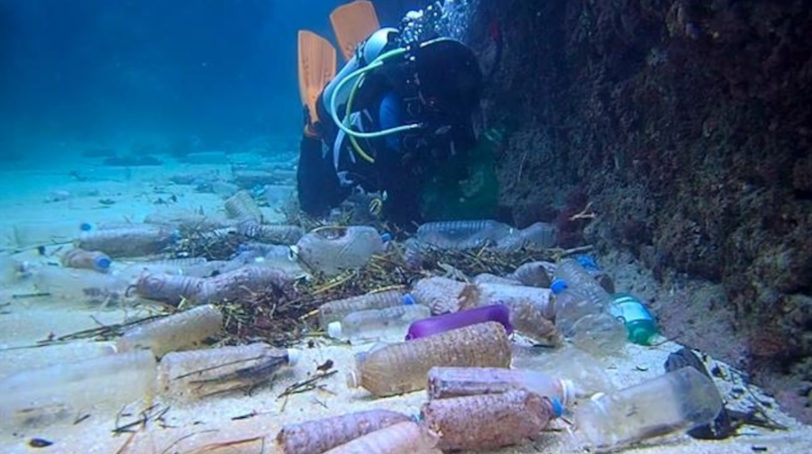
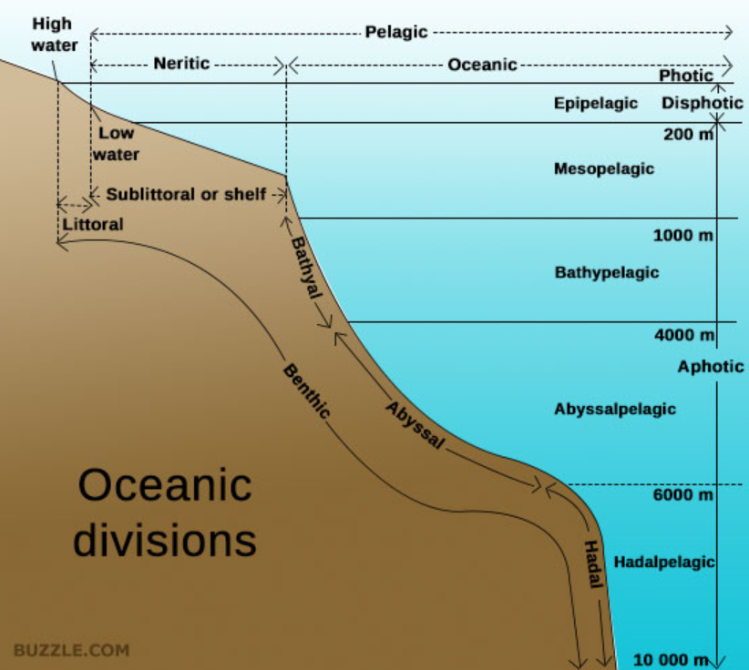

The ocean covers 70 percent of our planet. There is no doubt that it is the crucial system of Earth that supports biodiversity, climate regulation, and human livelihoods. However, the ocean's importance is overlooked, and it is frequently disturbed by pollution, which is generated by people. Oceans are not simple landscapes like broad plains; what happens inside is influenced dramatically by their depth. Oceanographers who study the deep sea classify the ocean into vertical regions: Sunlight, Twilight, Midnight, Abyss, and Hadal zones. Each zone presented here has its own light levels, organisms, and environmental conditions. Every zone is affected by humans: plastic bags and wrappers are found in the Mariana Trench, more than 10 kilometers in the darkest water. Even though the mechanisms and effects vary, it is undoubtedly true that plastics reach every part of the ocean.

The Sunlight zone, also called the Epipelagic zone, defines the region from the surface to 200 meters under water, and as its name suggests, it receives enough sunlight for photosynthesis. It includes most parts of marine life that are familiar to humans: coral reefs, plankton(photosynthesis), sea turtles, marine mammals, and most reef fish species. Since it's the closest to us, it is exposed to the highest level of pollution. Large amounts of plastic debris, such as single-use bags, abandoned fishing nets from enormous fishing industries, and any other trash from consumer products, are released here first. Marine animals exposed to the waste ingest it or become entangled, bringing unbearable consequences. Chemical pollution also flourishes in this zone, especially from the agricultural fertilizers and pesticides drained through rivers, which carry it out to the sea.

This uncontrolled release of nutrients brings algal blooms, the overpopulation of algae, which decay and use up oxygen from the water, creating dead zones that lack oxygen’s presence, directly affecting the organisms. Oil spills, which cause chaos, disrupt the whole food web and its habitats. The sunlight zone provides half of Earth’s oxygen through phytoplankton’s photosynthesis; therefore, the pollution in this specific zone harms both marine life and the whole planet’s oxygen supply.

The second region underneath is the Twilight zone, or Mesopelagic zone, from 200 to 1000 meters depth. The name basically comes from its presence of light, which fades as the temperature drops. This zone is a region crucial for the carbon cycle, as organisms move between the Twilight and Sunlight zones to feed and return afterwards, carrying carbon with them. Pollution interrupts this process. Microplastics that consequently sink to the twilight zone are also consumed by small fish and organisms, introducing toxins that disturb the food web of the zone. Also, from around this zone, organisms depend on sound to navigate and escape from predators, but ships and other water transportations make noise that disturbs these activities.

Under it is the Midnight zone, also known as the Bathypelagic zone, from 1000 to 4000 meters. Where there is no existence of sunlight, with extreme pressure and freezing cold temperatures. The environment of the Midnight zone makes organisms' metabolism rate slower, their growth slows as well, and they conserve energy. From such a condition, it lets the sunk pollutant remain unchanged for years and years. 

One more time, beneath it is the Abyssal zone, from 4000 to 6000 meters deep. It is consistent with the Midnight zone and is consistently dark. Even from recent years, some have believed this region was too deep and remote to observe the effect of humans; however, plastics, chemicals, and radioactive waste are found in this zone. Since the presence of organisms or the development of life is scarce or slow, recovery from pollution, of course, takes a much longer time, sometimes centuries. Deep-sea mining, which also mainly happens in this zone, basically involves the activities that destroy the seafloor, and it takes much more time to recover from damage.

Finally, the deepest is the Hadal zone, including trenches that are deeper than 6000 meters. Despite its depth, it has some of the highest plastic concentrations since it is really the lowest floor, where all the wastes get accumulated. The organisms living there have one of the most restricted food sources; therefore, a bit of contamination can greatly affect the food web of that small community.

Pollution in the ocean does not disappear, but it sinks into the deep ocean and accumulates. People affect places that they’ve never been to. It’s really humans who have to know and control where our remains stay.
