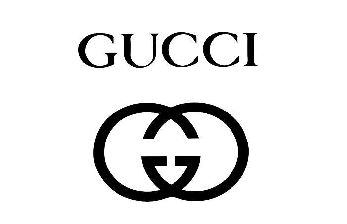

Many people will recognize what this double-G logo stands for. Yes! It’s the logo for the famous luxury fashion brand, Gucci. Gucci is known for its unique style, iconic designs, high-quality materials and craftsmanship. Also, their famous double-G logo and the red and green stripe designs made people know Gucci well. By the way, do you know who founded Gucci? Guccio Gucci found it. The brand name Gucci comes from his surname. In this article, I will explain the brief history of the founder of Gucci and the fashion brand itself.

Guccio Gucci was both an Italian businessman and fashion designer. He was born on March 26th, 1881 in Florence as a son of an Italian merchant. In 1898, at the age of 16, he left Italy to travel to gain inspiration and sophistication. In London, he got his first job at the Savoy Hotel. He had many jobs such as dishwasher, waiter, bell boy, and concierge. Savoy was the most central and luxury hotel in Europe during the 20th century. It was the first hotel in the world to run an electric elevator. They also installed electric lights and the first telephones. Since there were many celebrities and famous politicians staying at the hotel, Guccio had opportunities to meet them. He met Claude Monet, Marylin Monroe, Frank Sinatra, Winston Churchill, and countless other people. While he worked there, he observed and learned these people’s styles such as their clothing, accessories, jewelry, manners, and habits.

In 1901, Guccio married Aida Cavelli, a 24-year-old dressmaker and a tailor’s daughter. They had Grimalda, who was their first daughter, and four sons: Enzo, Aldo, Vasco, and Rodolfo. Sadly, their first son Enzo died early. After working at the hotel, he decided to start his own business. In 1921, he opened his first store in Via Della Vigna Nuova in Florence selling leather goods. As his business grew, he was able to expand his shop and hired more skilled artisans to design new custom bags. Since he targeted the rich people, his factory also produced horse harnesses too. Rich people enjoyed horse riding, so they quickly began to recognize the brand. 

In 1933, Aldo Gucci, his second son, designed the classic double-G logo that is still used today. It refers to his name Guccio Gucci. Rather than only producing strong leather bags, Gucci started to branch out to make other items such as shoes, wallets, and belts. Since they had to make many other items, they were in a situation of lacking leathers. They started to make bags out of specially woven Tuscan hemp. The handle part of the bag was made out of Tuscan hemp and the body part had leather trims and had the logo printed. This bag became one of the most famous Gucci bags, and it is still produced. Many popular celebrities used it. In 1938, Guccio’s second son Aldo Gucci asked his father for a second shop in Via Condotti, Rome. When World War II ended in 1945, Gucci’s folding suited bags became popular among British military officers. In 1947, Gucci produced its bamboo handle bags. At first, it was named “0633,” its item number. It had bamboo-inspired patterns such as the headscarves to watch straps. During the 1950s, Gucci added the red-green-red stripe designs to their items. They have found another design which became the iconic symbol for the brand. 

As Guccio aged, his son Aldo Gucci began to take more responsibilities. He traveled to many countries, meeting many influential people such as American lawyer Frank Dugan to get help to open more boutiques with his brothers. Gucci started to get invited to many fashion shows, and soon, they attended fashion weeks too. These things continued and made the luxury fashion brand Gucci in the 21st century. 
	
Similar to other fashion brands, Gucci keeps introducing new  “spring and summer collections” and “fall and winter collections” every year through fashion shows. They all have unique and different styles. For example, in 2023, Gucci showed their new collection exclusive to Korea celebrating the New Year. In their design, there was a hoodie with Gucci written in Korean next to their double-G logo. There were also t-shirts that had Korean writings as well. Many people thought it was a knock-off, but the photos were actually from Gucci's official website.

