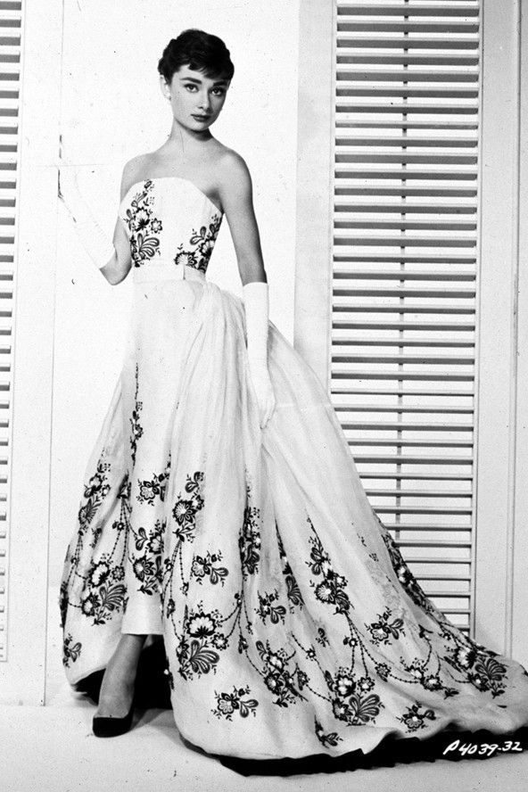

Audrey Hepburn was one of the most famous actresses in the early 20th century. She was also considered the most beautiful actresses with others such as Grace Kelly and Olivia Hussey. She was in many movies and the most famous ones were the “Roman Holiday,” “Sabrina,” and “Breakfast at Tiffany’s.” Also, she was considered as the best style icon. The clothes she wore in the movies became the best trend at that time. Not only her fashion, her hairstyle and lifestyle was also a trend. While she was filming her movies, she also wore clothes designed by fashion designers such as Givenchy and Coco Chanel. She mostly bought clothes from these brands and also collaborated with them. Especially, Audrey liked Givenchy’s collections and wore them frequently. We can almost say that Audrey wore Givenchy’s clothes in every movie and in the awards. In this article, I would be explaining Audrey Hepburn’s fashion in movies and her relationship with fashion brands and designers. 

The first movie Audrey became famous at one time was ‘Roman Holiday’, which was filmed with Gregory Peck and released in 1953. This movie let Audrey go up to the stardom and win her first Oscar award as the best actress. In the movie, she wore a variety of fashion from formal dresses and ball gowns to casual outfits and pajamas. At the first appearance of Audrey as Princess Ann, she is wearing a button-up blouse, swing skirt, and tie sandals. Swing skirt is a type of skirt that has a circular shape. It was trendy during the 1940s & 50s. Audrey’s skirt and blouse outfit became so iconic that many fashion brands copied her fashion and named it “The Hepburn”. And for the dress she wore, it was off-shoulder design with a choker necklace which was a reference from Cinderella’s dress. Also, in the bed chamber scene, she is in her old-fashioned nightgown. Unlike in her casual outfits and dresses, she let her hair down, not an updo. Audrey also wore many kinds of fashion accessories such as wide belts, vintage hats, jewelry, and gloves for her formal outfit.

As I mentioned in the introduction, Audrey mostly wore Givenchy’s designed outfits in movies and awards. Also, Audrey mentioned Givenchy: "His are the only clothes in which I am myself. He is far more than a couturier, he is a creator of personality". As we can see, Audrey and Givenchy had a close relationship as an actress and a designer. Audrey met Givenchy when she went to Paris to select her costumes for the movie “Sabrina”. Audrey insisted that she needs to select costumes from French designers because the character she was going to act was going to France during the movie. After a long persuasion, she gets the permission both from the film company and the director and flies to Paris to select her movie costume. 

While Audrey was in Paris, she heard of Givenchy’s design and soon scheduled to visit his shop. After she visited his shop, she tried a few samples, and asked him to design the costumes for Sabrina. Givenchy refused at first because he was busy with his collection for the fashion show. However, after he met her several times, he changed his mind. After he finished designing, he showed Audrey. She selected three looks which was slim two-piece suit of gray wool for the train-station scene following Sabrina’s return from Paris; a black silk cocktail dress with bows at the shoulders worn during a night out in New York; an evening gown crafted of a black strapless bodice over a white slim skirt and overskirt for the party scene. It was both decorated with black embroidery and jet beading that had the overskirt finished with a black organza ruffle. Since Audrey loved wearing hats, she added a turban-style hat for the suit and an evening hat for the cocktail dress. After the movie was released, the costumes that Audrey selected herself became a hit and also became Givenchy’s bestseller. 

From then, Audrey wore Givenchy’s design almost all the time in her movies such as in the movie “Funny Face” released in 1957 and “Breakfast at Tiffany’s” released in 1961. In the movie "Funny Face,” she wore Givenchy’s red dress with a shawl. In the movie “Breakfast at Tiffany’s,” she wore the famous little black dress designed by Givenchy and Chanel. After she retired as an actress, she became the ambassador of UNICEF Goodwill and traveled to regions around the world to help young kids until she passed away. 