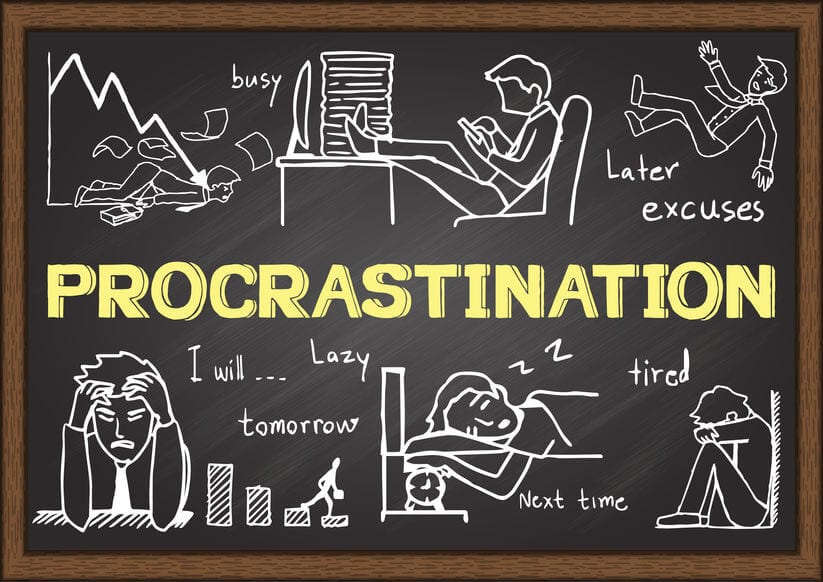

“Well, I’ll start when the clock reaches 6.” Five minutes later, the clock turns 6:05, and suddenly it feels easier to say, “I’ll just start at 6:30 instead,” and then 7, and eventually tomorrow. Almost everyone has experienced this moment. Setting small deadlines, pushing them back, convincing themselves there is still plenty of time, even when they know it will only make things worse later. Procrastination is usually blamed as being lazy or poor time management, but psychology suggests something much deeper is happening. In reality, procrastination is not about being unmotivated; it is a coping mechanism people use to avoid uncomfortable emotions like stress, fear of failure, and self-doubt. Understanding the psychological reasons behind procrastination reveals that it is less about discipline and more about how the brain manages emotions. 

Many people assume procrastination happens because someone is lazy. However, laziness is not wanting to do something at all, while procrastination usually involves wanting to complete a task but struggling to begin. The problem is not a lack of motivation; it is the emotional reaction the task triggers. When a task feels overwhelming or challenging, the brain searches for something that feels comfortable and more enjoyable, such as scrolling through social media, watching YouTube videos, or texting people for instant relief. At the moment, avoiding the task feels better than facing it. 

According to psychologist Timothy Pychyl, procrastination is not a problem of time management, but an emotion regulation. People delay tasks to alleviate their mood, even when they are aware that avoiding them will only worsen the situation. If starting a task causes anxiety, avoiding it temporarily reduces that anxiety, creating a sense of relief that feels satisfying in the moment, even though it does not last. Unfortunately, this creates a vicious cycle, since the longer someone postpones, the more pressure will continue to build. As deadlines approach, stress increases, and the task begins to feel even more overwhelming and difficult to start. What began as a small delay develops into a larger problem. 

Fear of failure is another major reason people procrastinate. When a task feels important, the pressure to do well can become overwhelming. Some students would rather delay starting than risk doing poorly. By procrastinating, they protect themselves from immediate disappointment. If they fail or receive a poor grade, they can blame the lack of time instead of their own ability. This protects self-esteem in the short term but prevents growth and confidence in the long term.

Perfectionism can also worsen procrastination. People who set extremely high standards for themselves often feel paralyzed even before they begin. If they feel the work has to be perfect, starting feels intimidating. Instead of writing a rough draft, they wait for the “perfect moment” when they feel fully prepared and inspired. The truth is that this perfect moment comes rarely. Waiting only increases anxiety and makes the task seem bigger than it actually is. Ironically, perfectionism, which is meant to improve performance, often leads to rushed work and lower-quality results. 

There is also a biological side to procrastination. The human brain is wired to seek immediate rewards. Activities like watching videos or playing games provide instant dopamine, a chemical linked with pleasure and motivation. School assignments, on the other hand, offer delayed rewards. The benefits, which are good grades and long-term success, come later. Because the brain prefers immediate satisfaction, it naturally chooses activities that feel good instantly. This does not mean people are weak; it means they are just following their instincts as humans.

Recognizing that procrastination is emotional rather than moral can help people break the cycle. Instead of calling themselves lazy, students can ask what feeling they are trying to avoid. Are they overwhelmed? Afraid of failing? Unsure how to start? Breaking tasks into smaller steps can make them feel less intimidating. Focusing on just five or ten minutes of work lowers emotional resistance. Self-compassion is also important. Research shows that being harsh and critical toward themselves often increases avoidance, while understanding makes it easier to try again. 

In the end, procrastination is not a simple problem of poor time management; it is a psychological response to discomfort. People delay tasks because they want to feel better in the moment, even if it creates more stress later. By understanding the emotional roots of procrastination, students can stop blaming themselves and start developing healthier coping strategies. The next time someone says, “I’ll start when the clock reaches 6,” they might pause and recognize what is really happening: not laziness, but a natural attempt to avoid discomfort. And with that awareness, they can choose to begin anyway. 

