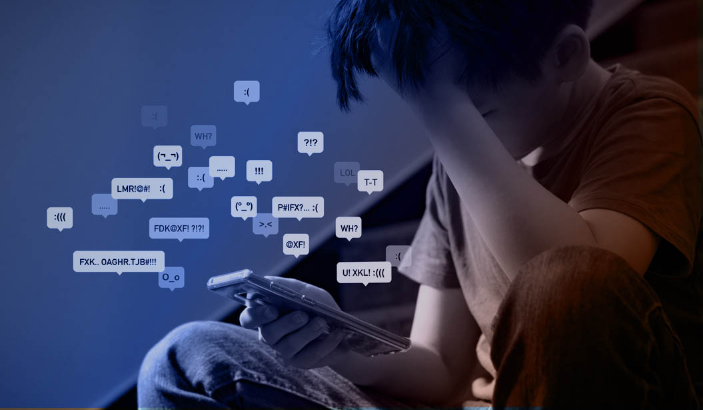

“Should I post this one or this one?” a girl asks her friends, carefully comparing photos before uploading them to Instagram. Moments later, the conversation shifts,“Did you see her post? She lost so much weight,” one friend says, while another adds, “Wait, didn’t that couple just break up?” as they continue scrolling through updates about other people’s lives. For many teenagers, such scenes are part of everyday life. Social media platforms create spaces for connection and self-expression, but they also encourage constant comparison and pressure to keep up with others. As teens become more focused on likes, comments, and online image, their mental health can be affected. Thus, despite the benefits social media can offer, it often harms teen mental health by increasing anxiety, lowering self-esteem, and fostering unhealthy comparison. 

One of the main ways social media affects teenagers is by lowering self-esteem through constant comparison. On platforms like Instagram and TikTok, most of the users post only the best parts of their daily lives, such as edited photos, achievements, and happy moments. It creates unrealistic standards that are difficult to fulfill in real life. Although this shows that there is more than meets the eye, teenagers who constantly view these idealized images may begin to feel that their own lives are not good enough, which can affect how they judge themselves. For example, watching influencers with perfect bodies or exciting lifestyles can make teens feel insecure about their appearance and daily lives. Over time, this repeated comparison can damage self-confidence and lead to a negative self-image. 

In addition to lowering self-esteem, social media can also increase anxiety through the seek for attention. Most teenagers measure their worth based on the number of followers, likes, or comments they receive. Posting something online can become stressful, as teens worry about how others will react. If a post does not get enough attention, it may lead to feelings of rejection or disappointment. This constant need for approval can create pressure to maintain a certain image online, making it difficult for teens to feel relaxed or authentic. Furthermore, the Fear Of Missing Out, often called FOMO, can increase anxiety as teens compare their experiences with others and feel left out of events or social groups. 

Another important effect of social media is the speed at which information spreads, often influencing emotions and relationships. News about breakups, friendships, or personal changes spreads rapidly, sometimes leading to rumors or misunderstandings. For instance, seeing posts about a couple breaking up may cause others to speculate or judge without knowing the context. This can create unnecessary stress and emotional reactions among teenagers. Constant exposure to others’ personal lives can make teens feel overly involved in situations that do not directly affect them, increasing emotional pressure and distraction from their own lives. 

Moreover, excessive social media use can interfere with sleep and daily routines, which are essential for good mental health. Many teenagers stay up late doomscrolling through their phones, which reduces sleep quality and affects mood and concentration the next day. Lack of sleep has been associated with higher levels of stress, irritability, and difficulty focusing in school. When social media becomes a habit that replaces rest or real -life interaction with others, its negative effects become even more serious. This shows that the impact of social media is both emotional and physical. 

However, it is important to recognize that social media also offers benefits. It can also provide opportunities for connection and support. Teenagers can stay in touch with friends, express themselves creatively, and find communities where they feel understood. For example, some teens use social media to share their own drawings or music, talk about their experiences, or connect with others who have similar interests or challenges. In this way, social media can help people feel less alone and more supported. The key difference lies in how it is used: whether it is used actively and positively or passively and excessively. 

Overall, social media plays a powerful role in shaping teenagers’ mental health. While it offers opportunities for connection and self-expression, it also encourages comparison, creates pressure for validation, and spreads information that can lead to stress. It can even affect sleep and daily habits, making its impact even more significant. As a result, many teens experience increased anxiety and lower self-esteem. Understanding these effects is important so that teenagers can use social media more mindfully and protect their mental well-being. By becoming more aware of how social media influences their thoughts and feelings, teens can take steps to build a healthier and more balanced relationship with the online world.
	