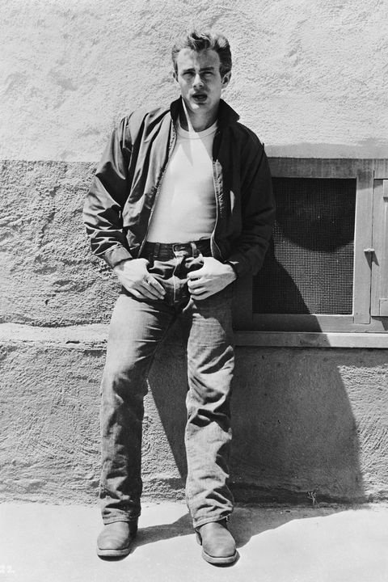

There is a cloth almost every person wears on this whole earth that never goes out of style. It is denim clothes. Denim clothes were first made in the mid-19th century and became popular all over the world. I think the most well-known type of denim clothes is denim jeans. They are strong, durable pants that symbolize youth and freedom, but did you know that denim jeans were originally made out of tents  and were made for miners? 

The history of denim goes back to 1853 in America. At this time, America was very excited because of the California Gold Rush initiated by James W. Marshall. The Gold Rush was a rapid movement of people to a newly discovered goldfield in California. There was a guy named Levi Strauss who was an immigrant from Buttenheim, Germany and was running a store named Levi Strauss & Co. There is a brief background story on why Levi moved from his birthplace. Levi was born on February 26, 1829 in Buttenheim. He was born the youngest in the family with three older brothers and three older sisters. Living in Germany was tough because they were Jewish. Furthermore, Levi’s father passed away because of tuberculosis when Levi was 16. Since Levi’s brothers were already living in America, his mother also decided to move to America with Levi and his sisters to start a new life. In America, Levi’s brothers were already running a business selling dry goods. While Levi was living in New York, he learned about business and helped their work. 

Then in 1848, the California Gold Rush started. Levi heard about the Gold Rush and thought it would be a great opportunity for business, so he decided to move to San Francisco. After he arrived, he opened his own store named after himself. One day, a merchant came and asked Levi to order about 100 thousand tents. Because of the Gold Rush, many gold seekers had to stay in tents near the gold mine. Levi spent 3 months filling the order, but all of a sudden the merchant canceled the order. Eventually, Levi got into debt and had to have dreary days. One day, he was drinking at the bar and saw miners sewing the tatter on their pants. He suddenly had an idea to make durable pants for miners with the tents he had. He went to Jacob Davis, a Nevadan tailor, and asked him to make work pants for miners with copper rivet reinforcements. Finally, on May 20, 1873, the huge amount of tents were made into work pants and were shown to the miners. Later, Levi named the cloth material denim and dyed them blue. This became the first denim jeans. Jacob Davis continued working in Strauss’s store and denim jeans became popular with the reputation for being the best work pants between miners. These were supplied throughout the U.S., and many years later, Levi Strauss’s store became the famous denim jeans brand Levi’s. 

Denim jeans were originally made for miners as work pants, but after many famous celebrities wore them, it became popular as another kind of fashion. Hollywood stars during the 1950s like James Dean, Marlon Brando, Elvis Presley, and Maryiln Monroe wore denim jeans and exposed them to the media. In the 1960s, the “Hippies,” who were young people that had freewheeling and rebellious mindsets, also started to wear denim jeans. Their cultures included crazy fashion, drugs, freedom, and peace. Soon, denim jeans became a symbol of the younger generation's rebellion against the older generation and became popular around the world. 
Denim jeans never went out of style, but their different designs became a trend and have changed throughout the years. In the 1950s, straight leg jeans were a trend. In the 1960s and 70s, the bell-bottom jeans and patchwork were a trend. The bell-bottom jeans had a flare design from the knee to look like a bell. Also, embroidered jeans and patchworks became popular too. Flowers and letters were commonly embroidered. ABBA, which was one of the most popular music groups at that time, also wore embroidered jeans. In the 1980s, ripped jeans were a trend. Also other designer brands other than Levi’s such as Calvin Klein started to introduce and expand their jeans lineups. Brooke Shields, a famous model at that time, wore Calvin Klein jeans. In the 2000s, the low-rise and skinny jeans were a trend. Unlike the other styles of jeans, low-rise jeans dropped way low down to the hips. Skinny jeans were also called “jeggings,” which combined the word “jean” and “leggings.” It had a slim fit, and like the low-rise jeans, it was usually worn by women. 

