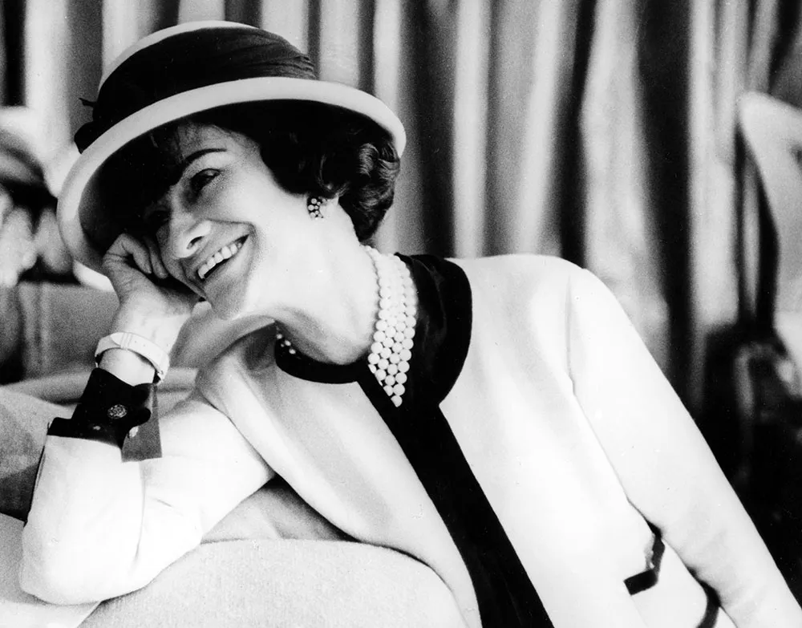

What things come to your mind when you think about Chanel? Many people would think about the high end fashion brand. But do you know who made Chanel? It is the designer Coco Chanel. She is known for her innovative designs for women's fashion. 
   
Chanel was born on August 19, 1883 in Saumur, France with the name Gabrielle Bonheur Chanel. Her father was a peddler and her family was in poverty when she was born and had two brothers and sisters. When she was 12, her mother passed away. Right away, she was sent to an orphanage with her sisters. She was raised by nuns and learned how to sew and other skills that would help her through life. After she came out of the orphanage, she worked as a seamstress and a club singer and continued her life. She got her nickname “Coco” while she sang a song called “Qui qu'a vu Coco?” This nickname later gave Chanel an inspiration to design a logo for her shop and brand, which is the famous double interlaced “C”s mirroring each other. 

However, her jobs weren’t enough to support her life. At the age of 20, Chanel met the wealthy aristocrat Etienne Balsan, while she was singing at the club. This gave Chanel a chance to meet other wealthy aristocrats and enter a different social circle. And She meets Arthur Capel, introduced by Etienne Balsan. Arthur Capel was a polo-player but he is better known for Coco Chnael’s 9 year lover. 

In 1910, Chanel opened her first shop in Rue Cambon, Paris, selling hats. She later opened stores in Deauville and Biarritz, starting to design clothes. At that time, women’s fashion had some stereotypes. Women wore dresses with puffy chest and thin waist lines to emphasize their bodies’ curves. They also wore corsets to make their waist look thinner, but they harmed their health. Thus, Chanel felt the need for a revolution of women’s clothes. She wanted to make women’s clothes comfortable and simple. She started to use jersey fabric to design women’s clothes and also used some fabric from men’s clothes. Since she enjoyed horse riding, she also introduced pants and trousers in women’s fashion too. Moreover, she cut her hair short, similar to men’s hairstyles. 

In 1921, Chanel got a chance to launch her own perfume. She met one of the most famous perfume makers, Ernest Beaux. Beaux showed several samples of perfumes to Chanel. Chanel picked sample Number 5 among them. It was a scent with jasmine and many other flower aromas. When they were selecting the name for the perfume, Chanel just decided to use the number for its name — “Chanel No.5”. This perfume became so popular that even celebrities used it. Marilyn Monroe was one of the celebrities who used Chanel No.5 frequently. She said herself that she wears Chanel No.5 when she goes to her bed. 

I bet some people will think about the little black dress and quilted bags when they think about Chanel. Chanel liked the color black because she thought it revealed a woman’s radiance. She even said that until she finds a darker color than black, she would only wear black. At that time, Chanel had a rival designer, Paul Poiret. He criticized her little black dress as “deluxe poverty”. But Chanel’s little black dress became so popular that Audrey Hepburn, who was one of the most famous actresses at the time, wore the little black dress for the movie “Breakfast at Tiffany’s” with a white pearl necklace. 

Chanel’s shops were successful until 1939. But then, World War 2 happened. Chanel closed her shops when France declared war on Germany. Other designers and couturiers left France, but Chanel stayed at Paris and endured. However, she didn’t return to fashion until 1954 when she reopened her shop and showed some of her other designs. 

Chanel died in 1971 at the age of 71. After she died, her couture house was led by other designers: Yvonne Dudel, Jean Cazaubon and Philippe Guibourgé. Even though Chanel is dead, her fame still continues with her famous perfume Chanel No. 5, quilted bag, and her clothes. These days, her company designs clothes, luxury goods, and accessories every year to present them in fashion shows. Chanel has become a high-end fashion brand and is still loved. 