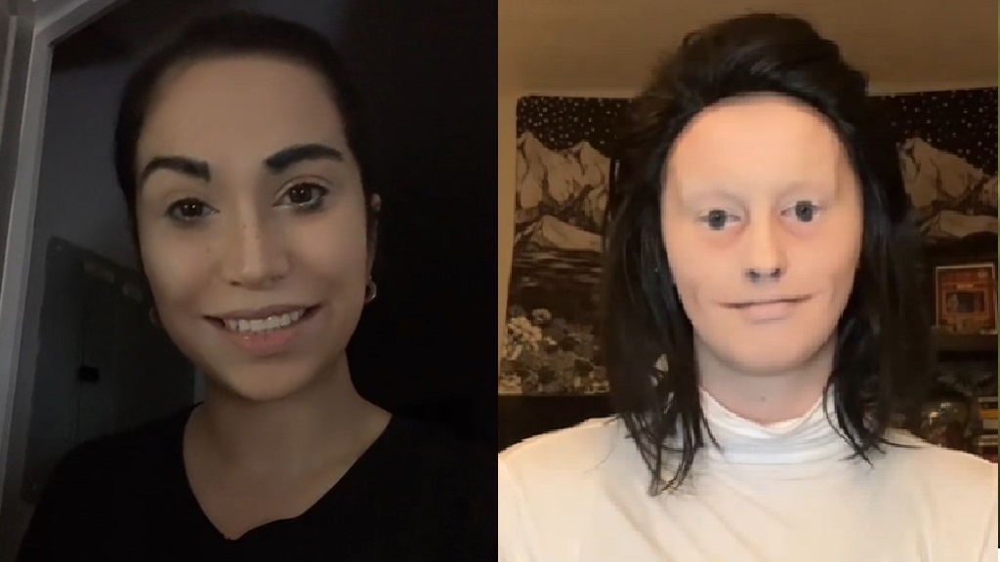
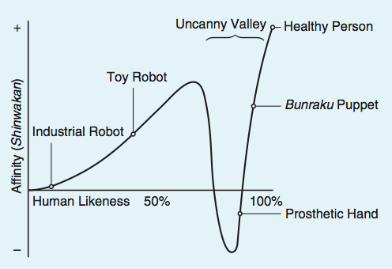

Have you ever felt uncomfortable or scared and terrified after looking at pictures like these? If so, you’ve just experienced a phenomenon known as the “Uncanny Valley.” The Uncanny Valley is a psychological theory that describes the negative emotional reaction people experience when they encounter something that looks almost, but not exactly, like a human, such as humanoid robots, mannequins, or even puppets or masks. This concept was first introduced in the 1970s by Masahiro Mori, a Japanese robotics professor at the Tokyo Institute of Technology. While he was studying people’s reactions to robots, he found that as robots’ appearances and behaviors were closer to humans, people initially responded with comfort and positive emotions. However, he discovered that emotional responses to human-like figures do not increase continuously as the figures become more human-like. Mori recognized an unexpected pattern in people’s psychological reactions against robots. When robots looked extremely similar to humans in appearance but still had subtle imperfections, such as unnatural movements, slightly unsettling facial expressions, or dull eyes, people’s emotional responses decreased dramatically. Instead of feeling more comfortable, they experienced discomfort, eeriness, or even fear. This sudden change in positive emotional response, which looked like a deep valley in his graph of familiarity versus human likeness, is what Mori called the Uncanny Valley. Below is Mori’s graph: 

Interestingly, Mori found that if a robot or a figure becomes almost indistinguishable from a real human, such as perfectly mimicking movement, expressions, and appearance, the emotional response increases again, and people feel a sense of comfort or familiarity. Basically, Mori discovered that humans are highly sensitive to small imperfections in human-like figures, and these imperfections can lead to strong negative reactions. 

So why does the Uncanny Valley happen? To provide an in-depth explanation, we first need to know how our brain works and consider the evolutionary perspective of humans. Human brains are accustomed to recognizing human faces, expressions, and movements, which is an ability to understand emotions, intentions, and identities, which is crucial for social interaction and empathy. When a figure looks almost like a human but shows subtle imperfections, our brains quickly detect these discrepancies. Even tiny flaws signal that something is not quite right. 

This creates a form of cognitive dissonance: a psychological discomfort, tension, or stress experienced when a person holds two or more conflicting beliefs, values, or attitudes, or when their actions contradict their beliefs. When people watch human-like figures, their brain perceives the figures as human, yet simultaneously recognize that they are not. This collision produces feelings of discomfort, eeriness, or even fear, as our neural circuit interprets the human-like figure as abnormal and threatening. 

Research suggests that the amygdala, an almond-shaped structure located in the brain's temporal lobe that is involved in processing emotions such as fear and disgust, plays a key role in this response. It analyzes subtle imperfections as warning signals, triggering an automatic emotional reaction even before we consciously understand why we feel uneasy. At the same time, the insula, which is a hidden area in the cerebral cortex deep within the brain's lateral sulcus, and is responsible for processing feelings of disgust and physical discomfort, becomes active, contributing to the sense of eeriness. This detection of abnormalities also stimulates the hypothalamus, activating the sympathetic nervous system and causing the release of stress-related hormones such as cortisol and adrenaline. These hormones prepare the body for a fight-or-flight response, an instinctive response to a threatening situation, producing physiological effects such as increased heart rate, tense muscles, increased alertness, and sometimes even goosebumps. Meanwhile, the prefrontal cortex attempts to resolve what we see with what we expect, creating a cognitive conflict that intensifies the uneasy feeling. Together, these neural and hormonal responses explain why figures that look almost human can provoke strong discomfort, eeriness, or even fear, although there is no real threat. 

From an evolutionary perspective, this response would be seen as a survival mechanism. Early humans had to quickly detect signs of illness, death, or abnormality in others to avoid dangers such as disease or predation. Figures that looked almost human but seemed slightly unsettling may have triggered an automatic sense of caution, signaling that something was not right. This sensitivity to human-like oddities could explain why people today still feel uneasy or fearful when they see highly realistic but imperfect robots, dolls, or digitally generated characters. This way, the Uncanny Valley reflects an instinctive adaptation that helped our ancestors survive by reacting quickly to small signs of danger or abnormality.
