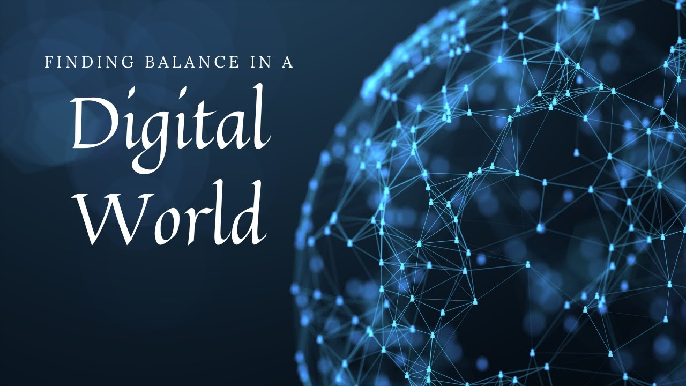

We all have digital devices. I do, you do, and probably everyone who is reading this does too. Whether it is a phone, a laptop, or a tablet, digital devices have become a normal part of our everyday lives. We use them to talk to our friends, watch videos, listen to music, do homework, and even find information about almost anything we want to know. In many ways, these devices make our lives easier and help us stay connected with other people. We can talk to someone who is miles away within seconds, see what our friends are doing, or join conversations even when we are not physically together. 

However, being constantly connected with others through our digital devices can sometimes make us less connected to the people around us. We have probably all experienced sitting with friends or family while everyone is looking at their own screen. We may be physically sitting in the same place, but our attention is somewhere else. Even in the middle of the conversation, it can be tempting to check a notification, reply to a message, or quickly look at something on our phones. When our attention keeps shifting between the conversation and our screens, we don’t fully communicate with the people right in front of us. We can be surrounded by people and still be disconnected, not because we have no one to talk to, but because we are not truly communicating with the people around us. 

So, why is this a problem? When we check our phones while spending time with other people, we may start to expect only part of someone's attention instead of their full attention. Looking at a screen during a conversation may seem normal now because many people do so without thinking much about it. In fact, a Pew Research Center survey conducted in 2014 found that 82% of U.S. adults said cellphone use at social gatherings at least occasionally hurts the conversation or atmosphere. However, meaningful communication requires more than simply being able to contact someone. It requires listening, responding, and paying attention to what the other person is saying. Being able to text someone anytime does not mean we are truly communicating with them. 

This is where digital detoxing comes in. Digital detoxing means taking a break from digital devices or limiting how much we use them. However, it does not necessarily mean completely giving up our phones or technology. We use our devices for many important parts of our lives, such as communicating with others, doing schoolwork, and finding information. Instead, digital detoxing can be about becoming more aware of how and when we use our devices. 

Digital detoxing can be especially meaningful when we are spending time with other people. Moreover, it is very simple: putting our phones in our bags so there are no notifications and no screen to check and think about when someone is talking is also part of digital detoxing. Even during  a short silence in a conversation, we do not always have to reach for our phones right away. We can use those moments to look around for a while, notice things around us, or just think about something else. Being away from our phones for even a few minutes can help us pay more attention to what is happening around us.

We receive notifications, messages, videos, and other forms of content throughout the day, so checking our phones can easily become a habit. Sometimes, we may reach for our phones simply because there is a quiet moment or nothing else happening. Not looking at our phones may feel boring at first, but we can learn to deal with that boredom in other ways. We could go for a walk, spend time outside, read a book, or simply enjoy a quiet moment without a screen. These moments may seem small, but they give us a chance to notice things we might otherwise miss. Digital detoxing can therefore be less about spending less time on our phones and more about paying attention to the people and moments around us.

Digital devices have made it easier than ever to stay connected, but real communication still requires our attention. Carrying a phone is important in case of an emergency, and there is nothing wrong with having it with us. What matters is knowing when to use it and when to put it away and be present with the people around us.
