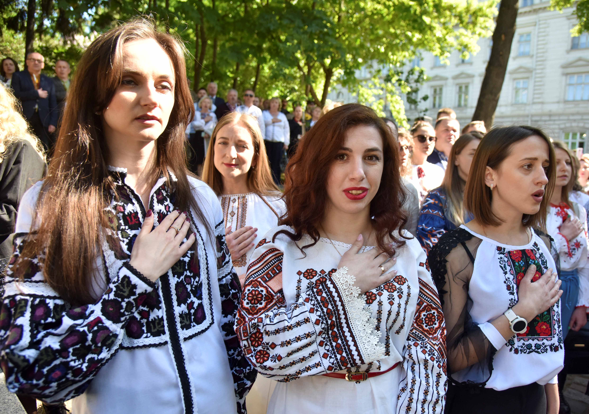

Do you like to travel around many countries? If you like to travel, then do you like trying on national costumes? I would really like to go on a short trip around many countries and get along with the cultures like trying the traditional foods and wearing the costumes. I think most of you guys have tried the hanbok, the national costume of Korea. But do you guys know other national costumes such as the ao dai or bunad? In this article, I will explain the national costumes of seven different countries.  
                  
## Norway 

Bunad is the national costume of Norway. These days, Norwegian people wear it on special occasions like Christmas Eve, graduation ceremonies, and national holidays. Bunads are very detailed and elaborate, which shows off Norwegians’ amazing embroidery skills because weaving takes time. Most Scandinavian countries have embroidery on their national costumes. The buttons, cufflinks, and belts are traditionally made of silver and gold. They are usually tailor-made to fit exactly to people, and the fabric is very strong so it can last long. Norwegians wear the essential brooch called sølje with the bunad. Also, it is a common practice for bunads and accessories to be passed down from generation to generation. Once they are passed down, tailors can help to adjust the size for the next person. 

## Scotland

Scotland’s national costume is called kilt. It evolved over time and became the symbol of Scottish identity and community. It looks like a skirt, but both men and women wear it. It is made out of worsted wool with a twilled pattern. The kilt is worn with a sporran, which is a small bag worn around the waist. Also, you would see many people holding bagpipes, which is a traditional Scottish instrument. Kilts are worn at important events such as weddings and military parades, but what makes them special is the practice of using family tartan, which is the patterned fabric used to show Scottish heritage and pride. 

## Germany | Switzerland | Austria

Germany, Switzerland, and Austria have different names for the men’s and women’s costumes. They are called lederhosen and dirndl, respectively. People wear them on Oktoberfest, which is a folk festival with beers. Lederhosen is a knee-length breech made out of leather. They are usually worn with knitted cardigans and buttoned long-sleeved shirts. A fun fact is that they were made originally as workwear for peasants. Women wear dirndl, which consists of a blouse, dress, and apron. The colors also have a meaning. For example, blue represents loyalty and harmony. It is a popular choice for weddings and other important celebrations. 

## Ukraine

Ukraine’s national costume is called vyshyvanka. It is a blouse made with natural materials and embroidered with various colors. Usually, the front part and the sleeves are embroidered. Ukrainians believe that embroidery is a talisman that has the power to protect a person and bring good luck. Since ancient times, Ukrainians have created various kinds of patterns and methods of dying threads. This passed down from generation and generation. Also, the embroidery depends on the region and the village. The most common ornaments are geometrical, having a sacred meaning, and the floral and animalistic patterns show respect for nature. 

## Vietnam

Ao dai is a Vietnamese national costume. It is a tunic worn with pants both for men and women. It is made out of silk and lace. The color of ao dai has different meanings. Red symbolizes luck and prosperity, white symbolizes purity and innocence, and black is mostly worn in funerals. Vietnamese women choose the color of ao dai based on their elements such as metal, wood, water, fire, and earth assigned on their birth. Most people wear a non la with the ao dai which is a cone-shaped hat made out of palm leaf. This hat is very useful in tropical countries like Vietnam. It protects people, especially farmers, from rainy and sunny weather. 

## Japan

The national costume of Japan is called kimono. The word “kimono” means “a thing to wear”. It also symbolizes longevity and good fortune. Usually, the kimono is an ankle-length robe with long, wide sleeves and a V-neck. It doesn’t have buttons or ties, but people wear it with a sash called obi which holds the kimono in place and keeps the front closed and safe. Most people wear the kimono with a geta, a slipper made out of wood, and tabi socks. These days, Japanese people rarely wear kimonos in daily life. They are worn at wedding ceremonies, graduations, and even at funerals. 

## Korea

Finally, let’s talk about the hanbok. Hanboks have many types such as ones for weddings and ones that royal people wore, but the most common type is a jeogori, a jacket and skirt or pants. In the past, women usually did low-bun hairstyles, and girls did single-braided hairs. These days, people don’t wear hanboks like in the past, except on Korean holidays like the Lunar new year. Instead, many tourists wear them when they visit Korea. They usually borrow them near tourist spots such as Gyeongbokgung. 

These were some of the most famous national costumes. I think national costumes are beautiful and interesting not only because of their designs but because they all contain different features from each country. I would like to try these national costumes one day.

*Listen to the article as read by the author:*
<iframe width="800" height="450" src="https://www.youtube.com/embed/1dSt77G2-R8" title="Megan Choi - December 2023 - TCA Journal" frameborder="0" allow="accelerometer; autoplay; clipboard-write; encrypted-media; gyroscope; picture-in-picture; web-share" allowfullscreen></iframe>