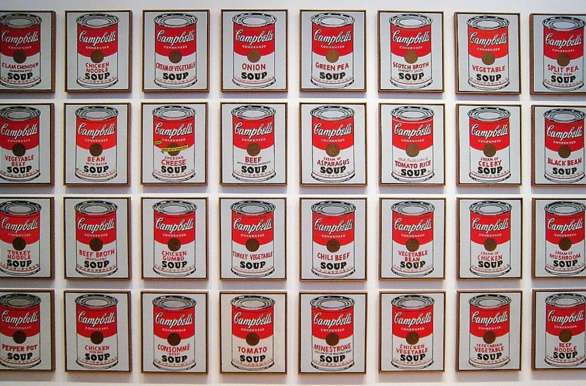

There are many different types of art movements, but today I will focus on four of them: pop art, Impressionism, Abstractionism, and Romanticism. We’ll learn about each art movement, its famous painters, and their works.

## Pop Art

Pop art is an art movement that began in the mid-1950s. Pop art is an abbreviation for “popular art.” As the name suggests, its style is not complicated. Rather, it is familiar as it mainly uses everyday materials, famous people, comic books references, etc. One of the most famous artists is Andy Warhol. His works are different from classical art, which usually takes a long time and produces only a single painting for the world. The above work is “Campbell’s Soup Cans” which was drawn by Warhol. He painted using the silkscreen technique. The steps for the technique are as follows: draw a picture on a board, make a hole, and paint into the hole to create a work. Using this technique, he drew multiple copies of the same picture. This method makes paintings look like they were printed by a machine. Using this technique, the paintings were mass produced. He mainly drew pictures of celebrities or products that appeared in advertisements. 

## Impressionism

Impressionism is an art movement that emerged from France during the late 19th century. Its paintings describe the real lives of people or landscapes on canvas. It focuses on expressing colors that change depending on the light rather than just drawing. In order to express light well, paint was often applied thinly to the point where the brushstrokes were visible. But at the time, people criticized Impressionist painters because they thought the painters lacked skills and their works looked unfinished. The term Impressionism was created because when people looked at Monet's paintings, they only got impressions. One of the most famous Impressionist painters is Claude Monet from France. He moved to Le Havre with his family when he was young. He is said to have spent time there looking at the beaches of Normandy. He began to paint Impressionist paintings while observing the scenery there, where the weather changed frequently. The painting above is by Monet and is called “Impression, soleil levant.” This work became a turning point in traditional art. This painting is an oil painting from 1872. If you look at his paintings, he did not use any black paint. Also, he used a short brush, which helped him build up layers in his painting. This way, he painted with detailed expressions of the colors of the landscape that changes over time.

## Abstractionism

Abstractionism is an art movement that emphasizes drawing pictures with abstract forms such as dots, lines, planes, and solid colors, rather than drawing concrete objects that are visible in real life. So, instead of focusing on actual daily objects or scenery, abstract paintings focus on abstractly expressing the artist's feelings and impressions. One of the representative abstract painters is Piet Mondrian. Mondrian was a Dutch painter born in 1872. He contributed greatly to the development of abstract art. Mondrian's paintings are characterized by squares and rectangles drawn with horizontal and vertical lines filled with color. He painted only using primary colors, but his paintings show intensity.

## Romanticism

Romanticism began in the late 18th century by criticizing the emphasis on reason. The word Romanticism comes from romance, a genre of literature, and it refers to something unrealistic and fantastical. Unlike Baroque Classicism, Romanticism does not have its own well-defined style or form and is an art style that is emotional rather than rational. Romantic painters expressed the beauty of nature through landscapes, emphasized emotions, focused on depicting one's inner self, and drew fantastical and unrealistic paintings. The painting above is a work called “The Raft of the Medusa,” painted by Théodore Géricault. This work marked the beginning of French Romantic painting. To describe it, a storm is coming and the waves are rough, and there are corpses scattered around the raft. People find a boat far on the horizon and are waving at it to save themselves.

Today, we learned about four art movements in total. Since there are more art movements than these four I explained today, it would be good to look for more painters and their works.

*Listen to the article as read by the author:*

`audio: https://www.dropbox.com/scl/fi/59eui1ulvez4ajcs8vlzk/miji_0124.mp3?rlkey=t3uopdqulavu58576vuhu5ncg&raw=1`